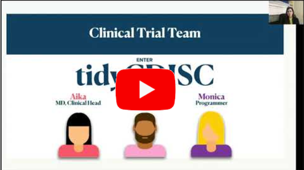

<!-- README.md is generated from README.Rmd. Please edit that file -->

```{r, include = FALSE}
knitr::opts_chunk$set(
  collapse = TRUE,
  comment = "#>",
  fig.path = "man/figures/",
  out.width = "100%"
)
# for tidyCDISC
# remotes::install_github("tidyCDISC")
```

# tidyCDISC <a href='https://Biogen-Inc.github.io/tidyCDISC/'></a>

tidyCDISC is a shiny app to easily create custom tables and figures from ADaM-ish datasets.

## Purpose

One of `tidyCDISC`'s goals is to develop clinical tables that abide to Biogen's table standards leveraged for submission filings, officially called "[STAN](https://biib.sharepoint.com/:w:/r/sites/ADSTCS/DS&G/_layouts/15/Doc.aspx?sourcedoc=%7B86cf7567-db46-4983-9a12-fdc63e77cf98%7D&action=view&wdAccPdf=0&wdparaid=688A3ED1&CID=B3A09B8B-6A35-4F43-A484-5E9EF88CD5FA&wdLOR=c8053EEAB-66ED-4CA0-9B71-331B73267CD8)" (short for 'standard analysis'). However, this is only secondary to the app's primary purpose: providing rich exploratory capabilities for clinical studies. High-level features of the app allows users to produce customized tables using a point-and-click interface, examine trends in a patient populations with dynamic figures, and supply  visualizations that narrow in on single patient profile.

The beauty of this application is that the user doesn't have to write a lick of code to acquire abundant insights from the study data, so it aims to serve a large population of clinical personnel with varying levels of programming experience. For example: 

- A **clinical head**, with presumably no programming skills but the most domain expertise, can explore results without asking a statistician or programmer to build tables & figures.


- A **statistician** can use the application to make tables/ figures instantly, cutting down on statistical programming requests for excess tables that aren't required, but nice to see. 

::: {.floatting}

```{r, echo=FALSE, out.width="30%", out.extra='style="float:right; padding:10px"'}
knitr::include_graphics("man/figures/pct_95_cropped.jpg")
```

- A **statistical programmer** can use tidyCDISC to do preliminary QC programming before writing the code in a validated process. Users who've leverage `tidyCDISC` for routine trial analysis tend to report **significant time savings, about 95%**, when performing programming duties.

:::

For a high-level overview of the app with a 10-minute demo, please review the following conference presentation on `tidyCDISC`, which is the open-sourced version of `tidyCDISC.` Internal to Biogen, the `tidyCDISC` application has all the same features as `tidyCDISC`, plus more!

<br>

<center>

[](https://youtu.be/QeHSjw-vU3U?t=103)

</center>


## Scope

As previously mentioned, tidyCDISC can only accept datasets that conform to CDISC ADaM standards with some minor flexibility (see [upload requirements](https://Biogen-Inc.github.io/tidyCDISC/articles/x00_Data_Upload.html) for more details. At this time, the app only accepts sas7bdat files.

If you're looking to regularly generate R code for tables, the tidyCDISC app has a built-in export feature that downloads an R script that reproduces any analysis performed in the app. However, if you already have experience with R programming, we'd highly recommend learning Biogen's (internal) [`stanly`](https://www.google.com/) package to expand on the R code that tidyCDISC yields for STAN-complaint tables. To summarize, the `stanly` package is a suite of functions designed for Biogen SAS programmers capable of producing 50+ STAN outputs.


## Usage

`tidyCDISC` is primarily a web application, so no installation is necessary. Simply access Biogen's network and start using the app here: [tidyCDISC](https://nate884.shinyapps.io/tidyCDISC/). Please review the "[Get Started](https://Biogen-Inc.github.io/tidyCDISC/articles/tidyCDISC.html)" guide to follow an example use case using the application. However, to optimize one's use of `tidyCDISC`, we highly recommend reading the following articles that take a deeper look into the topics presented in the getting started guide:

- [00 Data Upload](https://Biogen-Inc.github.io/tidyCDISC/articles/x00_Data_Upload.html)

- [01 Table Generator](https://Biogen-Inc.github.io/tidyCDISC/articles/x01_Table_Generator.html)

- [02 Population Explorer](https://Biogen-Inc.github.io/tidyCDISC/articles/x02_Pop_Exp.html)

- [03 Individual Explorer](https://Biogen-Inc.github.io/tidyCDISC/articles/x03_Indv_Expl.html)

- [04 Filtering](https://Biogen-Inc.github.io/tidyCDISC/articles/x04_Filtering.html)


We're confident the `tidyCDISC` application can save you time. If there is some use case that `tidyCDISC` can't solve, we want to know about it. Please send the [developers](https://github.com/Biogen-Inc/tidyCDISC/issues/new) a message with your question or request!


## Install `tidyCDISC` R package

`tidyCDISC` is primarily an application, so no installation is necessary. Simply access Biogen's network and start using the app here: [tidyCDISC](https://nate884.shinyapps.io/tidyCDISC/). However, if you choose to export and run R code from the Table Generator, you will need the `tidyCDISC` package installed on your machine locally.


The good news is that you don't need GitHub access in order to install tidyCDISC. You just need to be an HPC user to access Biogen's internal [Rstudio Package Manager](http://cran.rstudio.com/client/#/repos/5/packages/tidyCDISC) (RSPM)  where the package is hosted. If you cannot access RSPM from the above link, then you'll need to submit a simple BAM request as detailed below. If you can access the RSPM link, you can skip the access request step below.


#### Request Access for HPC account  
Click this [service-now link](https://www.google.com/) OR go to ***REMOVED***. When redirected to the request form, select "Access Request" for the `HPC Request Type`, then "HPC Account" for the `Access request` field that appears.

In the description field, type: "Please create an account for me on the ***REMOVED***." Also include the name of your department . You will receive an email when your account is provisioned, typically within one business day.


#### Install tidyCDISC from RSPM
Once you have confirmed access to RSPM, then execute the following code to install the package to your local machine:

```{r, eval=FALSE}
# For HPC users, add RSPM's GHE repo:
options(repos = c(
  CRAN = "https://cran.rstudio.com/",
  ghe = "google.com/latest")
)
options('repos') # to confirm "ghe" was added
install.packages("tidyCDISC")
```

Now you can access all the exported function from `tidyCDISC` that help users reproduce analysis performed in the app. Using the dev/run_dev.R file, you can even run the application locally:

```{r, eval=FALSE}
# Set options here
options(golem.app.prod = FALSE) # TRUE = production mode, FALSE = development mode

# Detach all loaded packages and clean your environment
golem::detach_all_attached()

# Document and reload your package, which runs these three functions...
golem::document_and_reload()

# Run the application 
run_app()
```


