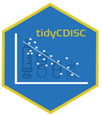
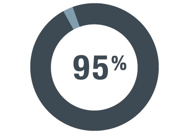

<!-- README.md is generated from README.Rmd. Please edit that file -->

# tidyCDISC <a href='https://Biogen-Inc.github.io/tidyCDISC/'></a>

<!-- badges: start -->

[](https://github.com/Biogen-Inc/tidyCDISC/actions)
[](https://openpharma.github.io/GithubMetrics/)
[](https://pharmar.github.io/riskmetric/)
[](https://codecov.io/github/Biogen-Inc/tidyCDISC?branch=master)
<!-- badges: end -->

`tidyCDISC` is a shiny app to easily create custom tables and figures
from ADaM-ish data sets.

<br>

<center>
<a href="https://rinpharma.shinyapps.io/tidyCDISC/">

</a>
</center>

## Purpose

One of `tidyCDISC`’s goals is to develop clinical tables that meet table
standards leveraged for submission filings, called “standard analyses”.
However, this is secondary to the app’s primary purpose: providing rich
exploratory capabilities for clinical studies. High-level features of
the app allow users to produce customized tables using a point-and-click
interface, examine trends in patient populations with dynamic figures,
and supply visualizations that narrow in on a single patient profile.

The beauty of the application: users don’t have to write a lick of code
to gather abundant insights from their study data. Thus, `tidyCDISC`
aims to serve a large population of clinical personnel with varying
levels of programming experience. For example:

- A **clinical head**, with presumably no programming experience (but
  the most domain expertise) can explore results without asking a
  statistician or programmer to build tables & figures.

- A **statistician** can use the application to make tables / figures
  instantly, cutting down on excess statistical programming requests for
  tables that aren’t required, but are “nice to see”.

<div class="floating">



- A **statistical programmer** can use `tidyCDISC` to perform
  preliminary QC programming prior to writing their own code in a
  validated process. Users who leverage `tidyCDISC` for routine trial
  analysis report **significant time savings, about 95%** on average,
  when performing their programming duties.

</div>

For a high-level overview of the app with brief 10-minute demo, please
review the following presentation on `tidyCDISC`at **Shiny Conf 2022**:

<br>

<center>

[](https://www.youtube.com/watch?v=0K8PCeKDbrI)

</center>

<br>

## Scope

As previously mentioned, `tidyCDISC` can only accept data sets that
conform to CDISC ADaM standards with some minor flexibility (see [upload
requirements](https://Biogen-Inc.github.io/tidyCDISC/articles/x00_Data_Upload.html)
for more details). At this time, the app is designed to accept
`sas7bdat` files only.

If you’re looking to regularly generate R code for tables, the
`tidyCDISC` app offers a handy feature to export an R script for full
reproducibility of analyses performed in the app.

<br>

## Usage

You can start using the demo version of the app here:
[tidyCDISC](https://rinpharma.shinyapps.io/tidyCDISC/). Note the demo
version disables the **Data Upload** feature and, instead, uses CDISC
pilot data. If you’d like to upload your own study data, we recommend
installing `tidyCDISC` from CRAN (instructions below) to run the app
locally or deploy it in your preferred environment. Please review the
“[Get
Started](https://Biogen-Inc.github.io/tidyCDISC/articles/tidyCDISC.html)”
guide to follow an example use case with the app. However, to optimize
one’s use of `tidyCDISC`, we highly recommend reading the following
articles that take a deeper look into the topics presented in the “Get
Started” tutorial:

- [00 Data
  Upload](https://Biogen-Inc.github.io/tidyCDISC/articles/x00_Data_Upload.html)

- [01 Table
  Generator](https://Biogen-Inc.github.io/tidyCDISC/articles/x01_Table_Generator.html)

- [02 Population
  Explorer](https://Biogen-Inc.github.io/tidyCDISC/articles/x02_Pop_Exp.html)

- [03 Individual
  Explorer](https://Biogen-Inc.github.io/tidyCDISC/articles/x03_Indv_Expl.html)

- [04
  Filtering](https://Biogen-Inc.github.io/tidyCDISC/articles/x04_Filtering.html)

We’re confident the `tidyCDISC` application can save you time. If there
is some use case that `tidyCDISC` can’t solve, we want to know about it.
Please send the
[developers](https://github.com/Biogen-Inc/tidyCDISC/issues/new) a
message with your question or request!

<br>

## Install the `tidyCDISC` R package

As a reminder, you can start using the demo version of the app right
now: [launch tidyCDISC](https://rinpharma.shinyapps.io/tidyCDISC/)
without any installation required. However, if you choose to upload your
own study data OR export & run R code from the Table Generator, you will
need the `tidyCDISC` package installed on your machine. Execute the
following code to install the package:

``` r
# Install from CRAN
install.packages("tidyCDISC")

# Or install the latest dev version
remotes::install_github("Biogen-Inc/tidyCDISC")
```

With a simple `library(tidyCDISC)` you can access all the exported
functions from `tidyCDISC` that help users reproduce analysis performed
in the app. Or, you can run the application locally (or deploy it in an
`app.R` file) using:

``` r
# Launch the application 
tidyCDISC::run_app()
```

<br>

## Staying current

`tidyCDISC` is an actively developed project, so things are frequently
changing. As such, there are a number of ways to stay current with the
latest changes in any user workflows & methods for new (or past)
releases! First, [our
blog](https://biogen-inc.github.io/tidyCDISC/articles/Blog.html) covers
all the new features and squashed bugs with detailed visuals and
explanations to help you get up to speed. In addition, we have a
[YouTube channel](https://www.youtube.com/@tidycdiscapp768) that posts
explain-er videos for special how-to’s, tips, and techniques. Last, the
[NEWS file](https://biogen-inc.github.io/tidyCDISC/news/index.html) is a
great resource for a recap on all the changes, with links to issues and
actual code changes available for your review.

<br>

<br>

<center>
<!-- {style="float:right; width:60px; margin-left: 20px;"} -->

[](https://biogen-inc.github.io/tidyCDISC/articles/Blog.html)
[](https://www.youtube.com/@tidycdiscapp768)
[](https://biogen-inc.github.io/tidyCDISC/news/index.html)

</center>

<br>

<br>

<br>

<br>

<br>

Happy exploring!

<br>

<br>
