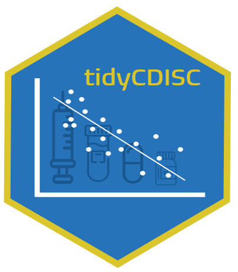

<!-- README.md is generated from README.Rmd. Please edit that file -->

# tidyCDISC 

The purpose of tidyCDISC is a shiny app to easily create custom tables
and figures from ADaM datasets.

# Installation

``` r
remotes::install_github("tidyCDISC")
```

# Use Case

Using the dev/run\_dev.R file, you can run the application locally:

``` r
# Set options here
options(golem.app.prod = FALSE) # TRUE = production mode, FALSE = development mode

# Detach all loaded packages and clean your environment
golem::detach_all_attached()

# Document and reload your package, which runs these three functions...
golem::document_and_reload()

# Run the application 
run_app()
```
