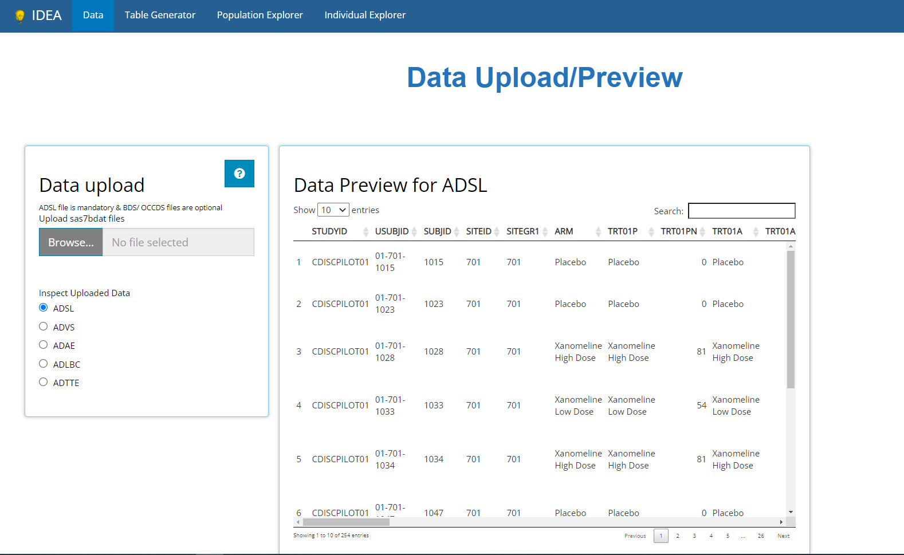
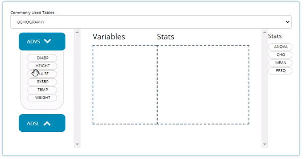
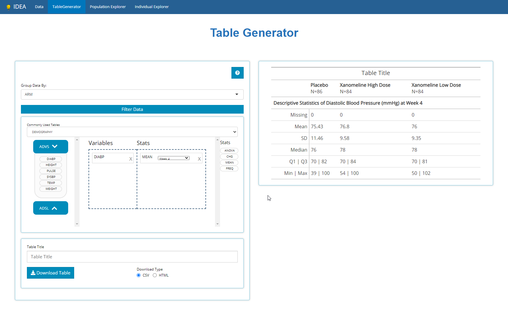

Let's walk through creating simple summary statistics using the CDISC Pilot data in conjunction with the Table Generator.

# Import Data

We can import data by clicking the 'Browse' button and selecting the files to upload. Here we've included the `adsl.sas7bdat` and `advs.sas7bdat` from the CDISC Pilot


```{r, out.width="90%", out.height="90%", echo=FALSE}

```

# Creating Tables

This tutorial will walk you through calculating simple statistics for an `ADSL` variable and a `PARAMCD` variable which must be calculated at a certain time point. 

Selecting the Table Generator tab results in the following screen which is divided in two: the area to create our tables using a drag and drop interface, and the table output. Because we uploaded two datasets we have two bins of blocks, an `ADSL` bin and `ADVS` bin. The `ADSL` bin includes all the column names of the variables inside `ADSL`, while the `ADVS` bin include the different PARAMCDs.

```{r, out.width="90%", out.height="90%", echo=FALSE}
knitr::include_graphics("figures/tableGen/02-TG.png")
```

## Age Summary Statistics

We can drag the `AGE` block from within `ADSL` and drag in the `MEAN` block from the statistical blocks to calculate summary statistics for `AGE` within the trial.

```{r, echo=FALSE}
knitr::include_graphics("figures/tableGen/03-age_mean.gif")
```

## PARAMCD Summary Statistics

Similarly, we can drag in `DIABP` from `ADVS` and use the `MEAN` block to calculate summary statistics. However, we also need to select the `AVISIT` from the week dropdown in order to calculate the summary statistics of `DIABP` at a certain week.

```{r, echo=FALSE}

```

## Group by another Variable

Lastly, we can use the `Group By` dropdown to calculate our statistics across groups. When we select `ARM`, rather than have a single column in the output table we now see the `DIABP` summary statics for each treatment group. 

```{r, out.width="90%", out.height="90%", echo=FALSE}

```

And that's it! 

# Other Statistics

The other statistical blocks we did not showcase in the demo are:

- `ANOVA:` this block can be used in conjunction with the grouping variable dropdown to compare a variable across groups.

- `CHG:` like the mean block, this also calculates basic summary statistics but uses the change from baseline value rather than `AVAL`

- `FREQ:` For categorical data you can calculate the frequency of variables. This too can be broken down into groups using the `Group By` dropdown
