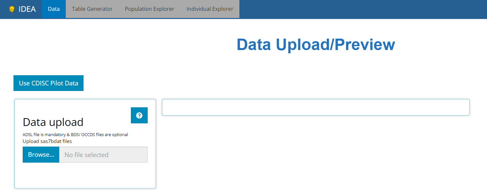

```{r, include = FALSE}
knitr::opts_chunk$set(
  collapse = TRUE,
  comment = "#>"
)
```


Greetings! The [IDEA](https://awshpc22133.abc.amazon.biogen.com/IDEA/) app is a robust tool which empowers its users to glean informative knowledge from clinical trial data with little resistance. To prove this, we'll take you on a brisk tour of the app, traversing all of it's wonderful features from each tab of the application. Throughout all the tabs, there are these little buttons (usually in the top right-hand corners) with question marks printed on them:

```{r, echo=FALSE, fig.align = 'center'}
knitr::include_graphics("figures/tableGen/TG need help.PNG")
```


When clicked, they launch a real-time guide that walks the user through the major components of the current screen/ tab, providing context and suggested workflow. So if this guide doesn't answer all your questions just click the ` ? ` button for assistance! 

<br>

**Without any further adieu, welcome to IDEA's landing page: the data upload tab**

<br>

```{r, out.height="60%", echo=FALSE}

```

<br>

<br>

# Upload Data

We cannot learn anything without some ADaM(-ish) data in hand. At a minimum, you'll need an `ADSL` sas7bdat file to get started, and the more data you bring, the more features and insights you can explore. We can import data by clicking the **'Browse'** button and selecting the files to upload from your computer or mapped network drives. In this way, the IDEA application is very secure, since you must have permissions to certain folders/ study directories to upload its data.

This tutorial will use 4 files: An `ADSL`, `ADVS`, `ADLBC`, `ADAE`, and an `ADTTE`, all from the CDISC pilot study. You can follow along by clicking the 'Use CDISC Pilot Data' button above the upload panel, as seen below. After the data is uploaded, we take a quick peek at our data and all the analysis tabs are unlocked, specifically:

- Table Generator

- Population Explorer

- Individual Explorer

Our first stop will be the table generator to build a disposition table that adheres to the STAN 2.0 guidelines.

<br>

```{r, echo=FALSE}
knitr::include_graphics("figures/tableGen/quick_upload_then_tg.gif")
```

<br>

There is more to be said about importing data, like, "What constitutes ADaM-ish data?" or "What if my data set won't upload?" To learn more on the topic, head over to the article titled [00 Data Upload](https://github.biogen.com/pages/biometrics/SEER/articles/x00_Data_Upload.html); you'll be glad you did! 


<br>

# Table Generator

The Table Generator tab is divided in two: the area to the left is the handy drag-and-drop interface used to define our tables, and on the right is the real-time table output.

<br>

```{r, echo=FALSE}
knitr::include_graphics("figures/tableGen/02-TG.png")
```

<br>

Any uploaded data will appear on the left-hand side as "bins". We call them "bins" because they are just containers, showcasing contents of the data when expanded. The `ADSL` & `ADAE` bins include the names of all their variables, while any `BDS` data sets, like the `ADVS` & `ADLBC` bins include a list of all the `PARAMCD` values. We call these variable & parameters "Variable blocks".

On the right-hand side, there are a list of "Stats", such as `ANOVA`, `CHG`, `MEAN`, and `FREQ` to name a few. We call these "STAT Blocks".


<br>

```{r, echo=FALSE}
knitr::include_graphics("figures/tableGen/bins.gif")
```

<br>

In order to build a table, we need only drag a variable block to the "Variable" drop zone and match it up with a corresponding stat block in the "Stats" drop zone. Below, we drag the `AGE` block from within `ADSL` and drag in the `MEAN` block from the list of Stats to calculate summary statistics for patient `AGE` within the trial.

<br>

```{r, echo=FALSE}
knitr::include_graphics("figures/tableGen/03-age_mean.gif")
```

<br>

Similarly, we can drag in `DIABP` from `ADVS` and use the `MEAN` block to calculate summary statistics on parameters. However, we also need to select the desired `AVISIT` in order to calculate the summary statistics of `DIABP` at a certain time point.

<br>

```{r, echo=FALSE}
knitr::include_graphics("figures/tableGen/04-diabp_mean.gif")
```

<br>

Using this technique, you can drag in as many variables and stat blocks to define a custom table. However, this tutorial's goal doesn't include building custom! If you recall, our goal is to build the disposition (Accounting of Subjects) STAN 2.0 table. 

<br>

You could build STAN tables from scratch by dragging and dropping pertinent variables into the drop zone, but since the standards are well defined and these tables are so common for regulatory submissions, the `IDEA` app has built them for you in advance. At the time this guide was authored, the Table Generator contains the following 'recipes' for STAN outputs:

<br> 

```{r, echo=FALSE, out.width="80%", fig.align = 'center'}
knitr::include_graphics("figures/tableGen/TG STAN dropdown.PNG")
```

<br>

If the data needed to produce a certain table aren't present, the available tables listed in this drop down selector will change. For example, if an `ADAE` is not uploaded, then all the AE tables will disappear from the above list.

When one of these tables is selected, the table generator simply compiles the needed variable and stat blocks in the correct order to generate the desired output, as seen below. Notice how the a population filter was set automatically, in this case to `FASFL` = 'Y' and the grouping variable set to `TRT01P`. Notice how the user changed the default table title and downloaded the R script needed to reproduce the table outside the app:

<br>

```{r,  echo=FALSE}
knitr::include_graphics("figures/tableGen/t_disp.gif")
```

<br>

Even still, there are a plethora of features described on the [01 Table Generator](https://github.biogen.com/pages/biometrics/SEER/articles/x01_Table_Generator.html) article that showcase how to DIY in the Table Generator, such as: add parameter variables and different statistical blocks, re-order or delete layers of table output, group the data by different categorical variables, export the static table for sharing, and will cover exporting the R code used to reproduce the table in more depth.


<br>


# Population Explorer

This module exists to visually glean insights about different patient populations via various chart types designed to drill down into the data in different ways. Below we will walk through a the "line plot  - mean over time" which graphs variables/ parameter mean values at each visit (using the visit variable of your choice).

Let's assume we want to check on our patients vital signs throughout the trial and look for any sub populations that are having a rough go of things. In the example below, we start checking diastolic blood pressure means at each visit and calculate a 95% confidence interval for each. Someone told us that the drug exposure tends to lower this vital sign over time and the data seems to support that. Let's say we're interested in mean `DIABP` is less than 77 from week to week. Thus, we add a reference line on the y-axis below. It seems that each week (except  baseline) seems to be completely under the threshold. To further dissect the data, we inspect how age impacts diastolic blood pressure and notice the younger (<65 y/o) population seems to remain high throughout the trial and download the data to excel to retain for later.

<br>

```{r,  echo=FALSE}
knitr::include_graphics("figures/popExp/line plot mean over time.gif")
```

<br>

Using the "Separate plots by" drop down list, we select `TRT01A` to investigate the effect the drug may have on `DIABP` and age group and it looks like the low dose group in particular is higher than any other group. Just like on any Population Explorer plot, we can hover over to inspect each point and download a PNG of our findings.

<br>

```{r,  echo=FALSE}
knitr::include_graphics("figures/popExp/line plot mean over time breakdown.gif")
```

<br>

On the Individual Explorer tab, we'll narrow in on this subset of patients and discover more findings.


# Individual Explorer

Use this tab to establish powerful patient narratives and explore outlier data from specific patients. Upon selecting the Individual Explorer tab, you'll be greeted with the following prompt (below) asking to select a patient, by `UBSUBJID.` All the data presented from here out will be tied directly the patient you select.

To subset the patients list prior to selecting a USUBJID, we recommend using "Advanced Pre-filtering". When selecting the `Advanced Pre-Filtering` check box, additional fields will appear (see below) to filter the population to the subgroup of interest. From the previous example, we're interested in exploring patient profiles that where the patient is <65 y/o, taking the drug's low dose with high diastolic blood pressure values.

<br>

```{r,  echo=FALSE, out.width="50%", fig.align = 'center'}
knitr::include_graphics("figures/IndvExp/filter patients.gif")
```

<br>

You just got a brisk live demo of the filtering widget which actually exists on each tab of the application. We didn't touch on the specifics here, but read our full tutorial on how to filter like pro by reading the [04 Filtering](https://github.biogen.com/pages/biometrics/SEER/articles/x04_Filtering.html) article.

<br>


Next, we scroll down to examine that patient's demographic info. Upon doing so, we see the patient is a white male, age 51 and weights 70.8 kg. Scrolling again, the 'Events' tab displays the patient's journey through the trial on an interactive timeline. In review, it seems the patient wasn't in the trial very long, and we don't see any outrageous adverse events, per say.


<br>

```{r,  echo=FALSE}
knitr::include_graphics("figures/IndvExp/drill down events.gif")
```

<br>


Switching to the "Visits" tab, we can see that this patient did indeed have consistently higher than average diastolic blood pressure, and it was always after standing for 1 minute. We hover over the plot to examine some points, download a png and also an html file containing a plot for each vital sign parameter available on this patient.


<br>

```{r,  echo=FALSE}
knitr::include_graphics("figures/IndvExp/drill down visits.gif")
```

<br>

That wraps up our patient profile analysis, but there is more to learn about the Individual Explorer! Read up on all it's hidden features in the [03 Individual Explorer](https://github.biogen.com/pages/biometrics/SEER/articles/x03_Indv_Expl.html) article. 


## Recap

So far, we've learned how to upload data, drag and drop blocks in the table generator as well as build a bonafide STAN table and export it's reproducible R code. Next we plotted mean diastolic blood pressure over time in the population explorer and define filters on the individual explorer tab to find the patients and analyze patient profiles responsible for elevating one subgroups values.

Users who've leverage `IDEA` for routine trial analysis tend to report **significant time savings, about 95%**, when performing programming duties. We're confident the `IDEA` application can save you time too. If there is some use case that `IDEA` can't solve, we want to know about it. Please send the [developers](mailto:adshelp@digicomm.jira.com?subject=IDEA App Question/ Request) an email with your question or request!

Have an IDEA to explore? Open the [IDEA](https://awshpc22133.abc.amazon.biogen.com/IDEA/) app!

