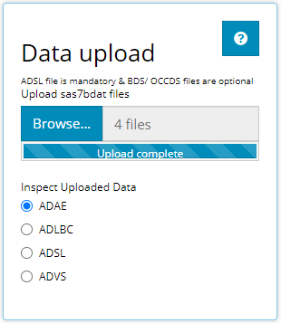

```{r, include = FALSE}
knitr::opts_chunk$set(
  collapse = TRUE,
  comment = "#>"
)
```


Greetings! The IDEA app is a robust tool which empowers its users to glean informative knowledge from clinical trial data with little resistance. To prove this, we'll take you on a brisk tour of the app, traversing all of it's wonderful features from each tab of the application. Without any further adieu, welcome to IDEA's landing page:

<br>

```{r, out.height="60%", echo=FALSE}
# knitr::include_graphics("figures/IndvExp/XXXXXXXX.PNG")
```

# Upload Data

We cannot learn anything without some (ADaM-ish) data. At a minimum, you'll need an `ADSL` sas7bdat file to get started, and the more data you bring, the more features and insights you can explore. We can import data by clicking the 'Browse' button and selecting the files to upload from your computer or mapped network drives. In this way, the IDEA application is very secure, since you must have permissions to certain folders/ study directories to upload that studies data. This tutorial will use 4 files: An ADSL, two BDS' (ADVS & ADLBC), and 1 OCCD (an ADAE), all from the CDISC pilot study. 

<br>

```{r, out.height="60%", echo=FALSE}

```

There is more to be said about importing data, like, "What constitutes ADaM-ish data?" or "What if my data set won't upload?" To learn more on the topic, head over to the article titled [00 Data Upload](https://github.biogen.com/pages/biometrics/SEER/articles/x00_Data_Upload.html); you'll be glad you did!

# Table Generator


# Population Explorer


# Individual Explorer


