This tutorial will walk through how to leverage the tidyCDISC app's Individual Explorer tab to establish powerful patient narratives and explore outlier data from specific patients. The Individual Explorer tab will interface with ADSL, BDS, and OCCDs class data files. This tutorial will use 4 files: An ADSL, two BDS' (ADVS & ADLBC), and 1 OCCD (an ADAE). 

<br>

```{r, out.height="60%", echo=FALSE}
knitr::include_graphics("figures/IndvExp/01_dataUpload.PNG")
```

<br>


## Patient Oriented from the Start

Upon selecting the `Individual Explorer` tab, you'll be greeted with the following prompt (below) asking to select a patient, by UBSUBJID. All the data presented from here out will be tied directly the patient you select. If you ever need help while navigating the patient selection widget, feel free to click the blue question mark in the upper right hand corner for a step-by-step guide through the widget, or keep reading this tutorial.

<br>


```{r, out.width="100%", out.height="100%", echo=FALSE}
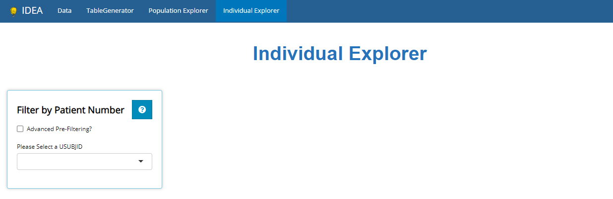
```

<br>

## Advanced Pre-Filtering

Sometimes you may have a specific patient whose data you wish to explore. However, other times you may want to explore any patient's data from a specific subgroup. To subset the patients list prior to selecting a USUBJID, we recommend using "Advanced Pre-filtering". When selecting the `Advanced Pre-Filtering` check box, additional fields will appear (see below) to filter the population to the subgroup of interest.


<br>


```{r, out.height="60%", echo=FALSE}
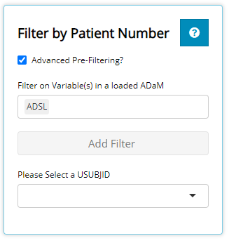
```

<br>


The first input field accepts the name of the data file that contains the variable you'd like to filter on. As you can see, it defaults to the ADSL. Feel free to delete `ADSL` and/or select another loaded data set. Let's say we're interested in patients with abdominal discomfort / pain or nausea that are younger than 70 years old. Thus, we'll filter on variables from both an ADSL and ADAE. Specifically, we'll filter on the `AGE` variable from the `ADSL` file & the `AEDECOD` variable from the `ADAE` file. Once both files are selected, you'll notice that the `Add Filter` drop-down is populated with variables from both data sets. You are welcome to scroll through this list and browse the variable names (with informative labels) or start typing the variable name of interest to save time. When typing, the drop-down will auto suggest the names of variable(s) that match what you type.

<br>

```{r, out.height="60%", echo=FALSE}
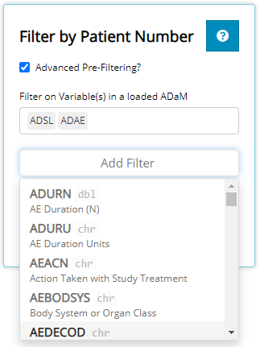
```

<br>

`AEDECOD` is the name of the variable that contains all the adverse events experience by patient's from this study. Since `AEDECOD` is a "character" variable, a drop-down list will appear containing all the unique values when selected. You may scroll through the list of adverse events or start typing "Abdominal" to have the drop-down selector auto-suggest existing variable names that match what you type. You'll notice that the number of rows of data is displayed to the right of the variable name. In this case, there is 1,191 rows of data when you combine the `ADSL` and `ADAE` data sets. However, after selecting both "Abdominal Discomfort", "Abdominal Pain", & "Nausea", there are only 28 rows remaining. This is a useful feature to understand the size of your sub-population when filtering.

<br>


```{r, out.height="60%", echo=FALSE}
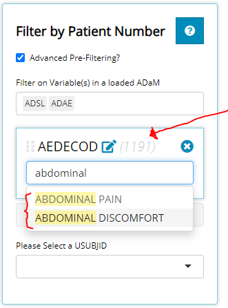
```

<br>

Next, we select the age variable. Since `AGE` is numeric, a slider will appear displaying the age range remaining in our sub-population of 28 subjects. As such, we can observe that age range is from 61 years old to 86 years old. As desired, we adjust the slider's upper limit to cap `AGE` at 70 years old. As a result, the parenthesis next to AGE shows there are 4 rows of data meet the criterion of this subgroup.

There is one exception when a slider will not be displayed for numeric variables, and that is when there are fewer than 7 unique values left in the sub-population. For example, if there were only 2 subjects left after some initial filtering, the ages of the remaining patients would display as check boxes.

<br>

```{r, out.height="60%", echo=FALSE}
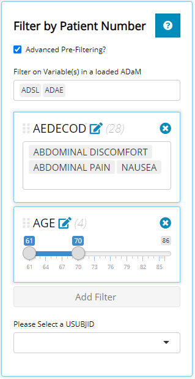
```

<br>

Note that the order these filters are applied will affect the order in which they are applied to the underlying data. You can also drag and drop these filters by clicking the the 6 grey dots to the left of the variable name, holding the click, and dragging them into the desired order where filters at the top execute first and filters at the bottom execute last.

Now that we have our sub population of interest, it's time to select one of our patients that meet the desire criteria. After opening up the USUBJID drop-down list, you'll see there are only a few patients available to select.

## Patient Selection

We'll select patient `01-718-1371`. Upon doing so, additional info populates the screen: 

<br>

```{r, out.width="100%", out.height="100%", echo=FALSE}
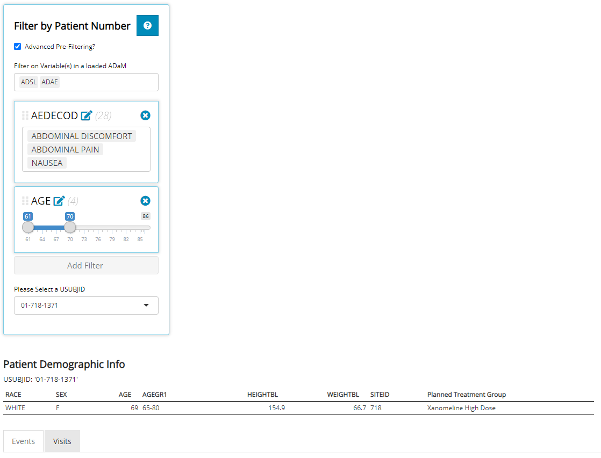
```

<br>

First take note of the brief `Patient Demographic Info` table that contains handy data about the patient selected (if these variables exists in the ADSL), including physical, geographic, and study characteristics. Immediately below that, two tabs display which contain visualizations for both Events and Visits. The `Events` tab plots dates on an interactive timeline (designed for OCCDs files) while the `Visits` tab plots PARAMs by Study Visit (using solely BDS files). No matter what tab you've selected, the basic demographic table is conveniently located just above for reference.

<br>

## Events

The primary objective of the events tab is to take important dates from the `ADSL` and any other date-oriented data sets to plot on an interactive timeline. What is displayed on the timeline is directly correlated with (1) the data sets uploaded and (2) which data sets you've selected in the check boxes below. Because we have an `ADSL` uploaded, the `Milestones` check box appears. It contains any date variable in the `ADSL` data set. Similarly, because we have an `ADAE` data set loaded, that check box appears. Last, we uploaded an `ADLBC` which contains dates blood chemistry labs were drawn. Other data supported are Con Meds or even medical history files, as denoted above the check boxes. Remember: if you ever need help while navigating the `Events` tab, feel free to click the blue question mark in the upper right-hand corner for a step-by-step guide through the tab, or just keep reading this tutorial.

<br>

```{r, out.width="100%", out.height="100%", echo=FALSE}
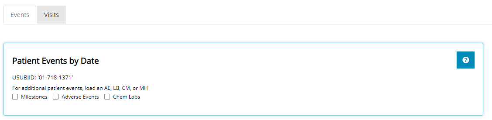
```

<br>

Next, we'll select all available check boxes to show off the interactive timeline visual.

### Timeline Visual

When each check box is selected, a new "swim-lane" is added to the plot, populated with that file's date data. Each data element in the swim-lane are color coded for easy identification. In this case: Milestones are green, chemistry labs grey, and adverse events purple. Each box has a line that extends down to the x-axis. The "x-axis" contains dates that span the length of the study. 

<br>


```{r, out.width="100%", out.height="100%", echo=FALSE}
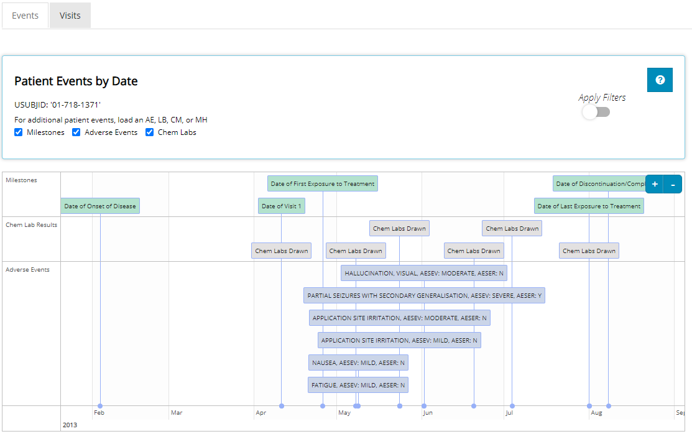
```

<br>

However, the date range displayed is subject to where the user wishes to zoom & pan. The user can either "hover and scroll" or leverage the small `+` or `-` sign on the top-right corner of the plot to zoom. To pan, the you can click and drag the timeline plot's screen to the left or right. As you zoom & pan, you'll see more and more detail in the x-axis and the events plotted will begin to spread out. See animation below:

<br>


```{r, out.width="100%", out.height="100%", echo=FALSE}
knitr::include_graphics("figures/IndvExp/Events_Plot_Interactivity.gif")
```


<br>

If you noticed, the timeline plot is currently showing all adverse events that this patient incurred. Yet, previously we used `Advanced Pre-Filtering` to identify a sub-population of interest based off of certain adverse events: "Abdominal Discomfort", "Abdominal Pain", & "Nausea". You may apply those filters to this plot by toggling the `Apply Filters` switch next to the small blue question mark. When toggled, only the adverse events-of-interest display in the timeline plot. Specifically, this patient had mild nausea in early May. A list of the pre-filters will be displayed (in blue text) beneath the graph as a reminder of what events were filtered out of the data.

<br>


```{r, out.width="100%", out.height="100%", echo=FALSE}
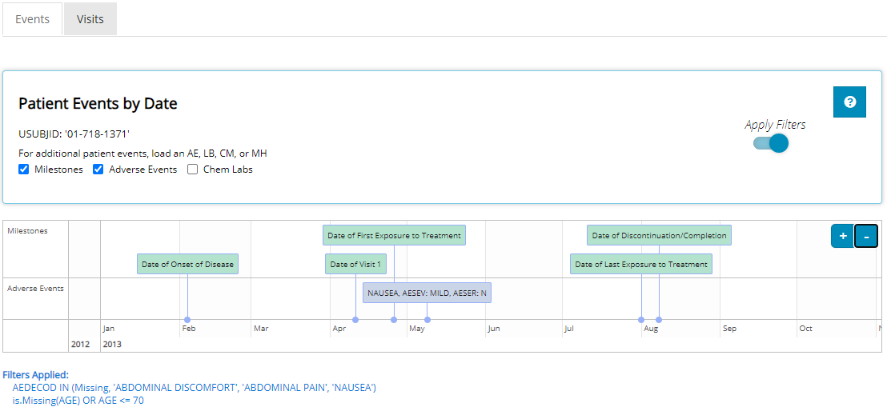
```

<br>

### Data table

Directly beneath the timeline visual is the data table used to plot these events. Just like the timeline plot, the data contained here depends on what check boxes are selected. The user can sort this data by any column and easily output the results to MS Excel by selecting the `Excel` button in the top left corner. Adjacent that button, the user can display more entries per page, instead of the default value of 15 rows or simply page through the results by clicking the `Next` button in the bottom right-hand corner.

<br>


```{r, out.width="100%", out.height="100%", echo=FALSE}
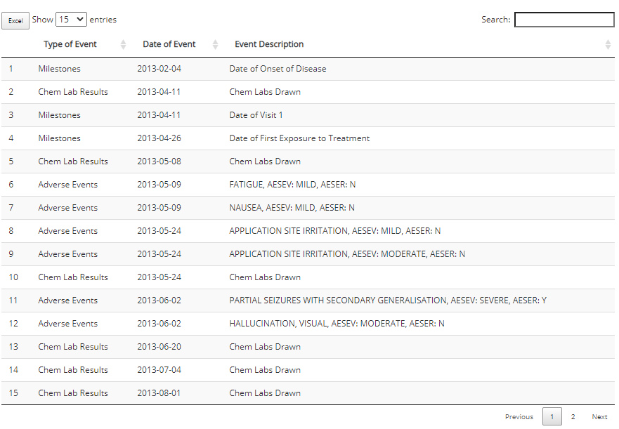
```

<br>


## Visits

Select the `Visits` tab. Recall, the `Visits` tab plots `PARAM`s by Study Visit using data from BDS-class data sets. Upon arrival, default selections are chosen for you if at least one BDS file is uploaded in the app. Off the bat, you'll see we are looking at a plot of Sodium (mmol/L) against Study Visit (ADY) for patient `01-718-1371`.

<br>


```{r, out.width="100%", out.height="100%", echo=FALSE}
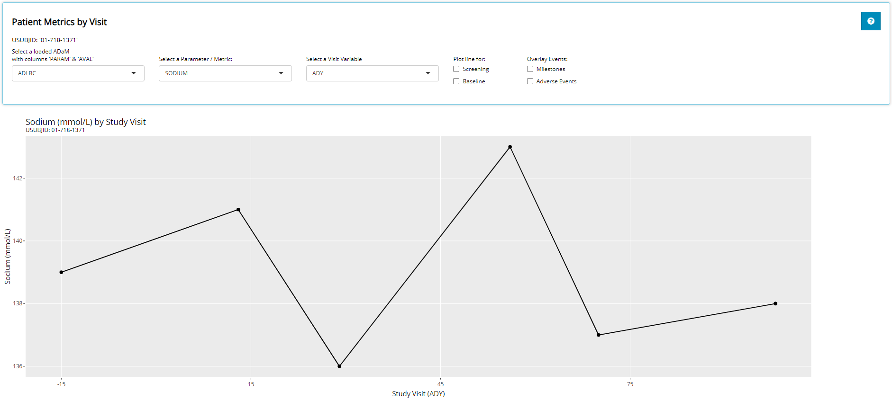
```

<br>

### The Visits Plot

The user can interact with the plot by hovering the cursor over plotted points to glean more information about the data presented. In addition, the user can easily zoom & pan around the graph as needed. Last the user can download the plot to a PNG with the click of a button. See animated demonstration below:

<br> 


```{r, out.width="100%", out.height="100%", echo=FALSE}
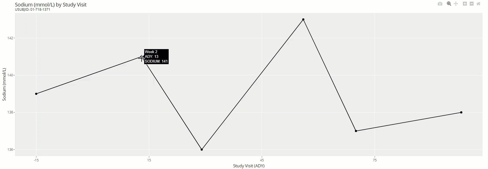
```


<br> 


Let's walk through each input and how it impacts the plot. Remember, if you ever need help while navigating the `Visits` tab, feel free to click the blue question mark in the upper right hand corner for a step-by-step guide through the tab, or continue reading this tutorial.

First: the "Select a loaded ADaM with columns 'PARAM' & 'AVAL'" input is hinting that only data sets of the BDS-class format will populate the drop-down. Notice that the lab and vital signs data meet these requirements. Once a data set is selected, we'll use it's data for plotting. We'll continue on with the `ADLBC` data set.


<br>


```{r, out.height="50%", echo=FALSE}
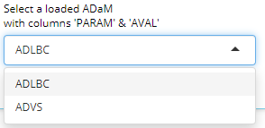
```

<br> 

Next, we must select which parameter (or metric) to plot. The drop-down list will automatically populate with all the parameter codes (`PARAMCD`s) that exist in the selected ADaM. The parameter selected will plot the param results (`AVAL` variable) onto the y-axis. Recall that this data set contains blood chemistry metrics. We'll select "Sodium".

<br>


```{r, out.height="50%", echo=FALSE}
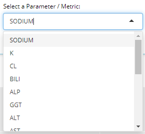
```

<br> 

Next, we'll select a numeric visit variable to plot on the x-axis. If available in the data set, `AVISITN` and `VISITNUM` will appear here, plus any other variables ending in "DY". In this example, the analysis day variable (`ADY`) is available. We'll select `ADY`.

<br>


```{r, out.height="50%", echo=FALSE}
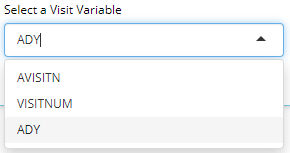
```

<br> 

You should see the plot start to take shape, and the remaining inputs / options allow the user to further customize the plot by overlaying additional data. Specifically, "Plot line for... `Screening` or `Baseline`" will plot a horizontal line across the entire plot with a y-intercept equal to the baseline visit's `AVAL` for the selected `PARAMCD`. Notice when `Baseline` is selected, a horizontal line is plotted through the 1st point on the graph (the baseline visit) and extends all the way the right-hand side of the graph. This is designed to help the user visually see the difference in the metric at each visit compared to patient's baseline value.

<br>


```{r, out.width="15%", out.height="15%", echo=FALSE}
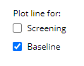
```

```{r, out.width="100%", out.height="100%", echo=FALSE}
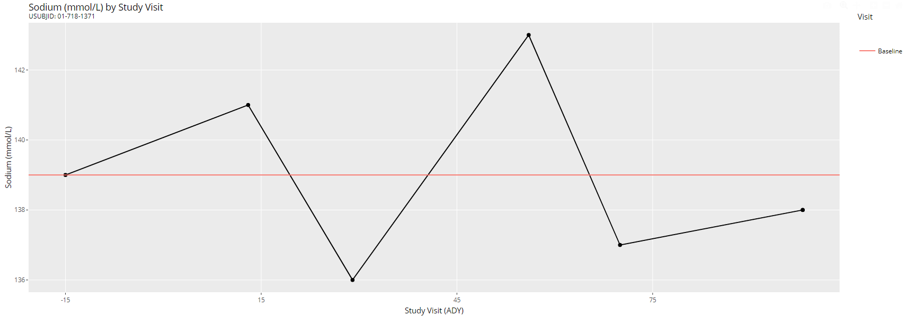
```


<br>

The next set of inputs / options are really useful because they allow the user to overlay event data from the `Events` tab onto our "visits plot". Note that this is only possible when lab data is uploaded (IE. an ADLB or ADLBC). As soon as you select one of the `Overlay Events` check boxes, vertical lines appear on the plot where the event dates are translated directly into the "DY" variable displayed on the x-axis (`ADY` in this case). These lines also allow for interactivity when you hover over the very top or bottom of each vertical line for a description of the event displayed in a small box (as shown below).


<br>

```{r, out.width="70%", out.height="70%", echo=FALSE}
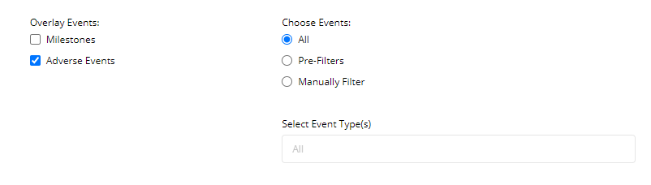
```


```{r, out.width="100%", out.height="100%", echo=FALSE}
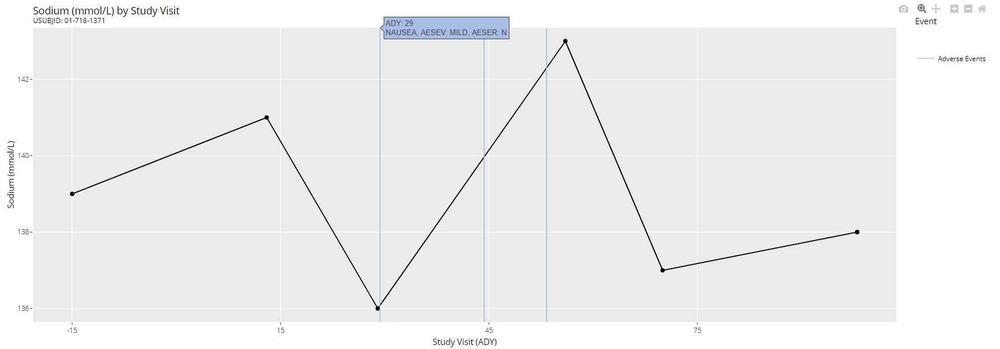
```


<br>

When any events are overlain on the plot, more inputs / options appear to the right of the check boxes allowing the user to either apply pre-filters (when applicable) or manually filter through the events displayed. As seen below, when `Pre-Filters` is selected, a reminder of the pre-filters used to subset our patient list is displayed next to the inputs and again below the plot. Notice how only the "Nausea" adverse event is now visible below. The other two adverse events were unrelated to our pre-filters.


<br>

```{r, out.width="50%", out.height="50%", echo=FALSE}
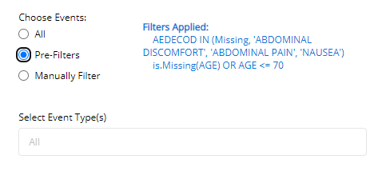
```


```{r, out.width="100%", out.height="100%", echo=FALSE}
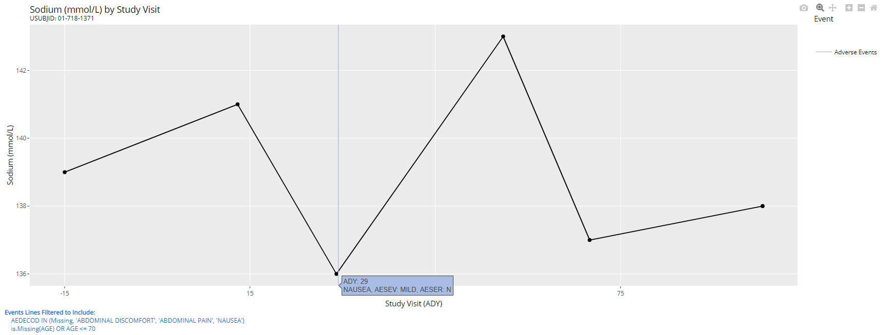
```

<br>

If we'd like to filter the displayed events in a manner that's not consistent with out advanced pre-filters, we can instead select `Manually Filter` and scroll through a list of adverse events this patient has experienced during the study. Or, when there are too many to scroll through, just start typing the name of an adverse event and the drop-down list will auto-suggest the event you are looking for. When we select "Application Site Irritation", notice how that is the only vertical line present on the graph below:

<br>

```{r,out.width="50%", out.height="50%", echo=FALSE}
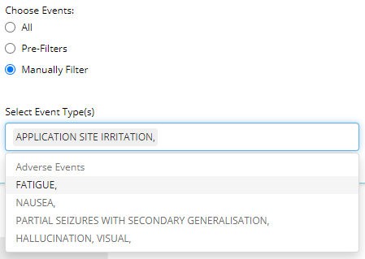
```


```{r, out.width="100%", out.height ="100%", echo=FALSE}
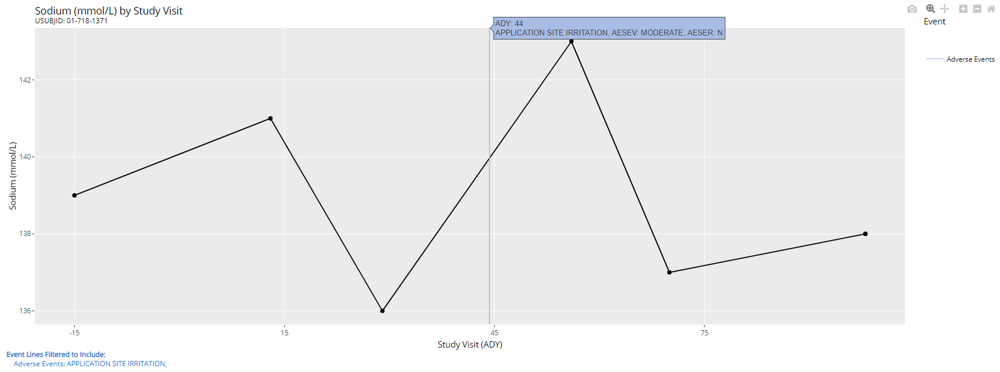
```


<br>

### Data table

Directly beneath the visual is the data table used to plot these events. As such, the data displayed depends on the inputs selected above the plot. The user can sort this data by any column and easily output the results to MS Excel by selected the `Excel` button in the top left corner. Adjacent that button, you can display more entries per page, instead of the default value of 15 rows. Or to page through the results, click the `Next` button in the bottom right-hand corner.

<br>


```{r, out.width="100%", echo=FALSE}
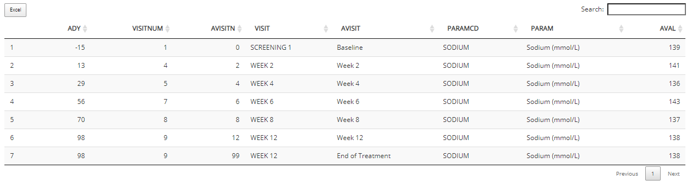
```

<br>

### Batch Downloading Plots

The `Visits` tab allows users to produce a multitude of plots with one click. You can create an HTML report (which maintains interactivity) or PDF that includes plots generated for every PARAMCD of the selected ADaM. The plots will inherit all the options you've selected in the app. Optionally, you may add your unique notes to be included in the final report.

<br>

```{r, out.width="60%", out.height="60%", echo=FALSE}
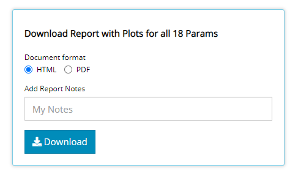
```

Clicking the `Download` button will produce the following report (below), downloaded straight to your browser window. Notice how there is an interactive table of content on the left-hand side to skip ahead to your favorite parameter / metric. And if you download more than 1 report, the `Report Summary` and your `Notes` come in handy to identify why you downloaded this report in the first place! Go ahead and save these reports wherever you'd like for future reference which means there is no need to re-open the tidyCDISC app and rebuild your plots.

<br> 

```{r, out.width="100%", echo=FALSE}
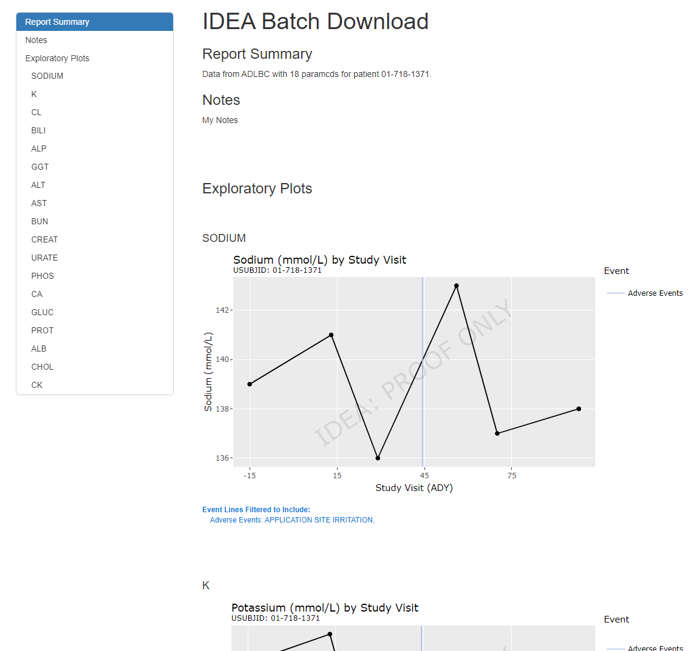
```


