```{r, include = FALSE}
knitr::opts_chunk$set(
  collapse = TRUE,
  comment = "#>",
  fig.path = "man/figures/"
)
```

On the road to generating desirable clinical tables and figures in R, `tidyCDISC` took some pioneering first steps towards that goal by open sourcing an interactive platform in `shiny` for all to use. However, the initial release was a minimum viable product and only promised users a foundation upon which to build. The latest release of `tidyCDISC` starts to build upon that foundation with a myriad of useful features and even lays some more footings for future expansion. Feel free to follow along with these announcement details using the demo version of `tidyCDISC` hosted on shinyapps.io. Note the demo version disables the **Data Upload** feature and instead uses the CDISC pilot data.

<br>

<center>
<a href="https://rinpharma.shinyapps.io/tidyCDISC/">

</a>
</center>

<br>

##  Big news for the **Table Generator**

Below are a number of improvements that enhance the user's table building experience (in and outside of the app). Checkout each feature and then take it for a spin in our **Table Generator** [test drive](https://biogen-inc.github.io/tidyCDISC/articles/announcing-tidycdisc-0-0-1-1.html#table-generator-test-drive-1). But before we get that far, just a quick refresher: if you want to build a table using the `tidyCISC`, all you need to do is drag and drop a variable or endpoint from the uploaded data on the left and pair it with an appropriate stat block on the left. Below, we drag the `AGE` block from the `ADSL` and drag the `MEAN` block from the list of Stats to calculate summary statistics on patient `AGE` within the trial. For more information on how to use the **Table Generator**, visit the respective [user guide](https://biogen-inc.github.io/tidyCDISC/articles/x01_Table_Generator.html).

<br>

```{r, echo=FALSE}
knitr::include_graphics("figures/tableGen/03-age_mean.gif")
```

<br>


### New Stat blocks 

New "STAT Blocks", such as `Y FREQ`, `MAX FREQ`, `NON-MISSING`, and a pair of `NESTED FREQ` blocks were added to the lineup. Each provides achieve a commonly desired output when paired with the appropriate variable. Let's briefly review each of the new blocks (grouped in red below).


```{r, echo=FALSE, out.width="15%", fig.align = 'center'}
knitr::include_graphics("figures/tableGen/new_release_stat_blocks.PNG")
```

<br>

- `Y FREQ`: Pair this STAT block with any flag variables (usually ending in 'FL', like `DTHFL`) that contain 'Y' values. The output will include a count and percentage for **only** the patients with 'Y' values.


<br> 

```{r, echo=FALSE, out.width="80%", fig.align = 'center'}
knitr::include_graphics("figures/tableGen/TG Y FREQ.PNG")
```

<br> 

- `MAX FREQ`: This stat block can only be paired to variables (VAR) that have a "N" (VARN) counterpart. For example, it's useful for variables like `AESEV`, when subjects should only be counted once at their maximum `AESEVN` (VARN) value. So, when `MAX FREQ` is paired with `AESEV` or `AESEVN`, the frequencies will reflect maximum severity of an adverse event during the trial.

```{r, echo=FALSE, out.width="80%", fig.align = 'center'}
knitr::include_graphics("figures/tableGen/TG MAX FREQ.PNG")
```

<br> 

- `NON MISSING`: A handy stat that counts subjects who have non-missing values for any given variable. As such, it can help provide a high level measure of how many subjects had some value, as seen below with `AEDECOD`

<br> 

```{r, echo=FALSE, out.width="80%", fig.align = 'center'}
knitr::include_graphics("figures/tableGen/TG NON MISSING.PNG")
```

<br> 

- `NESTED FREQ DSC`: Notice when using this stat block, you'll need to choose a variable to "nest" inside the values / levels of another. Without the nested variable selected (ie `NONE` is selected), the subject counts and percentages are displayed in descending order. Place the high level variable (like `AEBODSYS`) on the left hand side and select the more granular variable to be "nested" inside of it, like `AEDECOD`. Then the output will show all the `AEDECOD` values that exist within each `AEBODSYS`, all sorted descending. `NESTED FREQ ABC` provides the same functionality as `NESTED FREQ DSC`, but organizes the variables and it's values in alphabetical order!

<br> 

```{r, echo=FALSE, out.width="60%", fig.align = 'center'}
knitr::include_graphics("figures/tableGen/TG Nested Freq.PNG")
```


```{r, echo=FALSE, out.width="80%", fig.align = 'center'}
knitr::include_graphics("figures/tableGen/TG Nested Freq2.PNG")
```


<br>


### All new 'standard analysis' tables

There are a set of tables / listings that users need to build frequently, due to their common inclusion in submission filings to regulatory authorities. With the new STAT blocks mentioned above, `tidyCDISC` could now achieve dozens of standard analysis tables by just plugging in the correct variables from your ADaM data. As such, the Table Generator contains the following 'recipes' for commonly used tables:

<br> 

```{r, echo=FALSE, out.width="90%", fig.align = 'center'}
knitr::include_graphics("figures/tableGen/TG STAN dropdown.PNG")
```

<br> 

When data needed to produce certain outputs aren't present, the list of available tables in this drop down will change. For example, if an `ADAE` is not uploaded, then all the AE tables will disappear from the above list.

<br> 

When one of these tables is selected, the table generator simply compiles the needed variable and stat blocks in the correct order to generate the desired output. This can be particularly useful for tables like #41 "Blood Chemistry actual values by visit" since it would be cumbersome to manually drag in a `MEAN` block for each week and each blood chemistry parameter, as there can be many. See snapshot of this automation below:

<br> 

```{r, echo=FALSE, out.width="80%", fig.align = 'center'}
knitr::include_graphics("figures/tableGen/TG STAN TAB41 DD.PNG")
```


```{r, echo=FALSE, out.width="80%", fig.align = 'center'}
knitr::include_graphics("figures/tableGen/TG STAN TAB41.PNG")
```

<br>


### An R Script Downloader

Finally, reproducing analyses performed in the app from your local RStudio session is a single click away using this button:

<br> 

```{r, echo=FALSE, out.width="80%", fig.align = 'center'}
knitr::include_graphics("figures/tableGen/TG reprpoduce button.PNG")
```

<br> 

Upon clicking, an R script will download to your browser and when opened, should look something like the below snapshot The R script will first help you install any packages needed for analysis, including the `tidyCDISC` package. If you used the CDISC Pilot data, no code modification is needed to reproduce the output since that data is pre-loaded into the `tidyCDISC` package. However, if you uploaded your data from some other source, you'll need to enter the file path to your study's data (as a string), as seen on line 17. Note: `'path/to/study/directory/'` is just a placeholder until you replace with your own string. If you are unsure of how to format your string, just run `choose.dir()` in your R console (on Windows operating systems).


<br> 

```{r, echo=FALSE, fig.align = 'center'}
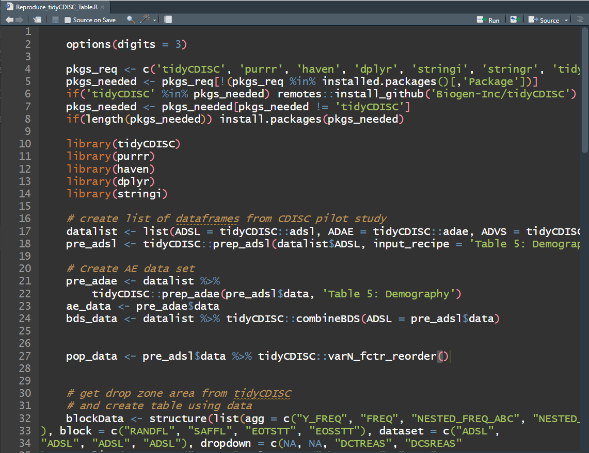
```

<br>

After reading in the data, the R script will recall the variable and stat blocks previously dropped into the "drop zone" to recreate the output using the exact same process as performed in the app. From there, an R data.frame and html rendering of your table is prepared for saving or, if preferred, further analysis.


### Table Generator Test drive

Why wait, test out the new additions for yourself using CDISC Pilot data! Or open the full application for demo here:

<center>
<a href="https://rinpharma.shinyapps.io/tidyCDISC/">

</a>
</center>

<br>

<style>
.shiny-app-frame {
  left: 0;
  top: 50px;
  bottom: 0;
  right: 0;
}
.shiny-app-frame iframe {
  width: 100%;
  height: 800px;
  border: none;
}
</style>

<div class="shiny-app-frame"> 
<iframe src = "https://rinpharma.shinyapps.io/tidyCDISC_Table_Generator/" class="shiny-app">
</iframe>
</div>

<br>


## Once you **Pop**, the fun don't stop

New Chart types in the **Population Explorer**! The initial release of `tidyCDISC` included some generic charts that *could* theoretically stretch into something useful. However, the recent release focused on making canned charts that get to the heart of the matter for many pharma use cases. If you have an idea for a useful chart typically used for trial analysis or submission, just send the [developers](https://github.com/Biogen-Inc/tidyCDISC/issues/new) a message with your request!


<br>

```{r, echo=FALSE, out.width="50%", fig.align='center'}
knitr::include_graphics("figures/popExp/type of chart.PNG")
```

<br>

The bottom three are new to the **Population Explorer** in the `0.0.1` release. It's important to note that the `Kaplan-Meier Curve` option will not appear unless an ADaM of class `TTE` (meaning it contains the `CNSR` variable) is uploaded on the Data tab. All other chart types will display by default. 

<br>

Thorough explanation of each new chart type is presented below followed by a active shiny session to [test drive](https://biogen-inc.github.io/tidyCDISC/articles/announcing-tidycdisc-0-0-1-1.html#population-explorer-test-drive-1) the new features. Take her for a spin!

<br>

### Line plot - means over time


<br>

Since being added, the line plot of mean variable/ param values over time has been a highly leveraged feature of the **Population Explorer**. As such, there are a few additional custom plot controls that have been engineered for this particular chart type. Here you can see that in addition to a y-axis and time variable selector, there exist options to overlay a vertical and horizontal line on the plot's x- or y-axis, respectively. When the feature is toggled on, an addition selector appears to help you set the value. As an example, let's say we've decided that 10.5 is an important bilirubin value we want to compare against and if the average extends above this threshold, we want that to be visually obvious. So, overlaying a horizontal line at 10.5 is a great value add for this plot.


<br>

```{r, echo=FALSE, out.width="40%", fig.align='center'}
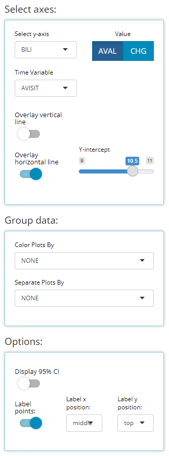
```

<br>

We *have* chosen to label our plotted data points below. This toggle simply turns labels on/off plus allows us to position the labels in the most visible location. For this example, on top & centered data labels are extremely visible and produces the following output:

<br>

```{r, echo=FALSE, fig.align='center'}
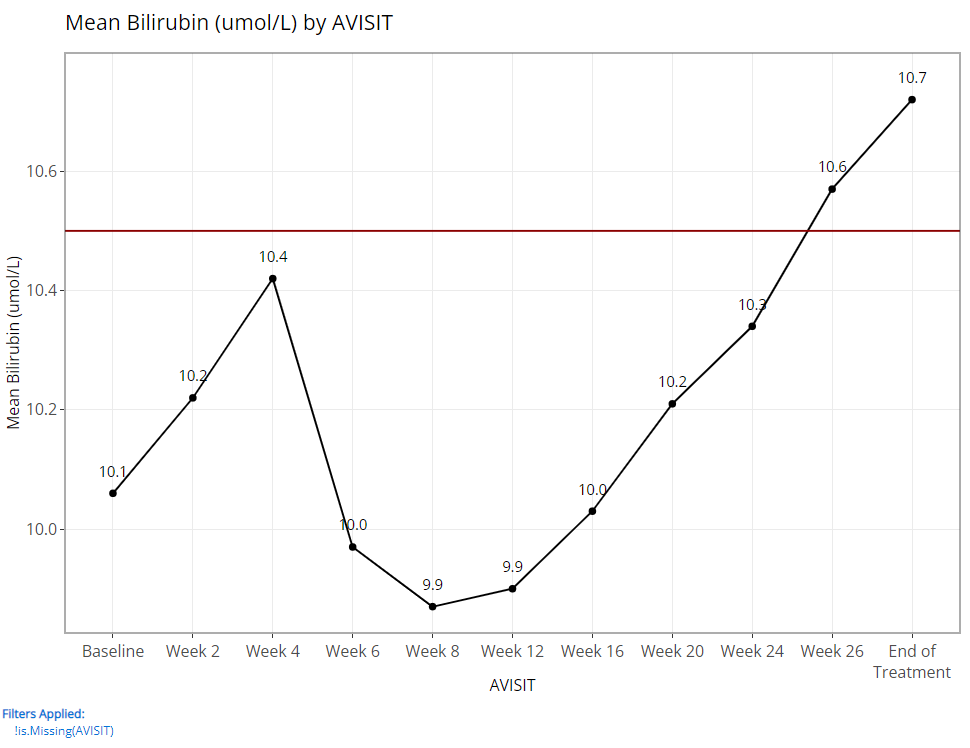
```

<br>

If we choose to display 95% confidence intervals for each mean, we need only toggle a few options (as follows) to produce the following output:


<br>

```{r, echo=FALSE, out.width="40%", fig.align='center'}
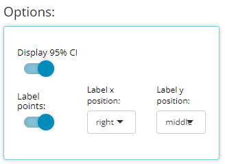
```

<br>

```{r, echo=FALSE, fig.align='center'}
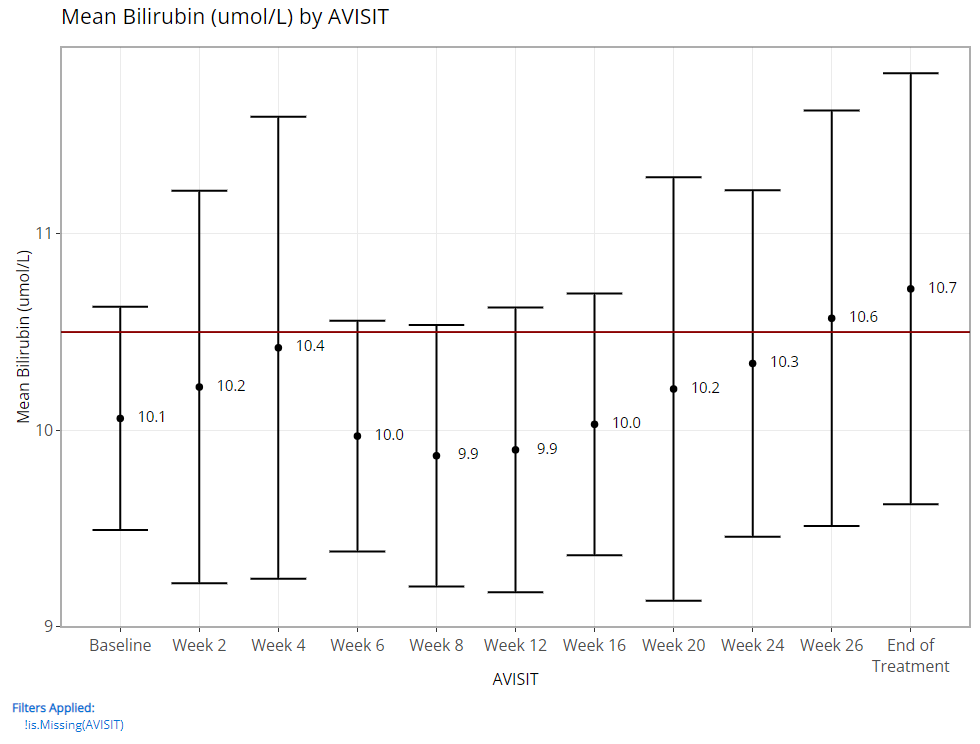
```

<br>


Besides those new controls, the "line plot - mean over time" have some of the same excellent "Group data" options as previously offered for the "scatterplot" char type. In general, both drop down lists only contain character or factor variables. 

<br>

```{r, echo=FALSE, out.width="50%", fig.align='center'}
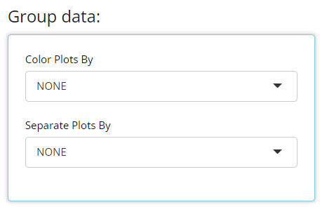
```

<br>

The **"Color Plots By"** variable helps the user create a different colored line for a variable's categories. In the example below, here is a plot where **"Color Plots By"** is `NONE`:

<br>

```{r, echo=FALSE, fig.align='center'}
knitr::include_graphics("figures/popExp/basic plot.PNG")
```

<br>

If we switch **"Color Plots by"** to from `NONE` to `AGEGR1`, the application creates the following line plot of means at each visit:


<br>

```{r, echo=FALSE, fig.align='center'}
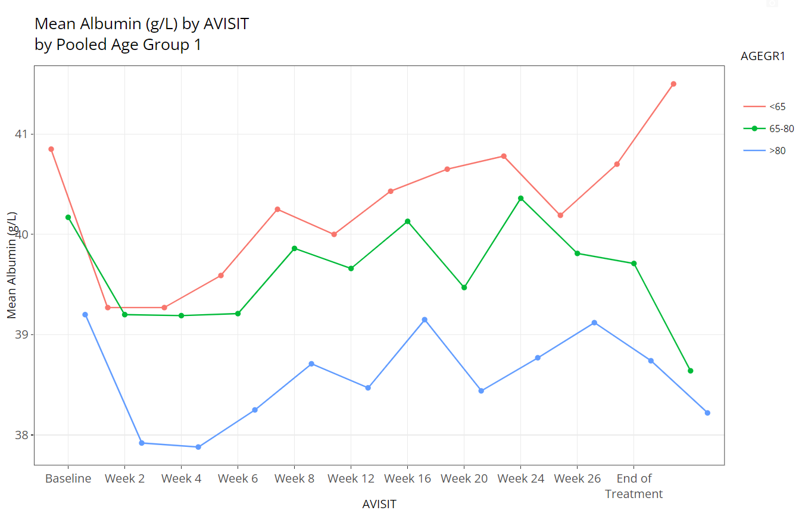
```

<br>

Similarly, if we leave **"Color Plots By"** as `NONE` and change **"Separate Plots By"** to `TRT01P`, the app creates a separate plot for each planned treatment arm:

<br>

```{r, echo=FALSE, fig.align='center'}
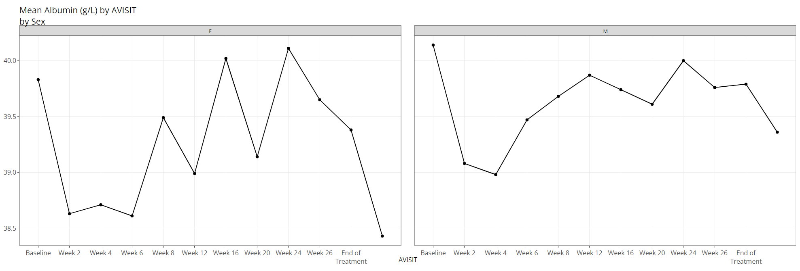
```

<br>


Lastly, the user can select a variable for both **"Color Plots By"** and **"Separate Plots By"** to view a plotted line for the combination of the selections' levels: in this case `AGEGR1` has three levels and `SEX` has two, so the end result is 2 x 3 = 6 plotted lines.

<br>

```{r, echo=FALSE, fig.align='center'}
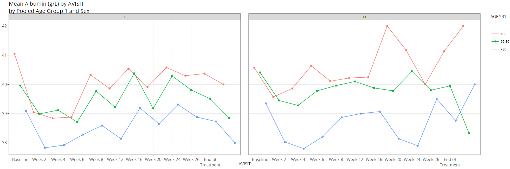
```

<br>

<br>

The plot is displayed prominently on the main panel, and embedded with a host of interactive features when moused over. In the example below, the "line plot - mean over time" contains additional information available at each plotted point like the visit variable and visit value, plus a slurry of statistics for the parameter selected (`ALB` in this case): mean, standard error, standard deviation, and patient count (N). Also notice the `SEX` variable is selected for **"Color Plot By"**. Thus, when we hover, the info boxes are color coordinated and include the chosen line's `SEX` value.


<br>

```{r, echo=FALSE, fig.align='center'}
knitr::include_graphics("figures/popExp/interactivity.gif")
```

<br>

Notice how the user can zoom-in / pan-out of any portion of the graph, retaining only the desired points. This can be helpful to filter out outliers and avoid using the "Filter Data" widget. Or perhaps its best use is to just zoom in on a cluster of densely populated area of points.

<br>

Last, hover over and click the small camera icon in the top right-hand corner of the chart area to download a PNG of a plot directly to your browser. This can be handy for sharing findings with colleagues. Or, users are equally welcome to use their favorite screenshot capturing software tools such as the snipping tool / snagit to capture results as well.

<br>

The aggregated data used to build the plot is included beneath the plot for easy download to Excel. If desired, select how many rows you'd like to view, search or sort the data, and click the **"Excel"** button on the top left corner when ready to download.


<br>

```{r, echo=FALSE, fig.align='center'}
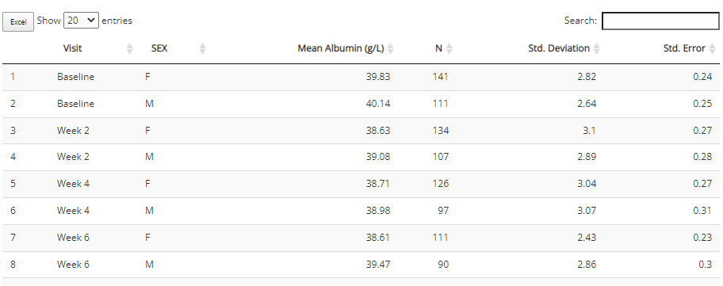
```

<br>

### Heat map - endpoint correlations

<br>

Certain analyses require to check if parameters / endpoints are highly correlated with each other. This heat map chart type helps us to do that quickly and with ease. First, the user can select any number of parameters for the x-axis and y-axis using the "Select axes" drop down lists. Doing so will generate a pair-wise grid shaded according to the correlation coefficient of your choice: either pearson (the default) or (Spearmans). Here, we've requested to only label significant correlations with alpha = 0.05.

<br>

```{r, echo=FALSE, out.width="45%", fig.align='center'}
knitr::include_graphics("figures/popExp/heatmap controls.PNG")
```

<br>

```{r, echo=FALSE, fig.align='center'}
knitr::include_graphics("figures/popExp/heatmap.PNG")
```

<br>

It's important to note that the color gradient in the graph is calibrated to the highest correlation coefficient calculated out of the bunch. When hovered over, you can view all the needed details, including exact p-values.

<br>

Furthermore, you may want to check your endpoint correlations from week-to-week. So with all other options remaining constant, if we choose 'AVISIT' as a grouping variable, the following plot is rendered:

<br>

```{r, echo=FALSE, out.width="45%", fig.align='center'}
knitr::include_graphics("figures/popExp/heatmap controls grouped.PNG")
```

<br>

```{r, echo=FALSE, fig.align='center'}
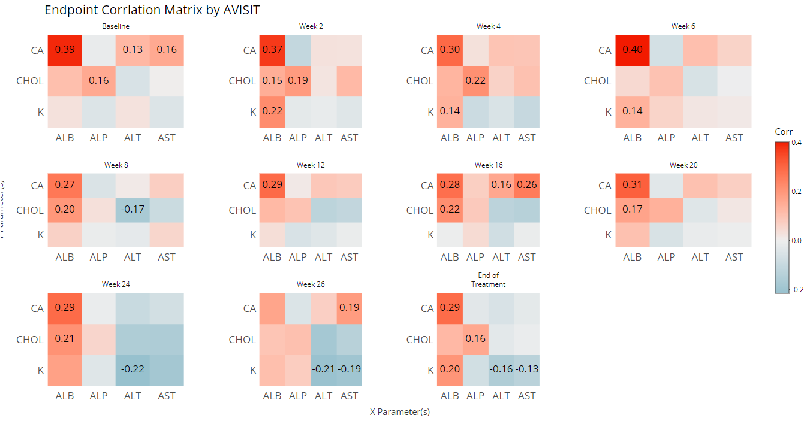
```

<br>

That's a lot of information / data to consume visually, so an export to Excel is available below the plot:

<br>

```{r, echo=FALSE, fig.align='center'}
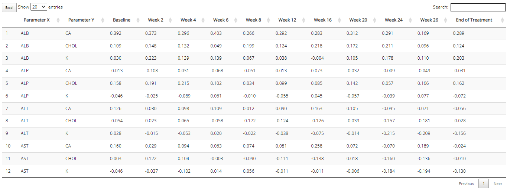
```

<br>

### Kaplan Meier Curve


<br>

Any time-to-event (`TTE`) analysis will include an obligatory Kaplan-Meier curve. And rightfully so! Much information can be gleaned from these graphics. The x-axis always contains a measure of time and the y-axis contains the probability of "surviving" up till or past those times. In the case of the CDISC Pilot data, we're measuring the probability of a patient having their first dermatological event for each time value, x. So even though the y-axis is labeled, "survival", don't think of it in terms of life or death! For any point on the graph, you can interpret plotted values as: "The probability of a patient having their first dermatological event on or past X time units is Y."

<br>

`tidyCDISC` knows which data sources contain `TTE` data based on the presence of the CDISC required `CNSR` variable. The `CNSR` variable must be either a 0 or 1. Zero indicates the patient's survival status is unknown after time period X. That is, we only have **some** information about the patient's event status up to a certain point, X, but after that time, their event status is unknown. Instead of just throwing away that data, it's valuable to know that they made it to at least time X. That time point data is retained and their last known X value is marked with a red "+" in the plot below.

<br>

In the plot control panel, we can toggle the `TTE` parameter (if more than one exists), the response value (usually `AVAL` is appropriate), and even the censor variable if case your data source has more than one. We've chosen to mark our censored observations and show 95% confidence bands in the below graphic:

<br>

```{r, echo=FALSE, out.width="40%", fig.align='center'}
knitr::include_graphics("figures/popExp/km controls.PNG")
```

<br>

```{r, echo=FALSE, fig.align='center'}
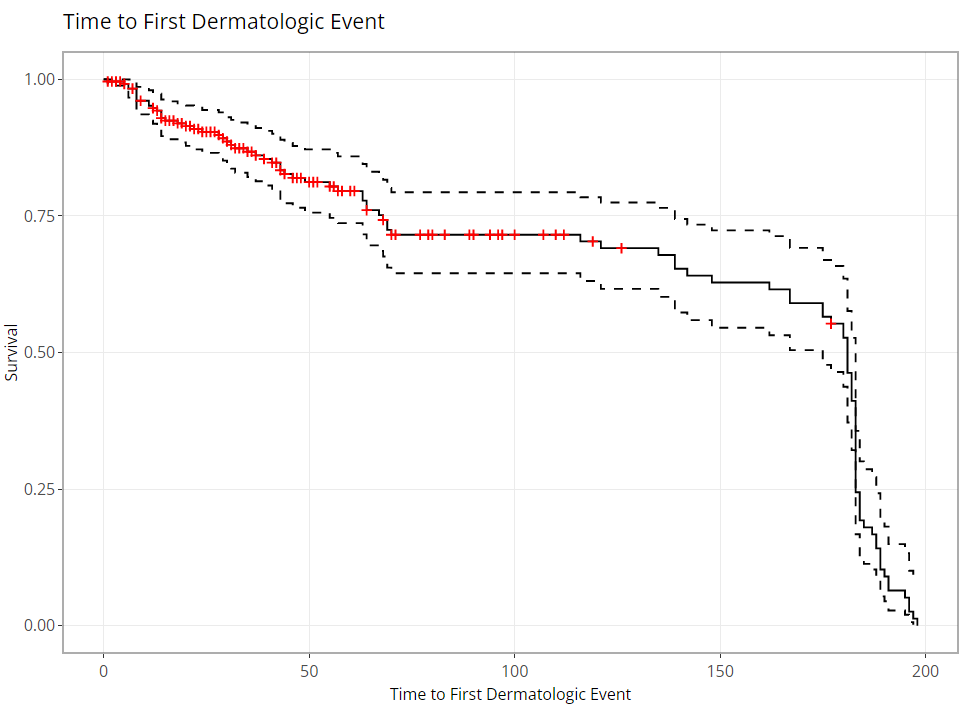
```

<br>

As you might expect, these plots can be extremely handy, and remarkably powerful when comparing time-to-event probability between groups of patients. Making a few adjustments to our options produces the following plot, which reveals differences between treatment groups. Remember: If you're interested in seeing if the probably of survival is significantly different between groups, you need only turn on the 95% confidence bands and look for any instance where the bands do not intersect between groups.


<br>

```{r, echo=FALSE, out.width="40%", fig.align='center'}
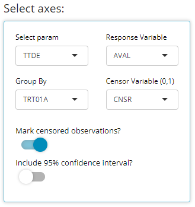
```

<br>

```{r, echo=FALSE, fig.align='center'}
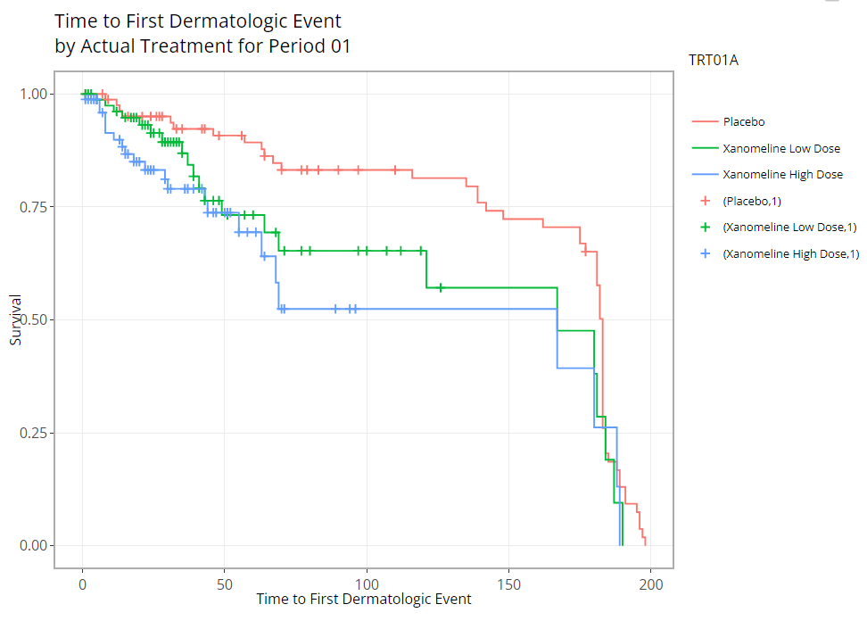
```

<br>

### Population Explorer test drive

Why wait, test out the new chart types for yourself using CDISC Pilot data! Or open the full application for demo here:

<center>
<a href="https://rinpharma.shinyapps.io/tidyCDISC/">

</a>
</center>

<br>

<div class="shiny-app-frame"> 
<iframe src = "https://rinpharma.shinyapps.io/tidyCDISC_Population_Explorer/" class="shiny-app">
</iframe>
</div>

<br>

## Misc upgrades

In addition to the major features above, this release also upgraded the `pkgdown` site documentation to be more robust and hassle-free for developers. Secondly, `tidyCDISC` now depends on updated version of IDEAFilter (>= 0.1.0.9000), and squashed bugs and other minor improvements.

## Contributions On the horizon

There's still a long list of improvements we can make to `tidyCDISC` to help users incorporate into existing workflows within their respective companies. The end goal is to continue to develop `tidyCDISC` until it's users can't help but "fall into a pit of success". To start, we have our sights on the table generator:

- **An improved UI for the Table Generator**. There are a number of standard analysis tables that are low hanging fruit and could likely be added right now. However, the current user interface poses a slight barrier to some more complex tables typically prepared for submissions. As such, we feel there needs to be a little more space to add options to each layer (or row in the drop zone) of a table.

- **Compare app output with SAS output**. If your goal is to use `tidyCDISC` for visual QC in parallel to your SAS programming efforts, it would be really convenient to compare the app's results to your own without having to sift with your own eye balls. `tidyCDISC` need only allow users to upload SAS results as `sas7bdat` file to generate R's version of a PROC COMPARE.

- **Support additional outputs, such as RTF**. This could be accomplished by various routes, but one thing to keep in mind is the `gt` helper package likely called `tgen` is under early development and promises to do this for us. This information was [disseminated](https://github.com/rich-iannone/presentations/tree/main/2021-11-02-rpharma_keynote) at 2021's R in Pharma conference.

## We need your help

Does `tidyCDISC` not work for you? [Tell us why.](https://github.com/Biogen-Inc/tidyCDISC/issues) Is there something different about the way you (or your company) handles certain tables / analyses? We want to know about it. Do you have a passion to see clinical trials analysis in R come to fruition in the next few years? Help us shape the process. Do you want to advance the industry forward by contributing to an open source project? Become a `tidyCDISC` developer!

whether you have time to contribute code to the project or not, we appreciate your feedback. We'd love to hear about any issues or improvements you'd like to see in the app by opening an [issue](https://github.com/Biogen-Inc/tidyCDISC/issues) in GitHub!


<br> 
<br>
<br>

Enjoy the new release!

<br> 
<br>
<br>


