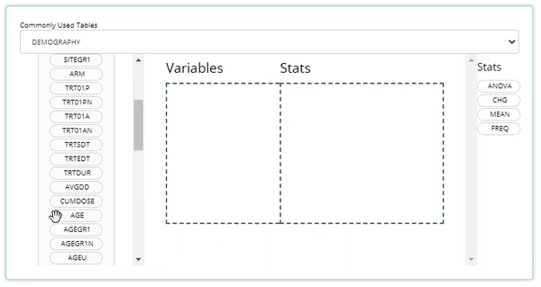

```{r, include = FALSE}
knitr::opts_chunk$set(
  collapse = TRUE,
  comment = "#>",
  fig.path = "man/figures/"
)
```

On the road to generating desirable clinical tables and figures in R, `tidyCDISC` took some pioneering first steps towards that goal by open sourcing an interactive platform in `shiny` for all to use. However, the initial release was a minimum viable product and only promised users a foundation upon which to build. The latest release of `tidyCDISC` starts to build upon that foundation with a myriad of useful features and even lays some more footings for future expansion.

##  Big news for the **Table Generator**

Below are a number of improvements that enhance the user's table building experience (in and outside of the app). Checkout each feature and then take it for a spin in our **Table Generator** tutorial. But before we get that far, just a quick refresher: if you want to build a table using the `tidyCISC`, all you need to do is drag and drop a variable or endpoint from the uploaded data on the left and pair it with an appropriate stat block on the left. Below, we drag the `AGE` block from the `ADSL` and drag the `MEAN` block from the list of Stats to calculate summary statistics on patient `AGE` within the trial. For more information on how to use the **Table Generator**, visit the respective [user guide](https://biogen-inc.github.io/tidyCDISC/articles/x01_Table_Generator.html).

<br>

```{r, echo=FALSE}

```

<br>

### New Stat blocks 

New "STAT Blocks", such as `Y FREQ`, `MAX FREQ`, `NON-MISSING`, and a pair of `NESTED FREQ` blocks were added to the lineup. Each provides achieve a commonly desired output when paired with the appropriate variable. Let's briefly review each of the new blocks (grouped in red below).


```{r, echo=FALSE, fig.align = 'center'}
knitr::include_graphics("figures/tableGen/new_release_stat_blocks.PNG")
```

<br>

- `Y FREQ`: Pair this STAT block with any flag variables (usually ending in 'FL', like `DTHFL`) that contain 'Y' values. The output will include a count and percentage for **only** the patients with 'Y' values.

```{r, echo=FALSE, out.width="80%", fig.align = 'center'}
knitr::include_graphics("figures/tableGen/TG Y FREQ.PNG")
```

<br> 

- `MAX FREQ`: This stat block can only be paired to variables (VAR) that have a "N" (VARN) counterpart. For example, it's useful for variables like `AESEV`, when subjects should only be counted once at their maximum `AESEVN` (VARN) value. So, when `MAX FREQ` is paired with `AESEV` or `AESEVN`, the frequencies will reflect maximum severity of an adverse event during the trial.

```{r, echo=FALSE, out.width="80%", fig.align = 'center'}
knitr::include_graphics("figures/tableGen/TG MAX FREQ.PNG")
```

<br> 

- `NON MISSING`: A handy stat that counts subjects who have non-missing values for any given variable. As such, it can help provide a high level measure of how many subjects had some value, as seen below with `AEDECOD`

```{r, echo=FALSE, out.width="80%", fig.align = 'center'}
knitr::include_graphics("figures/tableGen/TG NON MISSING.PNG")
```

<br> 

- `NESTED FREQ DSC`: Notice when using this stat block, you'll need to choose a variable to "nest" inside the values / levels of another. Without the nested variable selected (ie `NONE` is selected), the subject counts and percentages are displayed in descending order. Place the high level variable (like `AEBODSYS`) on the left hand side and select the more granular variable to be "nested" inside of it, like `AEDECOD`. Then the output will show all the `AEDECOD` values that exist within each `AEBODSYS`, all sorted descending. `NESTED FREQ ABC` provides the same functionality as `NESTED FREQ DSC`, but organizes the variables and it's values in alphabetical order!

```{r, echo=FALSE, out.width="60%", fig.align = 'center'}
knitr::include_graphics("figures/tableGen/TG Nested Freq.PNG")
```


```{r, echo=FALSE, out.width="80%", fig.align = 'center'}
knitr::include_graphics("figures/tableGen/TG Nested Freq2.PNG")
```


<br>


### All new 'standard analysis' tables

There are a set of tables / listings that users need to build frequently, due to their common inclusion in submission filings to regulatory authorities. With the new STAT blocks mentioned above, `tidyCDISC` could now achieve dozens of standard analysis tables by just plugging in the correct variables from your ADaM data. As such, the Table Generator contains the following 'recipes' for commonly used tables:

<br> 

```{r, echo=FALSE, out.width="90%", fig.align = 'center'}
knitr::include_graphics("figures/tableGen/TG STAN dropdown.PNG")
```

<br> 

When data needed to produce certain outputs aren't present, the list of available tables in this drop down will change. For example, if an `ADAE` is not uploaded, then all the AE tables will disappear from the above list.

<br> 

When one of these tables is selected, the table generator simply compiles the needed variable and stat blocks in the correct order to generate the desired output. This can be particularly useful for tables like #41 "Blood Chemistry actual values by visit" since it would be cumbersome to manually drag in a `MEAN` block for each week and each blood chemistry parameter, as there can be many. See snapshot of this automation below:

<br> 

```{r, echo=FALSE, out.width="80%", fig.align = 'center'}
knitr::include_graphics("figures/tableGen/TG STAN TAB41 DD.PNG")
```


```{r, echo=FALSE, out.width="80%", fig.align = 'center'}
knitr::include_graphics("figures/tableGen/TG STAN TAB41.PNG")
```

<br>


### An R Script Downloader

Finally, `tidyCDISC` has made it effortless to reproduce analyses performed in the app from your local RStudio session. 


### Test drive

Place holder for table generator tutorial app hosted on shinyapps.io.

## Once you **Pop**, the fun don't stop

New Chart types! The initial release of `tidyCDISC` included some generic charts that *could* stretch and flex into something that could be useful. However, the recent release focused making canned charts that get to the heart of the matter.

### line plot - means over time
### Heat map - endpoint correlations
### Kaplan Meier Curve (when `TTE` class data uploaded)

## Misc
Upgraded `pkgdown` site documentation to be more robust and hassle-free for developers. Depends on updated version of IDEAFilter (>= 0.1.0.9000). Squashed bugs and other minor improvements

## Contributions On the horizon

There's still a long list of improvements we can make to `tidyCDISC` to help users incorporate into existing workflows within their respective companies. The end goal is to continue to develop `tidyCDISC` until it's users can't help but "fall into a pit of success". To start, we have our sights on the table generator:

- **An improved UI for the Table Generator**. There are a number of standard analysis tables that are low hanging fruit and could likely be added right now. However, the current user interface poses a slight barrier to some more complex tables typically prepared for submissions. As such, we feel there needs to be a little more space to add options to each layer (or row in the drop zone) of a table.

- **Compare app output with SAS output**. If your goal is to use `tidyCDISC` for visual QC in parallel to your SAS programming efforts, it would be really convenient to compare the app's results to your own without having to sift with your own eye balls. `tidyCDISC` need only allow users to upload SAS results as `sas7bdat` file to generate R's version of a PROC COMPARE.

- **Support additional outputs, such as RTF**. This could be accomplished by various routes, but one thing to keep in mind is the `gt` helper package likely called `tgen` is under early development and promises to do this for us. This information was [disseminated](https://github.com/rich-iannone/presentations/tree/main/2021-11-02-rpharma_keynote) at 2021's R in Pharma conference.

## We need your help

Does `tidyCDISC` not work for you? [Tell us why.](https://github.com/Biogen-Inc/tidyCDISC/issues) Is there something different about the way you (or your company) handles certain tables / analyses? We want to know about it. Do you have a passion to see clinical trials analysis in R come to fruition in the next few years? Help us shape the process. Do you want to advance the industry forward by contributing to an open source project? Become a `tidyCDISC` developer!

whether you have time to contribute code to the project or not, we appreciate your feedback. We'd love to hear about any issues or improvements you'd like to see in the app by opening an [issue](https://github.com/Biogen-Inc/tidyCDISC/issues) in GitHub!


<br> 
<br>
<br>

Enjoy the new release!

<br> 
<br>
<br>


