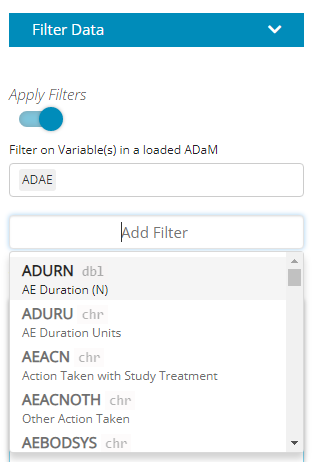

```{r, include = FALSE}
knitr::opts_chunk$set(
  collapse = TRUE,
  comment = "#>",
  fig.path = "man/figures/"
)
```

Version 0.2.0 of tidyCDISC has just been released and provides many improvements and new features. This new version has some new features for the Table Generator, as well as some general changes, enhancements, and bug fixes.


##  General changes


### `OS Health` and `riskmetric` badges

The `OS Health` and `riskmetric` badges are now displayed in the README.md file.

<br>

```{r, echo=FALSE, out.width="80%", fig.align = 'center'}

```

<br>


### Study ID displayed 

After you have selected and loaded your datasets, the Study ID (or IDs, if there are multiple studies) will be displayed on each tab. This lets you easily see which studies you have loaded.

<br>

```{r, echo=FALSE, out.width="90%", fig.align = 'center'}

```

<br>


## Changes to Table Generator

Several new features and enhancements have been added to the Table Generator.

<br> 

### RTF export option for tables

You can now export your table from the Table Generator as an RTF document. After you generate your table on the screen, select RTF as the Download Type and click on the Download Table button. It will ask you for the file name and location of the RTF document, and then you can open the document to view.

<br> 

```{r, echo=FALSE, out.width="80%", fig.align = 'center'}

```

<br> 


```{r, echo=FALSE, out.width="90%", fig.align = 'center'}

```

<br> 

The RTF document is generated using the `gt` package. Options for customization of RTF output are currently limited, but we will be adding new features as they are implemented in the `gt` package.

<br> 

### Automatic footnote with Source and Run Date

A footnote with the Source and Run Date is automatically added to all tables now.

<br> 

```{r, echo=FALSE, out.width="90%", fig.align = 'center'}

```

<br> 

### User-defined footnotes

A Table Footnote field has been added where a user can enter a custom footnote. The footnote will be displayed below the Source footnote.

<br> 

```{r, echo=FALSE, out.width="80%", fig.align = 'center'}

```

<br>

```{r, echo=FALSE, out.width="80%", fig.align = 'center'}

```

<br>

### Display analysis timepoints for each visit

If the analysis timepoint (ATPT) variable is present in a dataset, you have the option in the Table Generator to display the results at each timepoint of a visit. Under the Variables block, you can select “ALL” timepoints or individual timepoints. If you drag multiple variables, you can select timepoints for each variable.

<br> 

```{r, echo=FALSE, out.width="80%", fig.align = 'center'}

```

<br>

```{r, echo=FALSE, out.width="80%", fig.align = 'center'}

```

<br>

### Select “ALL” timepoints and/or visits

If a time- or visit-based statistic is chosen in the Table Generator, you can select “ALL” for the timepoints and/or visits. “ALL” is now the default value, and you can change it manually to a single timepoint or visit.

<br> 

```{r, echo=FALSE, out.width="80%", fig.align = 'center'}

```

<br>

```{r, echo=FALSE, out.width="80%", fig.align = 'center'}

```

<br>

### “ALL” is default visit selection for Table 41

For Table 41 (“Blood Chemistry actual values by visit”), the visit dropdown menu for Stats now has “ALL” as the default selection. All visits will be selected for each Variable selected. You can always manually change it to a single visit if you like.

<br> 

```{r, echo=FALSE, out.width="80%", fig.align = 'center'}

```

<br> 

## Changes to Population Explorer

### Population Explorer filtering depends on datasets

The columns available for filtering in the Population Explorer now depend upon the dataset(s) selected for filtering.

You can see which datasets are loaded on the Data tab. In this case, the ADSL, ADVS, ADAE, and ADLBC datasets are loaded.


<br> 

```{r, echo=FALSE, out.width="40%", fig.align = 'center'}

```

<br> 

In the Population Explorer, click on the field “Filter on Variable(s) in a loaded ADaM” and select the dataset you want to filter on:

<br> 

```{r, echo=FALSE, out.width="40%", fig.align = 'center'}

```

<br> 

After you select a dataset, click on the Add Filter button and you will see a dropdown with the variables in the selected dataset.

<br> 

```{r, echo=FALSE, out.width="40%", fig.align = 'center'}

```

<br> 

Click on one of the variables, and a field will appear where you can select the values for that variable:

<br> 

```{r, echo=FALSE, out.width="40%", fig.align = 'center'}

```

<br> 

AARON: Do we want to include the following Miscellaneous enhancements?

## Miscellaneous enhancements 

- Added an app.R file so that the Shiny app can be run directly from `shiny::runGitHub()` or `runUrl()`

- Ensured Table Generator output automatically updates the table name when a "standard analysis" is selected

- Engineered more user-friendly function to create the Table Generator output from the block data

- Cleaned up downloadable R Script to replicate Table Generator output

- Fixed bug where `data_from` was erroneously listed as a grouping option in the Population Explorer

- Cleaned up JS to "standard analyses" drop down


AARON: The below section is copied from the previous release. Modify?

## Contributions On the horizon

There's still a long list of improvements we can make to `tidyCDISC` to help users incorporate into existing workflows within their respective companies. The end goal is to continue to develop `tidyCDISC` until it's users can't help but "fall into a pit of success". To start, we have our sights on the table generator:

- **An improved UI for the Table Generator**. There are a number of standard analysis tables that are low hanging fruit and could likely be added right now. However, the current user interface poses a slight barrier to some more complex tables typically prepared for submissions. As such, we feel there needs to be a little more space to add options to each layer (or row in the drop zone) of a table.

- **Compare app output with SAS output**. If your goal is to use `tidyCDISC` for visual QC in parallel to your SAS programming efforts, it would be really convenient to compare the app's results to your own without having to sift with your own eye balls. `tidyCDISC` need only allow users to upload SAS results as `sas7bdat` file to generate R's version of a PROC COMPARE.


## We need your help

Does `tidyCDISC` not work for you? [Tell us why.](https://github.com/Biogen-Inc/tidyCDISC/issues) Is there something different about the way you (or your company) handles certain tables / analyses? We want to know about it. Do you have a passion to see clinical trials analysis in R come to fruition in the next few years? Help us shape the process. Do you want to advance the industry forward by contributing to an open source project? Become a `tidyCDISC` developer!

whether you have time to contribute code to the project or not, we appreciate your feedback. We'd love to hear about any issues or improvements you'd like to see in the app by opening an [issue](https://github.com/Biogen-Inc/tidyCDISC/issues) in GitHub!


<br> 
<br>
<br>

Enjoy the new release!

<br> 
<br>
<br>


