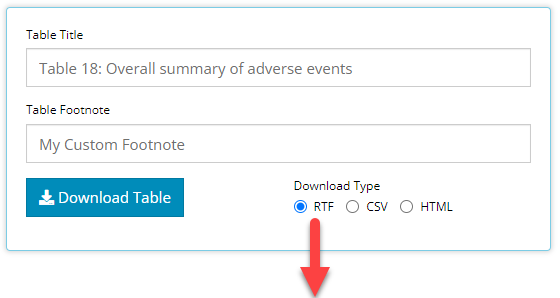
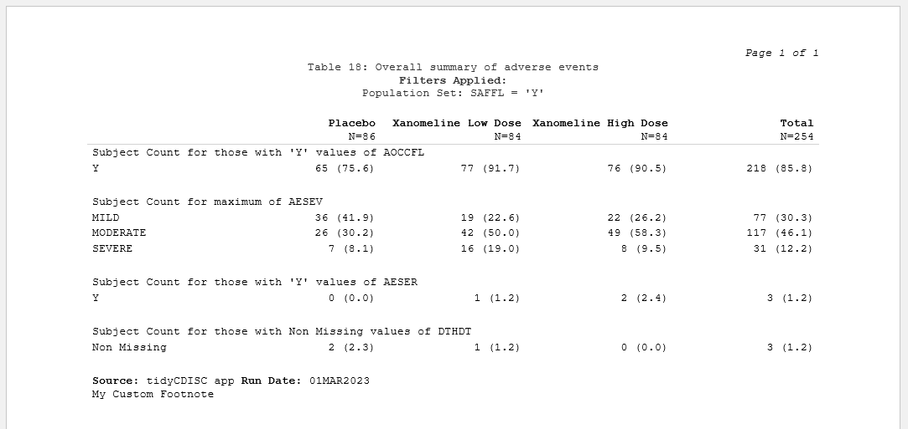
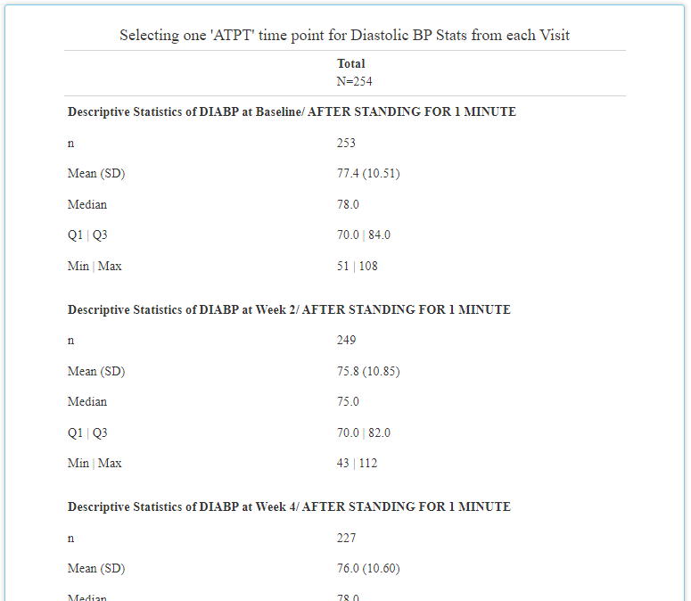

```{r, include = FALSE}
library(fontawesome)
knitr::opts_chunk$set(
  collapse = TRUE,
  comment = "#>",
  fig.path = "man/figures/"
)
```

Version 0.2.1 of `tidyCDISC` was released in March, 2023 and provides improvements to existing functionality, introduces new features, and squashes some nasty bugs. As you'll read, most of the changes impact the the `Table Generator`.


## Impacting all Modules/ Tabs

### Study ID prominently displayed 

After datasets are loaded into the application, the Study ID value is now displayed on each tab just above the content on each tab. This quickly reminds the user of which study they're analyzing, especially if they have multiple study analyses open at the same time!

<br>

```{r, echo=FALSE, out.width="90%", fig.align = 'center'}
knitr::include_graphics("figures/blog-0-2-1/studyid_w_arrow.png")
```

<br>


## Table Generator Enhancements

### Reformatting outputs to look more CSR-like

This is an on-going effort that the `tidyCDISC` dev team has prioritized. The table contains the exact same information as before, but now it resembles what you'd expect a clinical trial CSR output to look like. And overtime, it will get even better! Previously, the output was littered with horizontal lines (as seen below) and leveraged the same font as the rest of the application. However, now the extra lines have been eradicated and "Times New Roman" font leveraged.


<br> 

#### Before:

```{r, echo=FALSE, out.width="80%", fig.align = 'center'}
knitr::include_graphics("figures/blog-0-2-1/hlines_present.png")
```

<br> 

#### After:
```{r, echo=FALSE, out.width="90%", fig.align = 'center'}
knitr::include_graphics("figures/blog-0-2-1/hlines_gone.png")
```

<br> 

### Export tables to RTF

That's right! Users can (finally) export any table as an RTF document. After you've perfected the design of your table in the app, select `r fa(name = "circle-dot", fill = "blue", height = "1em")` **RTF** as the Download Type and click on the Download Table button. It will ask you for the file name and location of the RTF document, and then you can open the document to view.

<br> 

```{r, echo=FALSE, out.width="80%", fig.align = 'center'}

```

<br> 


```{r, echo=FALSE, out.width="90%", fig.align = 'center'}

```

<br> 

Options to further customize RTF output are currently limited, but the development team plans to add additional functionality in the future.

<br> 

### Footnotes!

You may have noticed in the example above, but all tables now automatically receive a `Source` and `Run Date` footnote and optionally, can contain a user-defined footnote. The latter is rather straight forward: the new "Table footnote" field allows users to slap a custom footnote onto the bottom of any table output. Just update the text field with any content you want, and it will immediately show up on the table.

<br> 

```{r, echo=FALSE, out.width="80%", fig.align = 'center'}
knitr::include_graphics("figures/blog-0-2-1/table_footnote_field_arrow.png")
```

<br>

```{r, echo=FALSE, out.width="80%", fig.align = 'center'}

```

<br>

Next, you can probably guess that all tables generated in the app will now receive a `Source` and `Run Date` footnote. The '`Run Date` field is self-explanatory, cataloging the date in which the analysis was run. Conversely, the `Source` entry will vary depending on the context in which the table was produced. For example, if the output was created and downloaded in the application, the `Source` will always display: "tidyCDISC app". However, when the user doesn't upload the CDISC Pilot data and then a reproducible R script is downloaded and run locally, `Source` will record the file location of the data used to produce the output. **Give it a try!**

<br> 


### Break out by "analysis time point"

The table generator can now intelligently identify when your `BDS` data contains more than one value (`AVAL`) for any parameter (`PARAM`) and visit. This most frequently happens in the presence of an analysis time point (`ATPT`) variable(s) in the data. The presence of `ATPT`-style variables are common in `ADVS` and `ADEG` datasets, to name a few. Prior to this enhancement, the values were aggregated together but now you can display output for each time point measured during a visit. To take advantage, watch for a new dropdown that appears on your variable blocks after they've been placed in the drop zone. Below is an example when `ATPT` exists in the uploaded `ADVS` data. When applicable, you can select "NONE" to revert to the old behavior of aggregating all time points. Conversely, selecting “ALL” will display output for each time point value available. In the example below example, that would produce a table containing a descriptive statistics on diastolic blood pressure while (1) lying down for 5 minutes, (2) after standing for 1 minute, and again (3) after standing for 3 minutes. Notice how these three outputs are created for each visit below.

<br> 

```{r, echo=FALSE, out.width="80%", fig.align = 'center'}
knitr::include_graphics("figures/blog-0-2-1/select_all.png")
```

<br>

```{r, echo=FALSE, out.width="80%", fig.align = 'center'}
knitr::include_graphics("figures/blog-0-2-1/select_all_output.png")
```


<br>

Last, you can (of course) select only one specific time point to display that measurement (and only that measurement). Let's see what that looks like (below) by selecting "After standing for 1 minute" and displaying "All" visits in our `MEAN` stat block:
 

<br> 

```{r, echo=FALSE, out.width="80%", fig.align = 'center'}
knitr::include_graphics("figures/blog-0-2-1/atpt_dropdown.png")
```

<br>

```{r, echo=FALSE, out.width="80%", fig.align = 'center'}

```

<br>

### Simplified function call to reproduce tables

If you're using `tidyCDISC` as an R script generator for reproducing your favorite tables, then your R files just a little cleaner. We've engineered a user-friendly function called `tidyCDISC::tg_gt()` that consolidates a lot of the code used to easily generate a table from the "block data". If you don't know what block data is, it's basically just configuration data.frame you've developed via the drag and drop interface in the app. In other words, "Block data" tells `tidyCDISC` how to build the table, but don't worry about it too much for now. The next release of `tidyCDISC` will include code that helps users manually create "block data" in a lot more intuitive way.

For more information on this releases' new function, run `?tidyCDISC::tg_gt` in your R console AND download an R script from the app to see it in action.


### Other enhancements 

- Added `OS Health` and `riskmetric` badges to the `README`

- Resolved issue when filtering module in Population Explorer where columns for non-selected datasets would display erroneously

- Added an app.R file so that the Shiny app can be run directly from `shiny::runGitHub()` or `runUrl()`

- Table title populates automatically when a "standard analysis" is selected

- “ALL” is now the default visit selection for standard analysis 41

- Fixed bug where erroneously variable was listed as a grouping option in the Population Explorer


## Contributions On the horizon

There's still a long list of improvements we can make to `tidyCDISC` to help users incorporate into existing workflows within their respective companies. The end goal is to continue to develop `tidyCDISC` until it's users can't help but "fall into a pit of success".

So we want to hear from you! Does `tidyCDISC` not work for you? then [tell us why.](https://github.com/Biogen-Inc/tidyCDISC/issues/new) Is there something different about the way you (or your company) handles certain tables / analyses? We want to know about it. Do you have a passion to see clinical trials analysis in R come to fruition in the next few years? Help us shape the process. Do you want to advance the industry forward by contributing to an open source project? Become a `tidyCDISC` developer!

Whether you have time to contribute code to the project or not, we appreciate your feedback. We'd love to hear about any issues or improvements you'd like to see in the app by opening an [issue](https://github.com/Biogen-Inc/tidyCDISC/issues/new) in GitHub!


<br> 
<br>
<br>

Enjoy the new release!

<br> 
<br>
<br>


