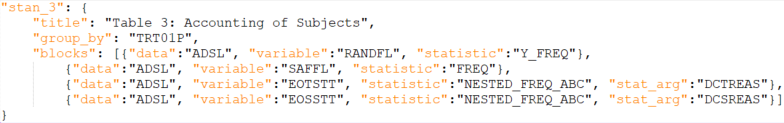

```{r, include = FALSE}
knitr::opts_chunk$set(
  collapse = TRUE,
  comment = "#>"
)
```

Learn how RECIPES are parsed by the application so that you can write your own custom tables.

 

## The structure of `recipes.json`

This tutorial will walk you through the structure of the `recipes.json` file.

### The table object

Within the `recipes.json` file you'll find a list of table objects. Below is the standard table #3 object.

```{r, out.width="90%", out.height="90%", echo=FALSE}

```

The naming of the table is important! When pulling this data into the application S3 objects are heavily utilized. In this example, the table object will be given the class `stan_3`. The application will use this information to correctly process the data used in the creation of the table.

The table object can contain a number of sub-objects. In the example, there are three such objects with the following key names: `title`, `group_by`, and `blocks`. The `title` object contains the text to be used as the title in the table generation. The `group_by` object contains the name of the field that the table generator should use to group by. The `blocks` object is more complicated.

### The `blocks` object

The `blocks` object is an array of `block` objects. The setup is very similar to blocks used in the Table Generator. The `blocks` object and the blocks from the Table Generator are two sides of the same coin, hence the naming convention used. Each `block` is a named list that can contain a number of different elements. Some of the most important elements are included in the example: `data`, `variable`, and `statistic`.

The `data` element denotes which data set provided is being used to create the block. The `variable` element denotes the field or parameter from the data set used for the block's statistical computation. The `statistic` element denotes which statistic is being calculated for the field/parameter.

A few other elements can also be present within a `block` object. The `recipes.json` file contains a couple more: `stat_arg` and `stat_options_fn`.  Currently no other elements have usage in the application, but active development will be changing this soon.

## The parsing of `recipes.json`

### The table object

As stated previously, the key/name of the table object in `recipes.json` is assigned as a class when pulling the table object into R. This class is used to determine how the pre-filtering should be completed in the functions `filter_adsl()` and `filter_adae()`. New outputs can be created for a hypothetical table with key `tbl_01` by defining `filter_adsl.tbl_01()` and `filter_adae.tbl_01()`.

The key/name of the table object will also be used to define the option in the recipe select input in the application.

### The `blocks` object

There is one additional sub-object not yet mentioned, the `recipe_inclusion` object, which can assign a class to the `blocks` object. The standard inclusion criteria is for all data sets in a `blocks` object to be present in the list of data sets uploaded and for all variables listed in the `block` objects to be present in the data set identified with them. Assigning a value to `recipe_inclusion` can affect the rules for inclusion in the recipes select input HTML element. If a user had a special set of criteria, they could assign `crit_01` to `recipe_inclusion` and assign the function `recipe_inclusion.crit_01()` to determine the criteria.

### The `block` object

Currently only one potential class is being assigned to the `block` object and it is the value of element `stat_options_fn`. For certain statistics, such as `MEAN`, a drop down is provided in the statistic block (e.g. `AVISIT` values for `MEAN`). In the event the user wants a block to output multiple weeks, they can provide a value for `stat_options_fn` and its corresponding function (i.e. A value of `opt_01` would correspond to `stat_options.opt_01()`). The user could also opt to hard code these values using the element `stat_options`.

The element `stat_arg` is used to determine the input for a statistic with a drop down. These two elements together can allow the user to create multiple generated blocks with only one `block` object.