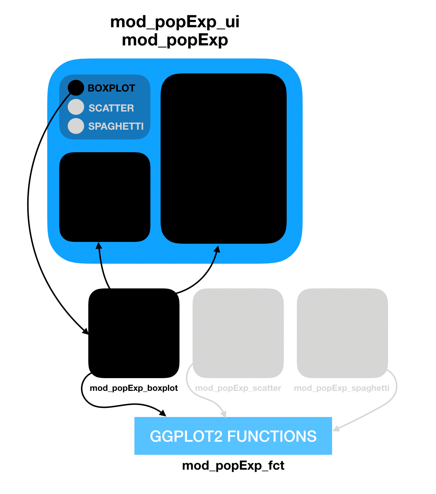

Making a new plot is a three step process:

- Create the plotting widgets
- Create the plotting output
- Connect the plot to the Population Explorer Module

Each plot in the Population Explorer is a submodule `mod_popExp_*.R` (where * is the plot name to be added) that is conditionally called within `mod_popExp.R` and `mod_popExp_ui.R`. The plotting module is used for the reactivity logic of the plot; the widgets needed as well as how to render them. The plot function itself is found within `mod_popExp_fct.R`

This tutorial will walk you through adding a plot module and a plot function, then applying it to the Population Explorer module using `mod_popExp_boxplot.R` as an example.

```{r, out.width="90%", out.height="90%", echo=FALSE}

```

# Create the Plotting Widgets

Inside `mod_popExp_boxplot.R`, `boxPlot_ui` is where we specify the widgets we need to create a boxplot, all wrapped inside a `wellPanel`

# Create the Plotting Output

The bulk of the server function, `boxPlot_srv` uses `updateSelectInput`s to populate the dropdown fields of the widget based on the module's data argument. The data is a reactive that is passed down from the parent module. The boxplot itself is created using the function `IDEA_boxplot()`, located in `mod_popExp_fct.R`. This function takes on the selected inputs from the widget.

## Testing

A file called `test-popExp_fct_boxplot.R` is created to test that the plot function inside `mod_popExp_fct` generates the expected output given various inputs.

# Connect to Population Explorer Module

## Connect to UI

Inside `mod_popExp_ui`, the radioButtons `plot_type` control which plot widgets and plot output the user sees. Therefore the first step is to add your plot name to the types of plots we can create:


```{r, eval=FALSE}
radioButtons(ns("plot_type"), NULL, choices = c("Scatter Plot", 
                                               "Spaghetti Plot", 
                                               "Box Plot",
                                               "New Plot Name Here!"))
```

Next we use `conditionalPanel` statements to show the correct inputs based on which plot the user selects. When the `input$plot_type` is `Box Plot` we call the `boxPlot_ui` function and name space it so that the inputs all have a prefix of both the Population Explorer module and the Box Plot module:

```{r, eval=FALSE}
conditionalPanel("input.plot_type === 'Box Plot'", ns = ns, boxPlot_ui(ns("boxPlot")))
```

## Connect to Server

On the server side we save the output of the boc plot server function to an object, `p_box`. Note that this module takes on a data argument. The user input files are properly merged and this merged dataset is what we pass to the child plot modules.

```{r, eval=FALSE}
p_box <- callModule(boxPlot_srv, "boxPlot", data = dataset)
```

## Conditionally Call Plot

Now that we have our module outputs, we can pass the graph object to Population Explorers plot_output. This takes on a switch statement where we render the module object based on which plot is selected. 

```{r, eval=FALSE}
output$plot_output <- renderPlotly({
        switch(input$plot_type,
               `Scatter Plot` = p_scatter(),
               `Box Plot` = p_box(),
               `Spaghetti Plot` = p_spaghetti(),
               `New Plot` = p_new()
        )%>% 
    ...
  })
```

