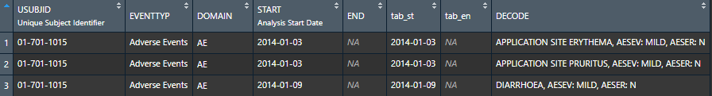

# Table Generator

Learn how to contribute useful code to the table generator tab, by topic.

 

## Create A Statistical Block

This tutorial will walk you through creating a new statistical block for the Table Generator using JavaScript and R, then writing an R function to use the block within the `gt` table.

### Create the Drag Zone Block

Within `R/mod_TableGen_ui` you'll find a list of blocks.

If you are going to create a simple block like in the case of `MEAN`, you'll give the block an id in lowercase, and a label to be displayed in uppercase. You must also give the block `class = agg`

```{r, eval=FALSE}
tags$li(id = "mean","MEAN",class = "agg")
```

If you want to create a more complicated block that changes within the drop zone, or has hover text there are a couple more arguments you must add:

```{r, eval=FALSE}
tags$li(class = "ui-state-default agg", id = "chg",
        div(tippy(div("CHG"), "Change from Baseline")))
```

- an additional `ui-state-default` class
- another div using the package `tippy` to create the text to display `CHG` and the hover text

### Create the Drop Zone Block

Under `www/inst` you will find the `script.js` file which describes the HTML for a block within the drag zone. 

Currently there are two JavaScript functions to create HTML blocks

- `simpleBlock` which creates a block like the `FREQ` block which says "FREQ" when dragged and has a delete button

- `selectWeekBlock` which creates a dropdown when the block is dragged into the drop zone, determined by the unique values in the `AVISIT` column

You can add your block to the function `$("#droppable_agg").droppable(...` like so:

```
} else if (draggableId.includes("mean")) {
    $(this).append(selectWeekBlock(newid, "MEAN", select));
}
```

Where the lowecase `mean` corresponds to the ID of the block, and `new_id` is a JavaScript function that appends a number to your block ID in case there are multiple `mean` blocks inside the dropzone. The uppercase `MEAN` is what you want your block to display. Similarly you can change this code from `selectWeekBlock` to a simple block if you don't need the week dropdown.

### Writing the function

When you drag a column block, the shiny input returns the name of the column and the data file it came from. Using the `custom_class` function, the column name is given a class of `BDS`, `ADSL`, or `OCCDS`

We can leverage these classes when creating a new statistical function because we may want to perform slightly different calculations on an ADSL or BDS, for instance.

Let's look at `mod_tableGen_fct_freq` as an example:


### Create a function

```{r, eval=FALSE}
app_freq <- function(column, week, group, data) {
  UseMethod("app_freq", column)
}


app_freq.default <- function(column, week, group, data) {
  rlang::abort(glue::glue(
    "Can't calculate mean because data is not classified as ADLB, BDS or OCCDS"
  ))
}
```


### Create a method for ADSL

In the case of ADSL we need to calculate the frequency for the entire table, or if groups are selected and return a table of values to be used in gt.

```{r, eval=FALSE}
app_freq.ADSL <- function(column, week, group = NULL, data) {
  
  column <- rlang::sym(as.character(column))
  
  if (!is.character(data[[column]])) {
    stop(paste("Can't calculate frequency, ", column, " is not categorical"))
  }
  
  if (is.null(group)) {
    data %>%
      distinct(USUBJID, !!column) %>%
      count(!!column) %>%
      group_by(!!column) %>%
      summarise(n = sum(n)) %>%
      ungroup() %>%
      mutate(prop = n/sum(n)) %>%
      mutate(x = paste0(n, " (", round(prop*100, 2), ")")) %>%
      select(!!column, x)
  } else {
    
    if (group == column) {
      stop(glue::glue("Cannot calculate frequency for {column} when also set as group."))
    }
    
    group <- rlang::sym(group)
    data %>%
      distinct(USUBJID, !!column, !!group) %>%
      count(!!column, !!group) %>%
      group_by(!!group) %>%
      mutate(prop = prop.table(n)) %>%
      mutate(v1 = paste0(n, ' (', round(prop*100, 2), ')')) %>%
      select(-n, -prop) %>% 
      spread(!!group, v1)
  }
}
```

### Create a method for BDS

We don't need a method for BDS because we currently only import PARAMCD blocks and since AVAL and CHG are numeric we can't calculate frequency:

```{r, eval=FALSE}
app_freq.BDS <- function(column, week, group = NULL, data) {
  rlang::abort(glue::glue(
    "Can't calculate frequency for BDS - {column} is numeric"
  ))
}
```

Feel free to explore the mean, ANOVA, and chg files for other statistical examples. For instance, blocks with BDS methods use the `week` argument which is supplied from the block's dropdown. 

## Putting it all together

Once you have your statistical function, you need to add it to the `app_methods` function:

```{r, eval=FALSE}
app_methods <- function(agg, column, week, group, data) {
  if (agg == "MEAN") {
    app_mean(column, week, group, data)
  } else if (agg == "FREQ") {
    app_freq(column, week, group, data)
  } else if (agg == "ANOVA") {
    app_anova(column, week, group, data)
  } else {
    app_chg(column, week, group, data)
  }
}
```

This function will look for the name of the dragged in statistical block and apply the correct statistical function based on the block's name. Since the first argument of the function is the column to apply the statistical block on, it will look for the data file the column came from and choose the correct method. 

Finally this function is used within a `map` in `mod_tableGen` so each statistical block is applied to each column in the drop zone iteratively.


<br>
<br>


---


<br>
<br>
<br>
<br>


# Population Explorer

Learn how to contribute useful code to the population explorer tab, by topic.


## Add a Graph to the Population Explorer

We plot points, but we graph functions.

Adding a new graph to the population explorer is a four-step process:

- Create the plotting widgets
- Create the plotting output
- Connect the plot to the Population Explorer Module
- Testing 

Each plot in the Population Explorer is a submodule `mod_popExp_<newgraph>.R` (where <newgraph> is the plot name to be added) that is conditionally called within `mod_popExp.R` and `mod_popExp_ui.R`. The plotting module is used for the reactivity logic of the plot; the widgets needed as well as how to render them. The plot function itself is found within `mod_popExp_fct_<newgraph>.R`

This tutorial will walk you through adding a graph module and a graph function, then applying it to the Population Explorer module using `mod_popExp_boxplot.R` and `mod_popExp_fct_boxplot.R` as examples.
This is what the population explorer looked like when it first launched.  Note we are using a small (N=15) test ADSL dataset here:

```{r, out.width="90%", out.height="90%", echo=FALSE}
knitr::include_graphics("figures/popExp/boxplot tidyCDISC.PNG")
```

### Create the Plotting Widgets ("ui")

Inside `mod_popExp_boxplot.R`, `boxPlot_ui` is where we specify the widgets we need to create a boxplot, all wrapped inside a `wellPanel`
```{r}
boxPlot_ui <- function(id, label = "box") {
  ns <- NS(id)
  tagList(
    h4("Select axes:"),
    wellPanel(
      selectInput(ns("yvar"), "Select y-axis", choices = NULL),
      fluidRow(column(12, align = "center", uiOutput(ns("include_var")))),
      selectInput(ns("group"), "Group By", choices = NULL),
      checkboxInput(ns("points"), "Add Points?")
    )
  )
}
```

Note that this has two selectInput widgets, a fluidRow, and a checkboxInput widget.<br>
Customize this to whatever widgets your graph requires.

### Create the Plotting Output ("server")

The bulk of the server function, `boxPlot_srv` uses `updateSelectInput`s to populate the dropdown fields of the widget based on the module's data argument. The data is a reactive that is passed down from the parent module. The boxplot itself is created using the function `app_boxplot()`, located in `mod_popExp_fct_boxplot.R`. This function takes on the selected inputs from the widget.

Here is the code for `mod_popExp_fct_boxplot.R`

```{r, eval=FALSE}
#' tidyCDISC boxplot
#' 
#' Create boxplot using either the selected response variable
#' or if a PARAMCD is selected, then plot the corresponding value
#' and filter the data by week
#' 
#' @param data Merged data to be used in plot
#' @param yvar Selected y-axis 
#' @param group Selected x-axis 
#' @param value If yvar is a PARAMCD then the user must select 
#' AVAL, CHG, or BASE to be plotted on the y-axis
#' @param points \code{logical} whether to add a jitter to the plot
#' 
#' @family popExp Functions

app_boxplot <- function(data, yvar, group, value = NULL, points = FALSE) {
  
  if (yvar %in% colnames(data)) {
    p <- ggplot2::ggplot(data) + 
      ggplot2::aes_string(x = group, y = yvar) +
      ggplot2::ylab(attr(data[[yvar]], "label"))
    
    var_title <- paste(attr(data[[yvar]], 'label'), "by", attr(data[[group]], "label"))
    
  } else {
    d <- data %>% dplyr::filter(PARAMCD == yvar)
    
    var_label <- paste(unique(d$PARAM))
    var_title <- paste(var_label, "by", attr(data[[group]], "label"))
    
    p <- d %>%
      ggplot2::ggplot() +
      ggplot2::aes_string(x = group, y = value) +
      ggplot2::ylab(glue::glue("{var_label} ({attr(data[[value]], 'label')})"))
  }
  
  p <- p + 
    ggplot2::geom_boxplot() +
    ggplot2::xlab("") +
    ggplot2::theme_bw() +
    ggplot2::theme(text = element_text(size = 12),
                   axis.text = element_text(size = 12),
                   plot.title = element_text(size = 16)) +
    ggplot2::ggtitle(var_title)
  
  
  if (points) { p <- p + ggplot2::geom_jitter() }
  return(p)
}
```

### Connect the plot to the Population Explorer Module

#### Connect to ui

Inside `mod_popExp_ui`, the radioButtons `plot_type` control which plot widgets and plot output the user sees. Therefore the first step is to add your graph name to the types of graphs we can create:


```{r, eval=FALSE}
radioButtons(ns("plot_type"), NULL, 
      choices = c("Scatter Plot", 
                  "Spaghetti Plot", 
                  "Box Plot",
	                "<newgraph>")
                      )
                  )
```

Next we use `conditionalPanel` statements to show the correct inputs based on which plot the user selects. When the `input.plot_type` is `Box Plot` the `boxPlot_ui` function is called and the "boxPlot" name space is added so that the inputs all have a prefix of both the Population Explorer module and the Box Plot module.  Do the same for your new graph.

```{r, eval=FALSE}
#wellPanel(uiOutput(ns("plot_ui")))
div(id = "pop_cic_chart_inputs", 
    conditionalPanel("input.plot_type === 'Scatter Plot'", ns = ns, scatterPlot_ui(ns("scatterPlot"))),
    conditionalPanel("input.plot_type === 'Spaghetti Plot'", ns = ns, spaghettiPlot_ui(ns("spaghettiPlot"))),
    conditionalPanel("input.plot_type === 'Box Plot'", ns = ns, boxPlot_ui(ns("boxPlot"))),
    conditionalPanel("input.plot_type === '<newgraph>'", ns = ns, boxPlot_ui(ns("<newgraph>")))
             )
```


#### Connect to Server

On the server side we save the output of the box plot server function to an object, `p_box`. Note that this module takes on a data argument. The user input files are properly merged and this merged dataset is what we pass to the child plot modules. Do the same for your new graph.

```{r, eval=FALSE}
  p_scatter <- callModule(scatterPlot_srv, "scatterPlot", data = dataset)
  p_spaghetti <- callModule(spaghettiPlot_srv, "spaghettiPlot", data = dataset)
  p_box <- callModule(boxPlot_srv, "boxPlot", data = dataset)
  p_<newgraph> <- callModule(boxPlot_srv, "<newgraph>", data = dataset)
```

Now that we have our module outputs, we can pass the graph object to Population Explorers plot_output. Don't forget to add the reactive callModule statement for your graph.  This takes on a switch statement where we render the module object based on which plot is selected. 

Note that the plot types are surrounded by back-ticks, not single quotes.  On American keyboards, the back-tick resides on the same key as the tilde ("~").  Be sure your naming conventions are consistent.  Don't use lowerCamelCase for your graph name in one place and UpperCamelCase in another.
  
```{r, eval=FALSE}
  # use plot output of the module to create the plot 
  output$plot_output <- renderPlotly({

        switch(input$plot_type,
               `Scatter Plot` = p_scatter(),
               `Box Plot` = p_box(),
               `Spaghetti Plot` = p_spaghetti(),
			   `<newgraph>` = p_<newgraph>()
        )%>% 
    ...
  })
```


### Testing

A file called `test-popExp_fct_boxplot.R` is created to test that the plot function inside `mod_popExp_fct_boxplot` generates the expected output given various inputs.

```{r, eval=FALSE}
require(testthat)
context("Create popExp Boxplot")

test_that("numeric response variable works", {
  plot <- app_boxplot(tg_data, "AGE", "SEX")
  expect_equal(quo_get_expr(plot$mapping$x), sym("SEX"))
  expect_equal(quo_get_expr(plot$mapping$y), sym("AGE"))
})

test_that("PARAMCD response variable works", {
  plot <- app_boxplot(tg_data, "DIABP", "SEX", value = "AVAL")
  expect_equal(quo_get_expr(plot$mapping$x), sym("SEX"))
  expect_equal(quo_get_expr(plot$mapping$y), sym("AVAL"))
})

test_that("adding jitter works", {
  plot <- app_boxplot(tg_data, "AGE", "SEX", points = TRUE)
  expect_equal("PositionJitter", class(plot$layers[[2]]$position)[1])
})
```

You will need to develop similar tests for you graph.  Review the `testthat()` package first.

## Example

Here is what the population explorer looks like after adding a Histogram to it.
This is using the same small ADSL dataset as above.

```{r, out.width="90%", out.height="90%", echo=FALSE}
knitr::include_graphics("figures/popExp/histogram.png")
```


<br>
<br>


---


<br>
<br>
<br>
<br>


# Individual Explorer

Learn how to contribute useful code to the individual explorer tab, by topic.

## Integrate New Events in Individual Explorer

This tutorial will walk you through how to add / display additional events on the Individual Explorer Tab. Currently, the app supports events from ADMH, ADAE, ADCM, ADSL, ADLB, and ADLBC. You'll note that most are occurrence (OCCD) class data sets which are designed to be date-oriented with the exception of ADSL, ADLB, & ADLBC. Regardless of data set class, the events tab's module extracts important dates that you (the developer) chooses from any data set for display.

When incorporating a new date / data set into the events module you'll not only need to consider additional UI elements, but there are two R functions to become familiar with which are introduced below.

### UI considerations

In `mod_indvExp_ui.R`, the input called "checkGroup" & "overlay_events" are introduced to the app's user interface. The former is for the `Events` tab and the latter is for the `Visits` tab. 

```{r, eval=FALSE}
# Events Tab
checkboxGroupInput(
  inputId = ns("checkGroup"),
  label = "For additional patient events, load an AE, LB, LBC, CM, or MH",
  choices = c(" "),
  selected = NULL,
  inline = TRUE
)
```


```{r, eval=FALSE}
# Visits Tab
checkboxGroupInput(
  ns("overlay_events"),
  label = HTML("<br/>Overlay Events:"),
  choices = c(" ")
)
```

Later, these values will get populated with server side logic that depends on what the ADaMs the user uploads & the USUBJID selected. That logic can be found in `mod_indvExpPat.R` and a snapshot is shown below. To summarize, the code checks if a supported ADaM exists, and if it does, that ADaM is assigned an domain abbreviation to be fed to the `choices` argument for our two inputs: checkGroup and overlay_events. Notice how overlay_events only receives a subset of these choices, because Labs and Medical History aren't terribly valuable vertical lines to overlay on the `Visits` tab.

```{r, eval=FALSE}
# update checkboxes on both Events and Visits Tabs
# Initialize
checked1 <- NA
checked2 <- NA
checked3 <- NA
checked4 <- NA
checked5 <- NA
mh_names <- NA

# check for "adsl" (required), "adae", "adcm", and "adlb"
if ("ADSL" %in% loaded_adams()) { checked1 <- "DS" }
if ("ADAE" %in% loaded_adams()) { checked2 <- "AE" }
if ("ADCM" %in% loaded_adams()) { checked3 <- "CM" }
if ("ADLB" %in% loaded_adams()) { checked4 <- "LB" }
if ("ADMH" %in% loaded_adams()) {
  # For ADMH, we want to create separate checkboxes for each type of 
  # Medical History Category that exist in the ADMH for the selected patient.
  mh_names <-
    datafile()[["ADMH"]] %>%
    filter(USUBJID == input$selPatNo) %>%
    distinct(MHCAT) %>%
    pull()%>%
    stringr::str_to_title()
  checked5 <- paste0("MH_",sapply(strsplit(mh_names, " "), function(x){
    toupper(paste(substring(x, 1, 1), collapse = ""))}))
}

# Combine all into a list
choices <- as.list(unlist(c(list(checked1,checked2,checked3,checked4,as.list(checked5)))))
names <- c("Milestones","Adverse Events","Concomitant Meds","Labs",mh_names) # ac: labels

# build a named list & Remove NULLs from the list
choices <- setNames(choices,names)
choices <- choices[!sapply(choices,is.na)]

# update the checkbox group
updateCheckboxGroupInput(
  session = session,
  inputId = "checkGroup",
  choices = unlist(choices),
  selected = NULL,
  inline = TRUE)

#######################################
# Version for vlines on Visits Graph
#######################################
# You can only overlay Milestones, Adverse Events, and Con Meds (currently)
choices2 <- as.list(unlist(c(list(checked1,checked2,checked3))))
names2 <- names[1:3]

# Setting up colors too
vline_eventtype_cols <- my_cols[1:3] # my_cols defined in utils_strObjs.R
v_event_cols <- setNames(vline_eventtype_cols,names2)
dashes <- c("solid","dotted","dashed")
v_event_lines <- setNames(dashes,names2)

# build a named list & Remove NULLs from the list
choices2 <- setNames(choices2,names2)
choices2 <- choices2[!sapply(choices2,is.na)]

updateCheckboxGroupInput(
  session = session,
  inputId = "overlay_events",
  choices = unlist(choices2), # optionally convert list to array
  selected = NULL)

```

Notably, to add another date-oriented data frame into the mix, you (the developer) will need to add an additional `checkedx` where `x` is the next sequential number of "checked" objects. For example, if your data set is called "ADMD" where "MD" is the abbreviation for "My Data", then you'd need to add these chunks of code into their respective positions above: 

```{r, eval=FALSE}
checked6 <- NA

# ...

if ("ADMD" %in% loaded_adams()) { checked6 <- "MD" }

# ...
choices <- as.list(unlist(c(list(checked1,checked2,checked3,checked4,as.list(checked5),checked6))))
names <- c("Milestones","Adverse Events","Concomitant Meds","Labs",mh_names, "My Data") # ac: labels

# ...

choices2 <- as.list(unlist(c(list(checked1,checked2,checked3,checked6))))
names2 <- c(names[1:3],"My Data")

```

Note that adjusting the objects `choices2` & `names2` are optional; only adjust if you (the developer) or subject matter experts (SMEs) deem it's appropriate to overlay these types of events on the plot in the `Visits` tab.

### Standardize the format of your Event data

Now that the groundwork has been established, it's time to introduce the function called `org_df_events()` which has various (well documented) arguments in the `mod_indvExp_fct_organizeEvent.R` file. This function takes a data set and manipulates it into a standard form. After being standardized, the app can (and will) combine it with other standardized event data frames as necessary.

### What It Does
Essentially, this function uses lots of shiny inputs to execute the following (among other things):

- Validate that the date variable(s)-of-interest exist in the data set provided
- Selects the preferred date variable, allowing for back-ups in case the user uploads a data set where that date variable doesn't exist
- Toggles the data source if advanced pre-filters exist
- Filters to a specific USUBJID and non-missing date variable
- Evaluates an expression to display a custom event Description based on other columns in the data set
- Produces a tidy tibble, in a standard format

#### An Example

In the example below, an Adverse Events (ADAE) is standardized using `org_df_events()`. The arguments that are pre-fixed with mi_ all come from shiny, but below they've been populated with examples to show the typical values they accept. That said, when implementing a new events data set, you (the developer) will need to concern yourself with the first 6 arguments, all of which are well documented on the function's help page.

```{r, eval=FALSE}

  ae_dat <- org_df_events(
      df_name = "ADAE"
    , df_domain_abbr = "AE"
    , df_desc = "Adverse Events"
    , df_st_date_vars = c("AESTDT","ASTDT")
    , event_desc_vars = c("AEDECOD","AESEV","AESER")
    , event_desc = 'paste0(AEDECOD, ", AESEV: ", AESEV, ", AESER: ", AESER)'
    , mi_input_checkbox = c("DS","AE")
    , mi_input_apply_filter = FALSE
    , mi_usubjid = "01-701-1015"
    , mi_loaded_adams = c("ADSL","ADAE")
    , mi_datafile = list(ADSL = adsl, ADAE = adae)
    , mi_filtered_dat = filtered_dat
  )
```

What's absolutely imperative when calling this function is that the `df_domain_abbr` matches the values for the named-list of choices passed to the `updateCheckGroupInput()` function used to update `input$checkGroup` and `input$overlay_events` discussed in `UI Considerations`.


Running a publicly available ADAE data set (available through [PHUSE's gitHub](https://github.com/phuse-org/TestDataFactory/tree/master/Updated/TDF_ADaM)) through `org_df_events()`, the output `ae_dat` might look something like the data frame below. 

```{r, out.width="90%", out.height="90%", echo=FALSE}

```

It will always contain these variables, but the amount of rows will certainly vary. In the example output below, we see that the column "EVENTTYP" was populated with the `df_desc` argument. Later, this will be the Event type label in the `timevis` object displayed on the `Events` tab.

The next column is START which used the "ASTDT" column, which makes it evident that the ADAE data frame we provided in `mi_datafile` (the list of data frames uploaded by the user), didn't have the preferred "AESTDT", so the function selected the next best date choice: "ASTDT". It's important that no matter how many potential dates you provide in the `df_st_date_vars` vector, that at least one of them is a required field according to the current ADaMIG.

Continuing on, the END variable exists only for date-oriented data sets that would benefit from seeing a visual start and end of an event. Typically, "events" happen in one day/ instant. However, an exception to this would be medical history data where events could include medical conditions that last several days, months, or years. As such, if you (the developer) wish to implement new event data that requires showing the start AND the end of an event, follow the precedent the Medical History code establishes in the next section called `Build Events`. At the end of the day, you just want to ensure the final output mimics the output above, for reasons that will also become obvious in the next section.

tab_st and tab_en are just character versions of START and END which play better with DT output tables in the app.

Last, DECODE contains the event description (`event_desc`) you want attached to those dates. So, in this instance, the app will actually display lots of information. Above, the function weaves together content from 3 different variables using the paste function: the adverse event itself, it's severity and seriousness. However, a single column that summarizes the event would be sufficient. If you (the developer) want to supply your own static description for an event, you should include single quotes within your double quotes. For example: `event_desc = "'Headache'"`. Doing so, will make all your adverse events take the string 'Headache'.

### Build Events

Now that we've organized our data into a standard format, we need to combine the events the user selects into a singular data frame to be used in the app. This task is performed in the `mod_indvExp_fct_buildEvents.R` file. By browsing this file, you'll witness the function just runs `org_df_events()` on all the applicable date-oriented data sets currently supported (ADMH, ADAE, ADCM, ADSL, and ADLB). The only exception to these is the ADSL and ADMH files, which require custom considerations when building the standardized data frame shown above. Therefore, if you (the developer) wish to add another date-oriented data set into the mix, add your new org_df_events() function. Then, include the name of your data frame (let's say it's called "md_rec") when creating this list:

```{r, eval=FALSE}
uni_list <- list(ds_rec, ae_rec, cm_rec, lb_rec, mh_rec, md_rec)
```


That's all it takes! A few lines later, `uni_list` is rbind-ed into a single data frame (hence the need for uniformity) that `build_events()` will sort and return in the app. Once that data is in the app, it will automatically flow through to the `timevis` object on the `Events` tab or the `Visits` tab, if you (the developer) allowed it to do so.

### Color Aesthetics
The absolutely last steps is going to be just adjust a few colors schemes on both the `timeviz` object on the `Events` tab and the plot on the `Visits` tab. Why? Because consistency between the tabs will help the users quickly recognize what type of data they're observing when the color is always consistent.

First, to update the colors on the `timeviz` object on the `Events` tab, find the file called `utils_strObjs.R` in the R directory. It's there you'll find the following code:

```{r, eval=FALSE}
my_cols <- RColorBrewer::brewer.pal(7,"Pastel2")

css <- paste0("
              .nav li a.disabled {
              background-color: #aaa !important;
              color: #333 !important;
              cursor: not-allowed !important;
              border-color: #aaa !important;
              }
              
              .vis-item.DS { background-color: ",my_cols[1],"; }
              .vis-item.CM { background-color: ",my_cols[2],"; }
              .vis-item.AE { background-color: ",my_cols[3],"; }
              .vis-item.LB { background-color: ",my_cols[4],"; }
              .vis-item.MH_MH { background-color: ",my_cols[5],"; }
              .vis-item.MH_FDH { background-color: ",my_cols[6],"; }
              .vis-item.MH_DH { background-color: ",my_cols[7],"; }
              ")
```

If you are adding another date-oriented data set, you'll manually add a new color by increasing brewer.pal's first argument by 1 (from 7 to 8 in this case). Then, you'll add another row at the bottom. Continuing with our example, an ADMD would add a row that looks like this:

```{r, eval=FALSE}
".vis-item.MH_DH { background-color: ",my_cols[8],"; }"
```

Similarly, for the `Visits` tab, you'll need to add the name of the new event description to an object called `names2`, found in `R/mod_indvExpPatVisits_fct_plot.R`, assuming this type of event is appropriate to overlay on such a plot. Here, we've actually taken the same colors as found in the `my_cols` vector above, but tinted them slightly darker so that they are more visible on the default grey ggplot2 background. Use your discretion whether you should tint or not. When ready, add the hex digit color to the vector below called vline_eventtype_cols, in the same element position as in `names2`.

```{r, eval=FALSE}
# mod_indvExpPatVisits_fct_plot
names2 <- c("Milestones","Concomitant Meds","Adverse Events")
vline_eventtype_cols <- c("#80d1ad", "#f5ae7d", "#a8bde6") # dark version of my_cols
```


Congratulations! After completing the above steps, you should now have access to the pertinent event/dates information in the app. With any questions, please feel free to reach out to app authors/ maintainers listed in the package documentation.

<br>

<br>
