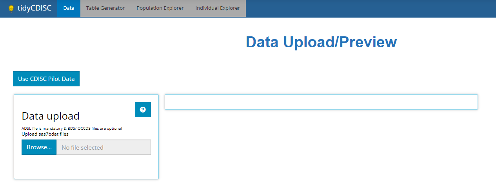
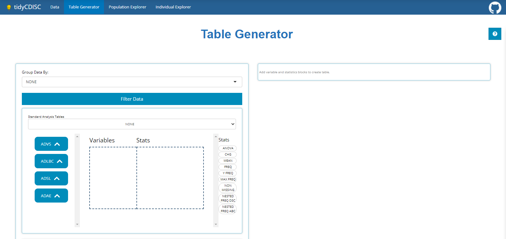
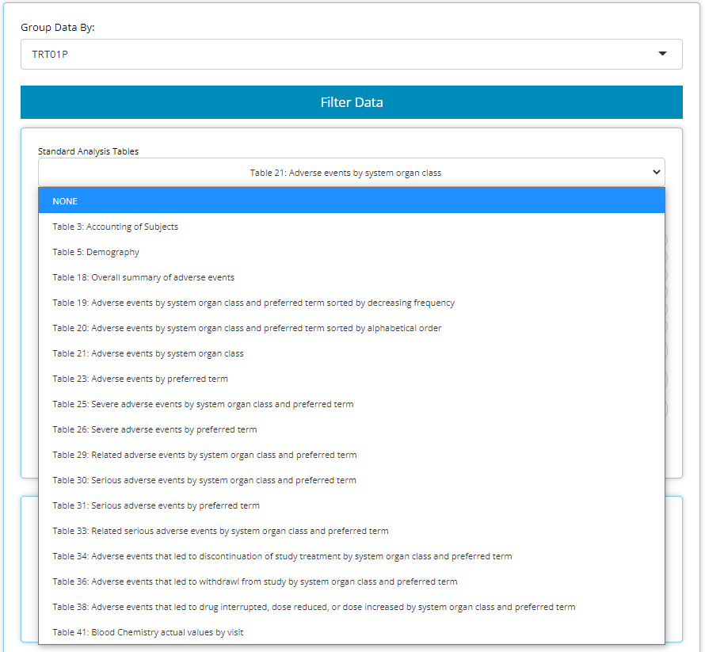

```{r, include = FALSE}
knitr::opts_chunk$set(
  collapse = TRUE,
  comment = "#>"
)
```


Greetings! The `tidyCDISC` [application](https://rinpharma.shinyapps.io/tidyCDISC/) is a robust tool set which empowers its users to glean informative knowledge from clinical trial data with little resistance. To prove this, we'll take you on a brisk tour of the app, traversing all of its wonderful features from each tab of the application. Feel free to follow along with this guide using the demo version of `tidyCDISC` hosted on shinyapps.io. Note the demo version disables the **Data Upload** feature and instead uses the CDISC pilot data.

<br>

<center>
<a href="https://rinpharma.shinyapps.io/tidyCDISC/">

</a>
</center>

<br>

Throughout all the tabs, there are these little buttons (usually in the top right-hand corners) with question marks printed on them. When clicked, they launch a real-time guide that walks the user through the major components of the current screen/ tab, providing context and suggested workflow. So if this guide doesn't answer all your questions just click the ` ? ` button for assistance! 

<br>

```{r, echo=FALSE, fig.align='center'}

```

<br>

Without any further adieu, **welcome to `tidyCDISC`'s landing page**: the *data tab*

<br>

```{r, out.width="95%", echo=FALSE}

```

<br>

<br>

# Data Upload

The app is useless without some ADaM(-ish) data in hand. At a minimum, you'll need an `ADSL` sas7bdat file to get started, and the more data you bring, the more features and insights you can explore. We can import data by clicking the **'Browse'** button and selecting files for upload from your computer or mapped network drives. In this way, the `tidyCDISC` application is very secure; you must have permissions to certain folders/ study directories to upload said data.

This tutorial will upload five files: An `ADSL`, `ADVS`, `ADLBC`, `ADAE`, and an `ADTTE`, all from the CDISC pilot study. You can follow along by clicking the **'Use CDISC Pilot Data'** button above the upload panel, as performed below. After the data is uploaded, two things happen: (1) we can take a peek at our data and (2) all the analysis tabs are unlocked, specifically:

- Table Generator 

- Population Explorer

- Individual Explorer

Our first stop will be the table generator!

<br>

```{r, echo=FALSE}
knitr::include_graphics("figures/tableGen/quick_upload_then_tg_tidyCDISC.gif")
```

<br>

There is more to be said about importing data, like, "What constitutes ADaM-ish data?" or "What if my data set won't upload?" To learn more on the topic, head over to the article titled [00 Data Upload](https://Biogen-Inc.github.io/tidyCDISC/articles/x00_Data_Upload.html); you'll be glad you did! 


<br>

# Table Generator

<br>

The Table Generator tab is divided in two: the area to the left is the handy drag-and-drop interface used to define our tables, and on the right is the real-time table output.

<br>

```{r, echo=FALSE}

```

<br>

Any uploaded data will appear on the left-hand side as "bins". "Bins" are just containers, showcasing the usable contents of the data when expanded. The `ADSL` & `ADAE` bins include the names of all their variables, while any `BDS` data sets, like the `ADVS` & `ADLBC` bins include a list of all the `PARAMCD` values. For simplicity, both variable & parameters bubbles are called "variable blocks".

On the right-hand side, there are a list of "Stats", such as `ANOVA`, `CHG`, `MEAN`, and `FREQ` to name a few. We call these "STAT Blocks". And finally, in the middle of it all is the "drop zone".


<br>

```{r, out.width="70%", echo=FALSE, fig.align='center'}
knitr::include_graphics("figures/tableGen/bins.gif")
```

<br>

In order to build a table, we need only drag a variable block to the "Variable" drop zone and match it up with a corresponding stat block in the "Stats" drop zone. Below, we drag the `AGE` block from the `ADSL` and drag the `MEAN` block from the list of Stats to calculate summary statistics on patient `AGE` within the trial.

<br>

```{r, echo=FALSE}
knitr::include_graphics("figures/tableGen/03-age_mean.gif")
```

<br>

Similarly, we can drag in `DIABP` from the `ADVS` and use the `MEAN` block to calculate summary statistics on parameters. However, because `DIABP` came from a `BDS` class data source, we need to select the desired `AVISIT` to calculate summary statistics for the desired time point.

<br>

```{r, echo=FALSE}
knitr::include_graphics("figures/tableGen/04-diabp_mean.gif")
```

<br>

Using this technique, you can drag in an unlimited number of variable and stat blocks to define a custom table. However, if you're looking for something more common, the app can help with that too. You could build standard analysis tables from scratch by dragging and dropping pertinent variables into the drop zone, but since the standards are well defined and these tables are so common for regulatory submissions, the `tidyCDISC` app has built-in support for constructing standard analysis tables. At the time this guide was authored, the Table Generator contains the following 'recipes' for standardized outputs:

<br> 

```{r, echo=FALSE, out.width="80%", fig.align = 'center'}

```

<br>

When data needed to produce certain outputs aren't present, the list of available tables in this drop down will change. For example, if an `ADAE` is not uploaded, then all the AE tables will disappear from the above list.

When one of these tables is selected, like disposition (Accounting of Subjects) below, the table generator simply compiles the needed variable and stat blocks in the correct order to generate the desired output, as seen below. Notice how the population filter was set automatically, in this case to `FASFL` = 'Y' and the grouping variable set to `TRT01P`. Within seconds, the user changed the default table title and downloaded the R script needed to reproduce the table outside the app:

<br>

```{r,  echo=FALSE}
knitr::include_graphics("figures/tableGen/t_disp.gif")
```

<br>

Even still, there are a plethora of features described on the [01 Table Generator](https://Biogen-Inc.github.io/tidyCDISC/articles/x01_Table_Generator.html) article that showcase how to fully DIY in the Table Generator, such as: add parameter variable and different stat blocks, re-order or delete layers of table output, group by different categorical variables, export the static table for sharing, and exporting the R code used to reproduce the table **in more depth**.


<br>


# Population Explorer

<br>

This module exists to glean visual insights on patient populations via a diverse mix of chart types, each uniquely designed to drill down deep into the data. Below we will walk through a the **"line plot - mean over time"** which graphs variable/ parameter mean values at each visit (using the visit variable of your choice).

Let's assume a scenario where we want to check on our patients' vital signs throughout the trial and look for any sub-populations that are having a rough go of things. In the example below, we check diastolic blood pressure mean values at each visit and calculate a 95% confidence interval for each. It's rumored that drug exposure tends to lower this vital sign over time and the data seems to support that finding. Let's say we're interested in when mean `DIABP` is less than 77 from week-to-week. Thus, we add a reference line on the y-axis below. It seems that each week (except  baseline) seems to be completely under the threshold. To further understand the data, we inspect how age impacts diastolic blood pressure and notice the younger (<65 y/o) population seems to remain heightened (on average) throughout the trial and download the data to Excel for later.

<br>

```{r,  echo=FALSE}
knitr::include_graphics("figures/popExp/line_plot_mean_over_time_tidyCDISC.gif")
```

<br>

Using the **"Separate plots by"** drop down list, we select `TRT01A` to investigate drug exposure may have on `DIABP` and age and it looks like the low dose group in particular is higher than any other group. Just like on any Population Explorer plot, we can hover over to inspect each point and download a PNG of our findings.

<br>

```{r,  echo=FALSE}
knitr::include_graphics("figures/popExp/line_plot_mean_over_time_breakdown.gif")
```

<br>

On the Individual Explorer tab, we'll narrow in on this subset of patients and seeking more findings.

<br>

# Individual Explorer

<br>

This analysis tab exists to establish powerful patient narratives and/or explore outlier patient data. Upon arriving to the Individual Explorer tab, you'll be greeted with the following prompt (below) asking to select a patient, by `UBSUBJID.` After selection, all the data presented will be tied directly that patient.

To subset the patients list to a subgroup of interest, we recommend using **"Advanced Pre-filtering"**. When selecting the `Advanced Pre-Filtering` check box, additional fields will appear (below) to filter the population. From the previous example, we were interested in exploring patient profiles where the patient is <65 y/o, taking the low dose treatment with higher-than-average diastolic blood pressure values.

<br>

```{r,  echo=FALSE, out.width="50%", fig.align = 'center'}
knitr::include_graphics("figures/IndvExp/filter_patients.gif")
```

<br>

If you were thinking, "Wow, filtering widget was pretty neat!" then you're in for a real treat because you can filter data like that on every tab! But honestly, we much of the specifics in that brisk demo, so read our full tutorial on how to filter like pro: [04 Filtering](https://Biogen-Inc.github.io/tidyCDISC/articles/x04_Filtering.html).

<br>


After selecting a `USUBJID`, we scroll down the page to examine that patient's demographic info. There, we see the patient is a white male, age 51 and weights 70.8 kg. Scrolling again, the **'Events'** tab displays the patient's journey through the trial on an interactive timeline. After reviewing his timeline, it seems the patient wasn't in the trial very long, but we don't see anything outrageous from an adverse events perspective... at least nothing that we'd expect would impact `DIABP`.


<br>

```{r,  echo=FALSE}
knitr::include_graphics("figures/IndvExp/drill_down_events.gif")
```

<br>


Switching to the "Visits" tab, we can see that this patient did indeed have consistently higher than average diastolic blood pressure, which was measured three times at each visit. We see it was always at it's highest after the patient was standing for 1-minute. Next, we hover over the plot to examine some points, download a png and an html file containing a plot for each vital sign parameter available for this patient.


<br>

```{r,  echo=FALSE}
knitr::include_graphics("figures/IndvExp/drill_down_visits.gif")
```

<br>

Well, that wraps up our patient profile analysis, but there is so much more to learn about the Individual Explorer! Read up on all it's hidden features in the [03 Individual Explorer](https://Biogen-Inc.github.io/tidyCDISC/articles/x03_Indv_Expl.html) article. 

<br>

## Recap & what's next?

<br>

So far, we've learned how to upload data, drag and drop blocks in the table generator as well as build a bonafide standard analysis table and export its reproducible R code. Next we plotted mean diastolic blood pressure over time in the population explorer and define filters on the individual explorer tab to find the patients and analyze patient profiles responsible for elevating one subgroup's values.

<br>

*Have an idea to explore?* **Open the [tidyCDISC](https://rinpharma.shinyapps.io/tidyCDISC/) app!** Otherwise, we highly recommend reading the following articles that take a deeper look into the topics presented in this 'get started' guide:

- [00 Data Upload](https://Biogen-Inc.github.io/tidyCDISC/articles/x00_Data_Upload.html)

- [01 Table Generator](https://Biogen-Inc.github.io/tidyCDISC/articles/x01_Table_Generator.html)

- [02 Population Explorer](https://Biogen-Inc.github.io/tidyCDISC/articles/x02_Pop_Exp.html)

- [03 Individual Explorer](https://Biogen-Inc.github.io/tidyCDISC/articles/x03_Indv_Expl.html)

- [04 Filtering](https://Biogen-Inc.github.io/tidyCDISC/articles/x04_Filtering.html)

Users who've leverage `tidyCDISC` for routine trial analysis tend to report **significant time savings, about 95%**, when performing programming duties. We're confident the `tidyCDISC` application can save you time too. If there is some use case that `tidyCDISC` can't solve, we want to know about it. Please send the [developers](https://github.com/Biogen-Inc/tidyCDISC/issues/new) a message with your question or request!

<br>

<br>

<br>
