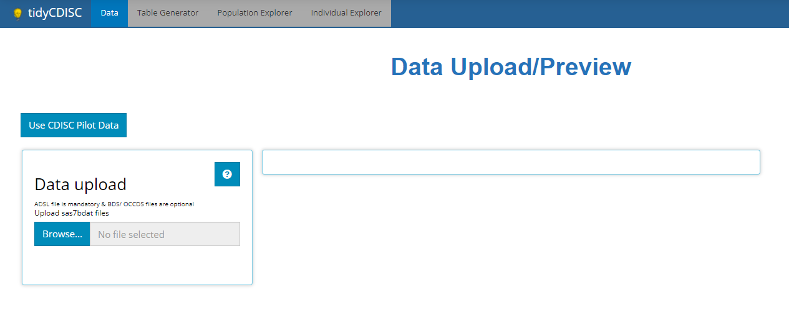
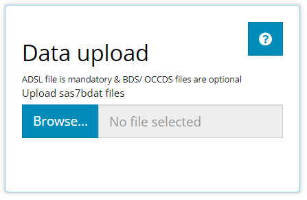
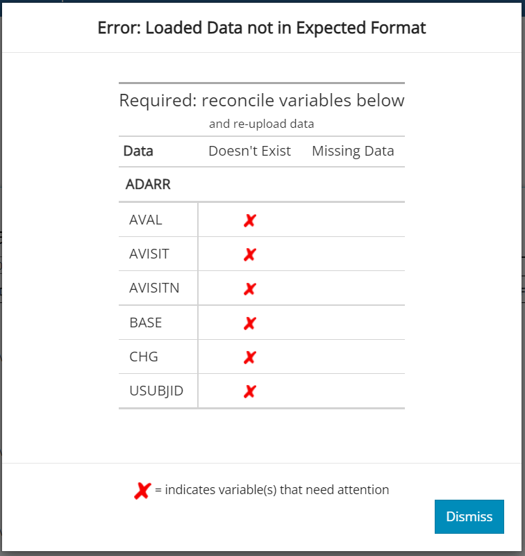
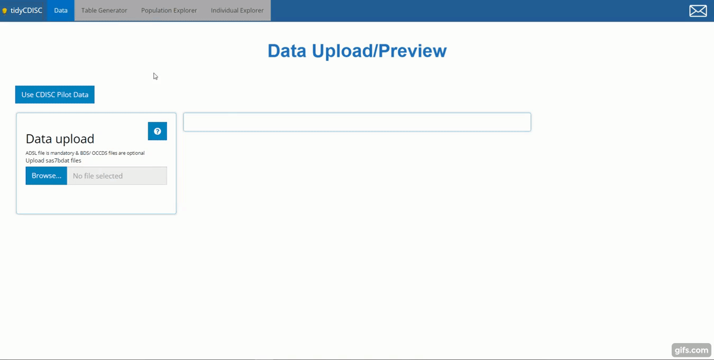

```{r, include = FALSE}
knitr::opts_chunk$set(
  collapse = TRUE,
  comment = "#>"
)
```

Rightfully so, the **Data** tab is the initial landing page for the `tidyCDISC` app. It's a place where you can find, upload, and view your data before proceeding to the analysis tabs, which are disabled until a `ADSL` sas7bdat file is uploaded.

<br>


```{r, echo=FALSE, out.width="95%", fig.align='center'}

```

<br>

## Upload requirements

<br>

This application was designed for quick analysis of ADaM-ish data, so since preparing sas7bdat files are apart of that process, `tidyCDISC` only accepts SAS data sets for upload. Thus, inside the window titled "Data Upload", you'll notice the following text: "`ADSL` file is mandatory and BDS/ OCCDS files are optional. Upload sas7bdat files." 

<br>

```{r, echo=FALSE, out.width="50%", fig.align = 'center'}

```

<br>

With an `ADSL` alone, you can explore all the tabs of this application, although, uploading more data with other data types is encouraged for optimized exploration. The `tidyCDISC` application was designed to analyze ADaM data of the following types, each having a unique purpose in the application:

- `ADSL`: demographic and trial info - one row per subject
- `BDS`: or "basic data structure" contains variables such as `PARAMCD`, `AVAL`, and `AVISIT` or some other visit variable that reports on metric values over time for each patient.
- `OCCDS`: Occurrence style data, reporting on adverse events, con-meds, or medical history, for example.
- `TTE`: Time-to-event data, identified by the presence of the required `CNSR` variable.

Identifying these data types, the app includes precise upload rules for each, accessible via the small button with a question mark:

<br>

```{r, echo=FALSE, fig.align = 'center'}
knitr::include_graphics("figures/tableGen/TG need help.PNG")
```

<br>

Upon clicking, what we define as "ADaM-ish" upload rules will pop up in a new window. There are several sets of rules. Some rules are *"Required"* and others are *"Recommended"*. In general, "required" rules are absolutely foundational to the app's function. Conversely, "recommended" rules are only suggestions to get the most feature-rich experience in the app. More on this later, but first, and quite plainly, our first and most pervasive rule is that all uploaded data must contain a `USUBJID` variable. Without this field, data portrayed in one data set simply cannot be linked to data in another, so this is a foundational rule and one that CDISC also imposes.

<br>


```{r, echo=FALSE, out.width="80%", fig.align = 'center'}
knitr::include_graphics("figures/upldDat/upload rules.PNG")
```

<br>

As depicted above, there exist different rule sets for specific data sets. Here, you can interpret the first rule as follows: "If you upload an `ADMH`, it's *required* that it contains a variable called `MHCAT`." This is so that core features in the app will work appropriately. Directly beneath, read the next rule as: "if you upload an `ADAE`, it's *recommended* that it have variables `AESTDT`, `AEDECOD`, `AESEV`, and `AESER` be present." Even though some of those variables may be required according to CDISC, they are only recommended here, hence the label "ADaM-ish". In the absence of the recommended variables, some features of the app may be voided, but the app will still function just fine without them. 

<br>

The final two sets of upload rules exist to make sure certain that data sets containing certain variables are treated appropriately. First if the data contains `CNSR` (i.e. `TTE` type data), it should also contain `PARAMCD` and `AVAL`. And finally, rules that apply to non-`TTE` type data: if the data contains `PARAMCD` (`BDS` data) it must also contain `AVISITN`, `AVISIT`, `PARAM`, `AVAL`, `CHG`, and `BASE`.

<br>

If any of these rules are violated, a prompt error or warning message will appear when attempting to upload the faulty data. If the uploaded data is missing a required variable (or if the variable exists, but is populated will only missing values), an error will be issued and your data will not upload to the application. If a recommended variable is missing, a warning is issued but the data source can still be used within the application. Here is an example of an attempt to upload an erroneous data set, an `ADARR`, with a litany of problems. Notice how the app checks that the variable both (1) exists and (2) is non-missing below. A red `X` indicates the area(s) that need attention and led to the failed test.

<br>

```{r, echo=FALSE, out.width="75%", fig.align = 'center'}

```

<br>

If you are having trouble uploading your data, and you think you have significant grounds to alter these upload rules, please [contact us](https://github.com/Biogen-Inc/tidyCDISC/issues/new) with your request.

<br>

## Use CDISC Pilot Data

Press this button if you are not interested in using `tidyCDISC` with your study data yet, but  want to explore all the app's features. Upon clicking, you'll see five data sets are loaded: an `ADSL`, `ADVS`, `ADAE`, `ADLBC`, and `ADTTE`. All these data sources came from the PHUSE [Test Data Factory's public GitHub](https://github.com/phuse-org/TestDataFactory/blob/master/Updated/TDF_ADaM/). Note that some adjustments were made to the raw data in order to best suit the needs of the application. That is, in some cases, variables were created and imputed with values that were applicable for the trial. For the sake of data security, we'll use this data thoroughly throughout this guide.

<br>

```{r, echo=FALSE, out.width="30%", fig.align = 'center'}
knitr::include_graphics("figures/upldDat/cdisc pilot button.PNG")
```

<br>

## Browse

<br>

When not using the CDISC pilot data, select "Browse" to navigate through your computer's file system and locate your study's data. If you normally **do not** have permissions to a certain folder, you will still **not** have permission to that folder while using `tidyCDISC`. You may select one file at a time or multiple files at once. Just note (as mentioned previously) that an `ADSL` is required for any analysis, so make sure one is loaded from your study. Since the application is designed for ADaM-ish data, only sas7bdat files are accepted.

<br>

```{r, echo=FALSE, out.width="55%", fig.align = 'center'}

```

<br>

Once selected, the file names will show up below the browse widget and populate the data preview window.

<br>


## Data Preview

<br>

The data preview exists to give users a perfunctory view of their data to make sure it uploaded correctly. Thus, the viewing window was intentionally designed to be small and hard to navigate! Just make sure your data is there and intact, then head over to the other tabs to dissect and analyze it.

<br>

```{r, echo=FALSE}

```

<br>

Specifically, try out the... 

- [Table Generator](https://Biogen-Inc.github.io/tidyCDISC/articles/x01_Table_Generator.html) to quickly and easily create submission compliant tables and listings

- [Population Explorer](https://Biogen-Inc.github.io/tidyCDISC/articles/x02_Pop_Exp.html) to plot trends in your treatment groups over time (among other things)

- [Individual Explorer](https://Biogen-Inc.github.io/tidyCDISC/articles/x03_Indv_Expl.html) to learn more about outlier patients or patients with certain adverse events, etc.

<br>

<br>

<br>

<br>
