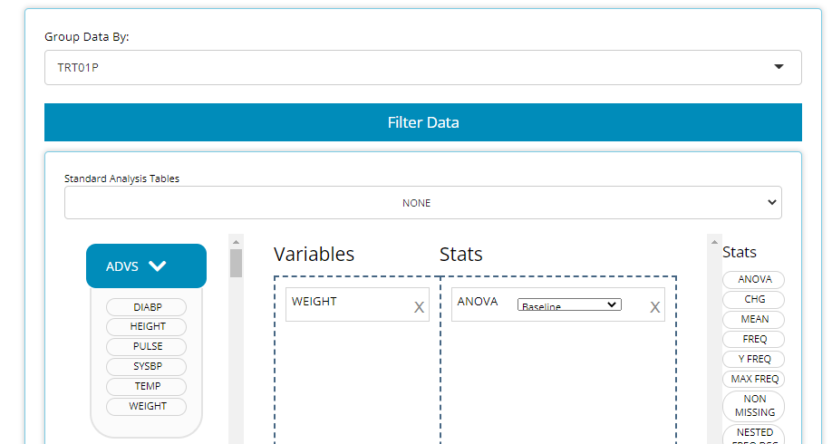
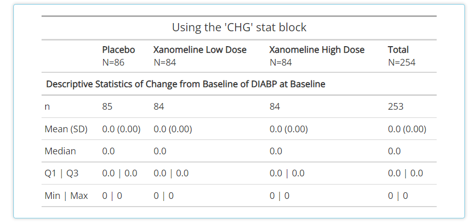
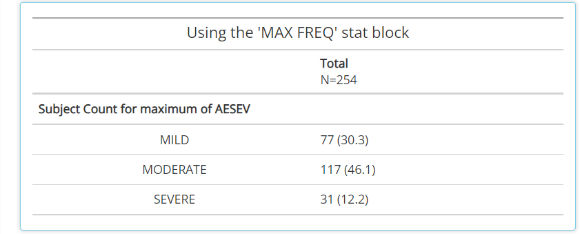
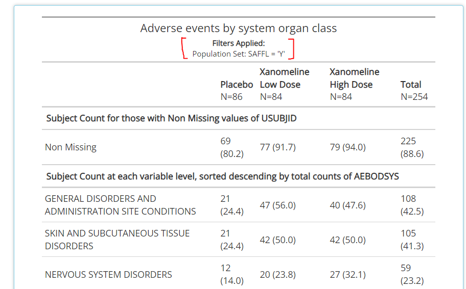
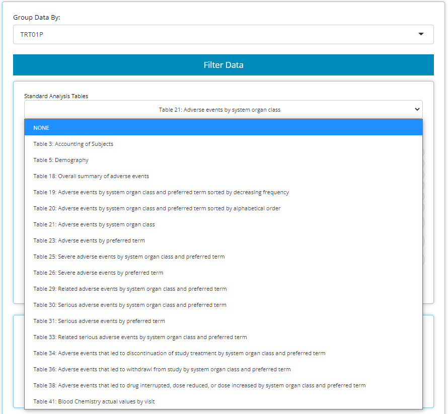
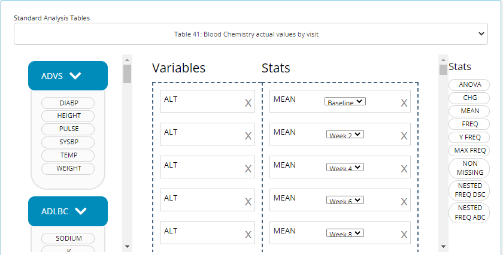
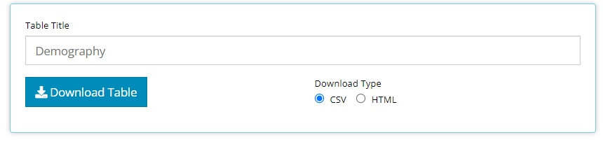
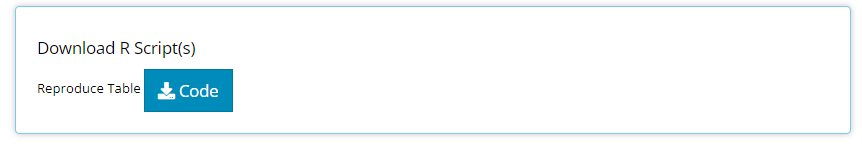
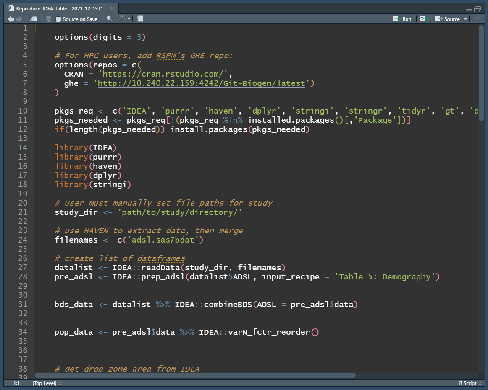

This tutorial will walk through how to leverage the `IDEA` app's Table Generator tab. Let's walk through creating simple summary statistics, among other things. If you haven't already, import your studies data. For this tutorial, we'll be using the five CDISC Pilot data files: An `ADSL`, `ADVS`, `ADLBC`, `ADAE`, and the `ADTTE`. 

## Import Data


<br>


```{r, echo=FALSE}
knitr::include_graphics("figures/tableGen/quick_upload_then_tg.gif")
```

<br>

<br>


## Building an example table from scratch

<br>

The Table Generator tab is divided in two: the area to the left is the drag-and-drop interface used to build tables, and on the right is the real-time table output.

<br>

```{r, echo=FALSE}
knitr::include_graphics("figures/tableGen/02-TG.png")
```

<br>

Any uploaded data sets will appear on the left-hand side as "bins". "Bins" are just containers, showcasing the usable contents from a data source, when expanded. The `ADSL` & `ADAE` bins include the names of all their variables, while any `BDS` data sets, like the `ADVS` & `ADLBC` bins include a list of all the `PARAMCD` values. `TTE` class data sources are currently not supported in the table generator.

On the right-hand side, there are a list of "Stats", such as `ANOVA`, `CHG`, `MEAN`, and `FREQ` to name a few. We call these "STAT Blocks". And finally, in the middle of it all is the "drop zone".


<br>

```{r, out.width="70%", fig.align='center', echo=FALSE}
knitr::include_graphics("figures/tableGen/bins.gif")
```

<br>

In order to build a table, we need only drag a variable block to the "Variable" drop zone and match it up with an applicable stat block by dragging it in the "Stats" drop zone, demonstrated in the following example.

<br>

### Age Summary Statistics

<br>

Below, we drag the `AGE` block from the `ADSL` and drag the `MEAN` block from the list of Stats to calculate summary statistics on patient `AGE` within the trial.

<br>

```{r, echo=FALSE}
knitr::include_graphics("figures/tableGen/03-age_mean.gif")
```

<br>

### PARAMCD Summary Statistics

<br>

Similarly, we can drag in `DIABP` from the `ADVS` and use the `MEAN` block to calculate summary statistics on parameters. However, because `DIABP` came from a `BDS` class data source, we need to select the desired `AVISIT` to calculate summary statistics for the desired time point.

<br>

```{r, echo=FALSE}
knitr::include_graphics("figures/tableGen/04-diabp_mean.gif")
```

<br>

<br>

### Add FREQ stat to categorical variable block, re-shuffle, and delete output

<br>

Now let's assume we forgot to add some frequency statistics for our studies age groups. In fact, we really prefer it over the quantitative statistics previously calculated on the `AGE` variable. It's no problem! We simply go back to our `ADSL` bin, select & move the `AGEGRP1` variable to the "drop zone" and pair it with a `FREQ` stat block. Recently added blocks are always added to the bottom of the list, but that's no worry, once added, you can shuffle the blocks around to present the output in the most logical manner. To remove an undesired output, just click the `X` on the right-hand side of each variable & corresponding stat block.

<br> 

```{r, echo=FALSE}
knitr::include_graphics("figures/tableGen/add_freq_reshuffle_delete.gif")
```

<br>

<br> 


### Group by another Variable

<br>

We can use the **'Group By'** drop-down list to calculate our table's statistics across levels of a categorical variable. For example, When we select `TRT01P`, the a single column of statistics is broken down by all the planned treatment groups.

<br>

```{r,  echo=FALSE}
knitr::include_graphics("figures/tableGen/grouping.gif")
```

<br>

Here is the resulting table:

<br>

```{r,  echo=FALSE}
knitr::include_graphics("figures/tableGen/grouped.png")
```

<br>

### Title and download table output

<br>

Now that we've created a simple table, it's time to name and download it for saving/ sharing. Below, we insert our table title and download as CSV. Currently, the app supports CSV and HTML output formats, but PDF and RTF are coming soon!

<br>

```{r, echo=FALSE}
knitr::include_graphics("figures/tableGen/title_download.gif")
```

<br>

<br> 

That's it for our example workflow when building tables from scratch. However, the table generator offers many more features, including filtering, other statistical blocks, recipes for standard analysis (STAN) tables, more export file types for output, exported R code to reproduce the table, and in-app guided help. Those topics are expanded on below!

<br> 

## Other Stat blocks

<br> 

Please use this resource as a guide when determining how to summarize your data. It's important to note that new statistical blocks are in development, so if they are not listed below, you can hover over any of the stat blocks in the app and text will appear for a "quick reference" description. The stat blocks we showcased in the demo above include the following:

- `MEAN:` Eight summary statistics are displayed. These include n, mean, standard deviation, median, Q1, Q3, Min, and Max.

- `FREQ:` Counts and percentages are displaced for all variable values that exist. Note this does not count subjects like the frequencies described below. If you'd like to count subjects, see `NESTED FREQ DSC` OR `NESTED FREQ ABC`.


The other statistical blocks not showcased in the demo are:

- `ANOVA:` this block can be used in conjunction with the grouping variable drop down selection to determine if means differ across groups.

```{r, echo=FALSE, out.width="80%", fig.align = 'center'}

```

```{r, echo=FALSE, out.width="80%", fig.align = 'center'}
knitr::include_graphics("figures/tableGen/TG Anova.PNG")
```

<br> 

- `CHG:` like the mean block, this also calculates basic summary statistics but uses the change from baseline value rather than `AVAL`

```{r, echo=FALSE, out.width="80%", fig.align = 'center'}

```

<br> 

- `Y FREQ:` Only applies to flag variables (ending in 'FL', like `DTHFL`) that contain 'Y' values. The output will include a subject count and percentage for **only** the 'Y' values.

```{r, echo=FALSE, out.width="80%", fig.align = 'center'}
knitr::include_graphics("figures/tableGen/TG Y FREQ.PNG")
```

<br> 

- `MAX FREQ:` This statistic only applies to variables (VAR) that have a "N" (VARN) counterpart. It's useful for variables like `AESEV` when a subjects should only be counted one time at their max VARN value. So, when paired with `AESEV` or `AESEVN`, the frequencies will reflect maximum severity of an adverse event during the trial.

```{r, echo=FALSE, out.width="80%", fig.align = 'center'}

```

<br> 

- `NON MISSING:` A handy statistic that counts subjects who have non-missing values for a given variable. As such, it can help provide a high level measure of how many subjects had some value, as seen below with `AEDECOD`

```{r, echo=FALSE, out.width="80%", fig.align = 'center'}
knitr::include_graphics("figures/tableGen/TG NON MISSING.PNG")
```

<br> 

- `NESTED FREQ DSC:` Notice when using this stat block, you'll need to choose a variable to "nest" inside the values / levels of another. Without the nested variable selected (ie `NONE` is selected), the subject counts and percentages are displayed in descending order. Place the high level variable (like `AEBODSYS`) on the left hand side and select the more granular variable to be "nested" inside of it, like `AEDECOD`. Then the output will show all the `AEDECOD` values that exist within each `AEBODSYS`, all sorted descending. 

```{r, echo=FALSE, out.width="60%", fig.align = 'center'}
knitr::include_graphics("figures/tableGen/TG Nested Freq.PNG")
```


```{r, echo=FALSE, out.width="80%", fig.align = 'center'}
knitr::include_graphics("figures/tableGen/TG Nested Freq2.PNG")
```


<br> 

- `NESTED FREQ ABC:` provides the same functionality as `NESTED FREQ DSC`, but organizes the variables and it's values in alphabetical order!

<br>


## Filtering data in the table generator

<br>

There is an entire guide called "[04 Filtering](https://github.biogen.com/pages/biometrics/IDEA/articles/x04_Filtering.html)" dedicated to filtering in the `IDEA` application. Please reference that article as the ultimate filtering resource, but just note that when filtering occurs on the Table Generator tab, those filters permeate **all data sets** on the tab and will be reflected in the table output as seen below. Also note that some mandatory filters will be applied automatically when 'standard analysis' tables are selected so be aware of the filtering caption displayed beneath the table title (red brackets added for attention). Ultimately, it is the users responsibility to make sure the correct data filters are applied for their table output!

<br> 

```{r, echo=FALSE, out.width="80%", fig.align = 'center'}

```

<br>

## Standard Analysis (STAN) Tables 

<br>

There are a set of tables / listings that users need to build frequently, due to their common inclusion in submission filings to regulatory authorities. As such, the Table Generator (at the time this guide was authored) contains the following 'recipes' for commonly used tables:

<br> 

```{r, echo=FALSE, out.width="80%", fig.align = 'center'}

```

<br> 

When data needed to produce certain STAN outputs aren't present, the list of available tables in this drop down will change. For example, if an `ADAE` is not uploaded, then all the AE tables will disappear from the above list.

<br> 

When one of these tables is selected, the table generator simply compiles the needed variable and stat blocks in the correct order to generate the desired output. This can be particularly useful for tables like #41 "Blood Chemistry actual values by visit" since it would be cumbersome to manually drag in a `MEAN` block for each week and each blood chemistry parameter, as there can be many. See snapshot of this automation below:

<br> 

```{r, echo=FALSE, out.width="80%", fig.align = 'center'}

```


```{r, echo=FALSE, out.width="80%", fig.align = 'center'}
knitr::include_graphics("figures/tableGen/TG STAN TAB41.PNG")
```

<br>


## Export output file types

<br>

As displayed in an earlier demo, you can export table output to a CSV or HTML file. In a future release of `IDEA`, you'll be able to prepare PDF and RTF versions of your output. In the meantime, you can create a PDF using a temporary work-around: first export as HTML, then download page as a PDF.

<br> 

```{r, echo=FALSE, out.width="80%", fig.align = 'center'}

```

<br>


## Export R code to reproduce table outside of app

<br>

As previously mentioned, one can reproduce any table created inside the app in an R script by downloading code using this button:

<br> 

```{r, echo=FALSE, out.width="80%", fig.align = 'center'}

```

<br> 

Upon doing so, the R script will download to your browser and when opened in R Studio, should look something like the below image. The R script will help you install any packages needed for the analysis, including the `IDEA` package. If you used the CDISC Pilot data, no code modification is needed to reproduce the output since that data is pre-loaded into the `IDEA` package. However, if you uploaded your data from a different source, you'll need to enter the file path to your study directory's data as a string, as seen on line 21. Note: `'path/to/study/directory/'` is just a placeholder until you enter your own string. In a future release of `IDEA`, we hope to automatically fill this field for you, but security protocols prevent `IDEA` from doing so at this time. 


<br> 

```{r, echo=FALSE, fig.align = 'center'}

```

<br>

After reading in the data, the R script will recall the variable and stat blocks previously dropped into the "drop zone" to recreate the output using the exact same process as performed in the app. From there, an R data.frame and html rendering of your table is prepared for saving or further analysis.


## Need help?

Throughout all the tabs in the application, there are these little buttons (usually in the top right-hand corners) with question marks on them:

```{r, echo=FALSE, fig.align = 'center'}
knitr::include_graphics("figures/tableGen/TG need help.PNG")
```


When clicked, they launch a real-time guide that walks the user through the major components of the currently visible screen/ tab, providing context and suggested workflow. However, if the in-app guide doesn't address your needs, consult the online documentation (that you're reading now) for the most thorough user guide. If all else fails, send the [developers](mailto:adshelp@digicomm.jira.com?subject=IDEA App Question/ Request) an email with your question or request!

<br> 

```{r, echo=FALSE}
knitr::include_graphics("figures/tableGen/TG need help guide demo.gif")
```


<br> 

<br> 

<br> 

