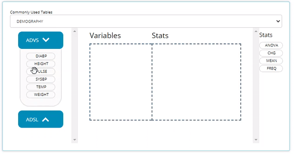

Let's walk through creating simple summary statistics using the CDISC Pilot data in conjunction with the Table Generator.

## Import Data


<br>


```{r, echo=FALSE}
knitr::include_graphics("figures/tableGen/quick_upload_then_tg.gif")
```

<br>

<br>


## Building an example table from scratch

This tutorial will walk you through calculating simple statistics for an `ADSL` variable and the `AVAL` values for a `PARAMCD` variable, calculated at a different time points in the `ADVS`.

The Table Generator tab is divided in two: the area to the left is the drag-and-drop interface used to build tables, and on the right is the real-time table output. Any uploaded data sets will appear on the left-hand side as "bins". We call them "bins" because they are just containers, showcasing contents of the data set when expanded. The `ADSL` & `ADAE` bins include all the names of all their variables, while any `BDS` data sets, like the `ADVS` & `ADLBC` bins include a list of all the `PARAMCD` values.

<br>

```{r, echo=FALSE}
knitr::include_graphics("figures/tableGen/bins.gif")
```

<br>

<br>

### Age Summary Statistics

We can drag the `AGE` block from within `ADSL` and drag in the `MEAN` block from the statistical blocks to calculate summary statistics for `AGE` within the trial.

<br>

```{r, echo=FALSE}
knitr::include_graphics("figures/tableGen/03-age_mean.gif")
```

### PARAMCD Summary Statistics

Similarly, we can drag in `DIABP` from `ADVS` and use the `MEAN` block to calculate summary statistics. However, we also need to select the `AVISIT` from the week dropdown in order to calculate the summary statistics of `DIABP` at a certain week.

<br>

```{r, echo=FALSE}

```

<br>

<br>

### Add Freq stats, re-shuffle, and deleting output

Now let's assume we forgot to add some frequency statistics for our studies age groups. In fact, we really prefer it over the quantitative statistics previously calculated on the `AGE` variable. It's no problem! We simply go back to our `ADSL` bin, select & move the `AGEGRP1` variable to the "drop zone" and pair it with a `FREQ` stat block. Recently added blocks are always added to the bottom of the list, but that's no worry, once added, you can shuffle the block around to present the output in a logical manner! To remove an undesired output, just click the `X` on the right hand side of each variable & corresponding stat block.

```{r, echo=FALSE}
knitr::include_graphics("figures/tableGen/add_freq_reshuffle_delete.gif")
```

### Group by another Variable

We can use the `Group By` drop-down list to calculate our statistics across groups. When we select `TRT01P`, the a single column of statistics in the output is now broken down by all the planned treatment groups!

<br>

```{r,  echo=FALSE}
knitr::include_graphics("figures/tableGen/grouping.gif")
```

<br>

<br>

### Title and download table output

Now that you've created a simple table of information you needed, it's time to name it and download. Below, we insert our table title and download as CSV for further use or sharing with co-workers. Currently, the app supports CSV and HTML output formats, but PDF and RTF are coming soon!

<br>

```{r, echo=FALSE}
knitr::include_graphics("figures/tableGen/title_download.gif")
```

<br>

<br> 

That's it for our example workflow when building tables from scratch. However, the table generator offers many more features, including filtering, other statistical blocks, recipes for standard analysis (STAN) tables, more export file types for output, exported R code to reproduce the table, and in-app guided help. Those topics are expanded on below!

## Filtering data in the table generator


## Other Stat blocks

The other statistical blocks we did not showcase in the demo are:

- `ANOVA:` this block can be used in conjunction with the grouping variable dropdown to compare a variable across groups.

- `CHG:` like the mean block, this also calculates basic summary statistics but uses the change from baseline value rather than `AVAL`

- `FREQ:` For categorical data you can calculate the frequency of variables. This too can be broken down into groups using the `Group By` dropdown


## Standard Analysis (STAN) Tables 


## Export output file types

## Export R code to reproduce table outside of app

## Need help?


