```{r, include = FALSE}
knitr::opts_chunk$set(
  collapse = TRUE,
  comment = "#>"
)
```

This tutorial will walk through how to leverage the `IDEA` app's Population Explorer tab. It exists to glean insights about different patient populations participating in the trial. The Population Explorer tab will interface with all data types: `ADSL`, `BDS`, `OCCDS`, and `TTE`. This tutorial will use 5 CDISC Pilot data files: An `ADSL`, `ADVS`, `ADLBC`, `ADAE`, and the `ADTTE`. 

<br>

```{r, echo=FALSE, out.width="40%", fig.align='center'}
knitr::include_graphics("figures/popExp/tutorial_data.PNG")
```

<br>


## Tab layout

Below is a plot built with the population explorer, where an example Kaplan Meier curve is being rendered. There are 4 main components to this tab, the first 3 are located on the side panel:

1. The **filter data** widget (we'll cover this last)

1. The **type of chart** selection

1. The **plot controls**

1. The desired **plot**


<br>

```{r, echo=FALSE, fig.align='center'}
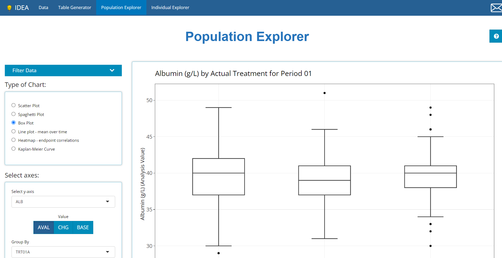
```

<br>

Together, we'll take a look at each of element of the Population Explorer, including the chart types and their controls, plot options and interactivity. But first, a quick note on filtering!


## Type of Chart

Below are the currently supported chart types, which can be expanded to include any number of charts, just send the [developers](mailto:adshelp@digicomm.jira.com?subject=IDEA App Pop Ex Request) an email with your request!


<br>

```{r, echo=FALSE, out.width="50%", fig.align='center'}
knitr::include_graphics("figures/popExp/type of chart.PNG")
```

<br>

It's important to note that the `Kaplan-Meier Curve` option will not appear unless an ADaM of class `TTE` (contains the `CNSR` variable) is uploaded on the Data tab. All other chart types will display by default.


## General plot controls

The user interface to each plot dynamically updates based on the the chart type selection. In general, you'll be asked to specify how to set up the axes using either variables or parameters from `BDS` class data sources, among other options. Consistent with the Table Generator, when a parameter is being plotted, often times you'll need to select "AVAL", "CHG", or "BASE" in addition to a specific visit. The only exception, with the exception of the "spaghetti" and "line plot - mean over time" as the x-axis will always be a time variable by design. 

<br>

```{r, echo=FALSE, out.width="50%", fig.align='center'}
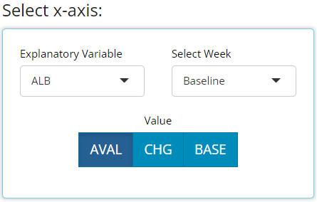
```

<br>

If a variable is chosen for plotting, the AVAL/CHG/BASE options & visit selector will disappear:


<br>

```{r, echo=FALSE, out.width="50%", fig.align='center'}
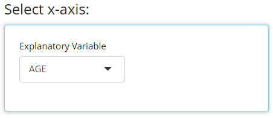
```

<br>

Besides those general axes set up controls, the "scatter" and "line plot - mean over time" have some "Group data" options in common as well. In general, both drop down lists only contain character or factor variables. 

<br>

```{r, echo=FALSE, out.width="50%", fig.align='center'}
knitr::include_graphics("figures/popExp/group data.PNG")
```

<br>

The "Color Plots By" variable helps the user create a different colored line for a variable's categories. In the example below, here is a plot where "Color Plots By" is `NONE`:

<br>

```{r, echo=FALSE, fig.align='center'}
knitr::include_graphics("figures/popExp/basic plot.PNG")
```

<br>

If we switch "Color Plots by" to `AGEGR1`, the application creates the following line plot of mean over time:


<br>

```{r, echo=FALSE, fig.align='center'}
knitr::include_graphics("figures/popExp/color by.PNG")
```

<br>

Similarly, if we leave "Color Plots By" as `NONE` and change "Separate Plots By" to `TRT01P`, the app creates a separate plot for each planned treatment arm:

<br>

```{r, echo=FALSE, fig.align='center'}
knitr::include_graphics("figures/popExp/group by.PNG")
```

<br>


Lastly, the user can select a variable for both "Color Plots By" and "Separate Plots By" to view a plotted line for the combination of `AGEGR1` and `SEX`.

<br>

```{r, echo=FALSE, fig.align='center'}
knitr::include_graphics("figures/popExp/color by and group by.PNG")
```

<br>


## The plots

The plot is displayed prominently on the main panel, and with a host of interactive features when moused over. In the example below, the "line plot - mean over time" contains additional information available at each plotted point like the visit variable and visit value, plus a slurry of statistics for the parameter selected (ALB in this case): mean, standard error, standard deviation, and patient count (N). Also notice the `SEX` variable is selected for "Color Plot By". Thus, when we hover, the info boxes are color coordinated and include the line's `SEX` value.


<br>

```{r, echo=FALSE, fig.align='center'}
knitr::include_graphics("figures/popExp/interactivity.gif")
```

<br>

Notice how the user is also allowed to zoom-in / pan-out of any portion of the graph, which retains only the desired points. This can be helpful to filter out outliers without using the "Filter Data" widget or just to zoom in on a cluster of densely populated points.

Last, click the hover over and select the small camera icon in the top right-hand corner to download a PNG of any plot directly to your browser. This can be handy for sharing findings with colleagues. Or, users are equally welcome to use the snipping tool / snagit to capture results as well.

Depending on the plot, the aggregated data used to plot values may be included below the plot for easy download to excel. Right now, that includes the "line plot - mean over time" and "Heat map - endpoint correlations". If desired, select how many rows you'd like to view, search through or sort the data and just click the "Excel" button on the top left corner when ready to download.


<br>

```{r, echo=FALSE, fig.align='center'}
knitr::include_graphics("figures/popExp/download data.PNG")
```

<br>

Now it's time to dive into each plot and highlight it's unique output and plot controls.

### Scatter plot

The scatter plot is one of the most basic plots offered by the population explorer. As you're likely aware, this chart type plots two quantitative variables against each other in a two dimensional space. The plot controls have already been addressed in great detail above. Though it's a simple graph, it's output can be quite helpful, especially at identifying outliers since every subject will be plotted on the graph. Here is an example where we can hover over an outlier for more detail when plotting Glucose at baseline vs age. 

<br>

```{r, echo=FALSE, out.width="40%", fig.align='center'}
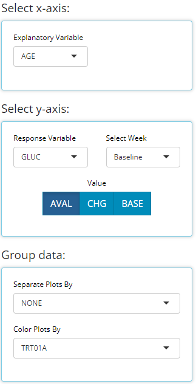
```

<br>

```{r, echo=FALSE, fig.align='center'}
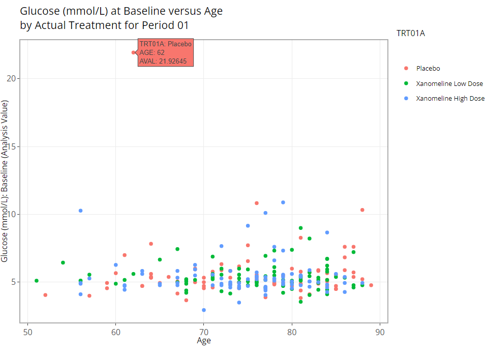
```

<br>


### Spaghetti plot

Similarly, the spaghetti plot mimics the scatter in that every subject is plotted, except the x-axis must be a time variable and a subject's values are plotted over time and connected with a line. As one might expect, with many subjects, this would lead to a very messy graph. But again, you can see edge cases very clearly.

<br>

```{r, echo=FALSE, out.width="40%", fig.align='center'}
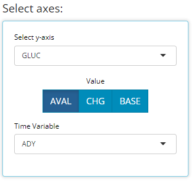
```

<br>

```{r, echo=FALSE, fig.align='center'}
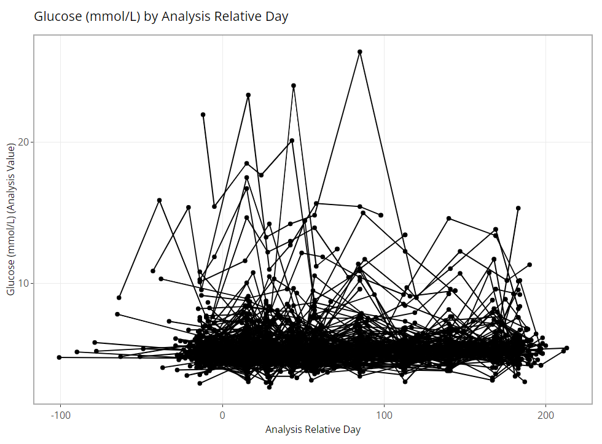
```

<br>

### Box Plot

Population Explorer wouldn't be a legitimate graph generator without a box plot, offering everyone's favorite 7-number summary on hover. See example below:


<br>

```{r, echo=FALSE, out.width="40%", fig.align='center'}
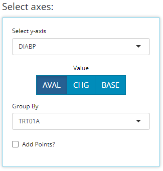
```

<br>

```{r, echo=FALSE, fig.align='center'}
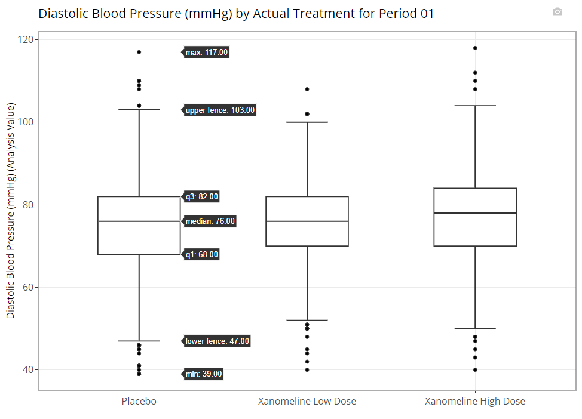
```

<br>

Notice there is an additional plot control called "Add Points?". If this check box is marked, all individual data points are overlain on the existing box plot in a "jittered" fashion to help the user better understand the distribution of the data.


<br>

```{r, echo=FALSE, out.width="20%", fig.align='center'}
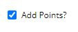
```

<br>

```{r, echo=FALSE, fig.align='center'}
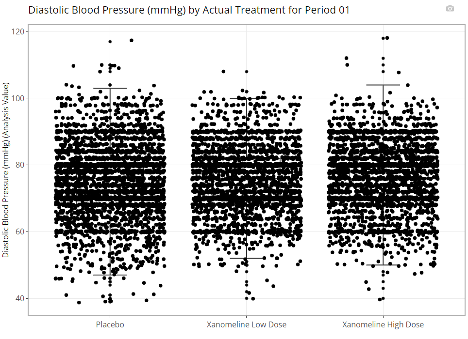
```

<br>


### Line Plot - mean over time

A line plot of mean variables/ parameter values over time is a highly requested / used feature of the Population Explorer. As such, the a few additional custom plot controls have been built in for this chart type. Here you can see that in addition to a y-axis and time variable selector, we've included options to overlay a vertical or horizontal line on the plot's x or y axis, respectively. When the feature is toggled on, an addition selector will appear to help you set the value. Perhaps in this case, we've decided that 10.5 is an important Bilirubin value we want to track and if the average extends above this threshold, we want that to be obvious. So, overlaying a horizontal line at 10.5 is a great option for this plot.


<br>

```{r, echo=FALSE, out.width="40%", fig.align='center'}
knitr::include_graphics("figures/popExp/line plot controls.PNG")
```

<br>

We've discussed the Group Data plot controls above, so we'll choose to bypass those for now. However, we've chosen to label our plotted data points. This toggle simply turns the feature on/off and allows us to position the labels in the most visible location. For this example, on top and centered data labels are extremely visible and produces the following output:

<br>

```{r, echo=FALSE, fig.align='center'}
knitr::include_graphics("figures/popExp/line plot.PNG")
```

<br>

And if we choose to display 95% confidence intervals for each mean, we need only toggle a few options as follows to produce the following output:


<br>

```{r, echo=FALSE, out.width="40%", fig.align='center'}
knitr::include_graphics("figures/popExp/line plot option chng.PNG")
```

<br>

```{r, echo=FALSE, fig.align='center'}
knitr::include_graphics("figures/popExp/line plot 95 ci.PNG")
```

<br>


Notice that this chart type offers a view of the aggregated plot data. If you wish to download it from the browser, simply click the "Excel" button.


<br>

```{r, echo=FALSE, fig.align='center'}
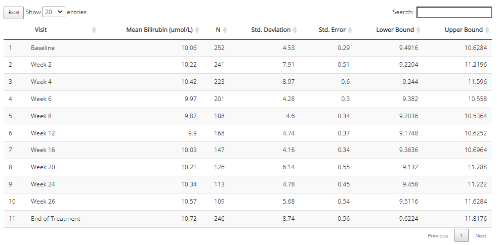
```

<br>


### Heatmap - endpoint correlations

A helpful check for many analyses is to check if some parameters / endpoints are highly correlated with each other. This chart helps to do this quickly, and with ease. First, the user can select any number of parameters for the x-axis and y-axis using the "Select axes" drop downs lists. Doing so will calculate a pairwise correlation using the coefficient of your choice: either pearson (the default) or (Spearmans).  Here's we've requested to only label significant correlations with alpha = 0.05.

<br>

```{r, echo=FALSE, out.width="45%", fig.align='center'}
knitr::include_graphics("figures/popExp/heatmap controls.PNG")
```

<br>

```{r, echo=FALSE, fig.align='center'}
knitr::include_graphics("figures/popExp/heatmap.PNG")
```

<br>

It's important to note that the color gradient in the graph is calibrated to the highest correlation coefficient calculated out of the bunch. When hovered over, you can view all the needed details, including exact p-values.

Furthermore, you may want to check your endpoint correlations from week to week. So with all other options remaining the same, if we choose 'AVISIT' as a grouping variable, the following plot is rendered:

<br>

```{r, echo=FALSE, out.width="45%", fig.align='center'}
knitr::include_graphics("figures/popExp/heatmap controls grouped.PNG")
```

<br>

```{r, echo=FALSE, fig.align='center'}
knitr::include_graphics("figures/popExp/heatmap grouped.PNG")
```

<br>

In addition, that's a lot of information / data to consume, so an export to Excel is available in the included plot data below the graph:

<br>

```{r, echo=FALSE, fig.align='center'}
knitr::include_graphics("figures/popExp/heatmap data.PNG")
```

<br>


### Kaplan-Meier Curve

Any time-to-event (`TTE`) analysis will include an obligatory Kaplan-Meier curve. And rightfully so! So much information can be gleaned from these graphics. The x-axis always contains a measure of time and the y-axis contains the probability of "surviving" up till those times. In the case of the CDISC Pilot data, we're measuring the probability of a patient having their first dermatological event for each time value, x. So even though the y-axis is labeled, "survival", don't think of it in terms of life or death! For any point on the graph, you can interpret plotted values as: "The probability of a patient having their first dermatological event on or past X time units, is Y."


`IDEA` knows which data sources contain `TTE` data based on the presence of the CDISC required `CNSR` variable. The `CNSR` variable must be either a 0 or 1. Zero indicates the patient's survival status is unknown after time period X. That is, we only have **some** information about the patient's time-to-event survival up to a certain point, X, but after that time, their survival is unknown. Instead of just throwing away that data, it's valuable to know that the made it to at least time X, so that data is retained and their last known X value is marked with a red "+" in the plot below.

In the plot control panel, we can toggle the `TTE` parameter, the response value (like `AVAL`), and even the censor variable in case your data source has more than one. We've chosen to marked our censored observations and show 95% confidence bands below.

<br>

```{r, echo=FALSE, out.width="40%", fig.align='center'}
knitr::include_graphics("figures/popExp/km controls.PNG")
```

<br>

```{r, echo=FALSE, fig.align='center'}
knitr::include_graphics("figures/popExp/km.PNG")
```

<br>

As you might expect, these plots can be extremely handy, and remarkably powerful when comparing time-to-event probability between groups of patients. Making a few adjustments to our plot options, produces the following plot which reveals differences between treatment groups. PRO-TIP: If you're interested in seeing if the probably of survival is significantly different between groups, you only need to turn on the 95% confidence bands and see if there is anywhere the bands do not intersect.


<br>

```{r, echo=FALSE, out.width="40%", fig.align='center'}
knitr::include_graphics("figures/popExp/km controls grouped.PNG")
```

<br>

```{r, echo=FALSE, fig.align='center'}
knitr::include_graphics("figures/popExp/km grouped.PNG")
```

<br>


## Filtering

Like other `IDEA` tabs, the "Filter Data" widget manipulates the data before it is processed on the tab, in this case: plotted. Filtering will not be discussed in detail guide so you're highly encouraged to view the article called [04 Filtering](https://github.biogen.com/pages/biometrics/SEER/articles/x04_Filtering.html) for a complete filtering tutorial. However, we will address a few things that are unique about filtering in the Population Explorer. By clicking the drop down arrow, the filtering widget expands to reveal the following controls:


<br>

```{r, echo=FALSE, out.width="50%", fig.align='center'}
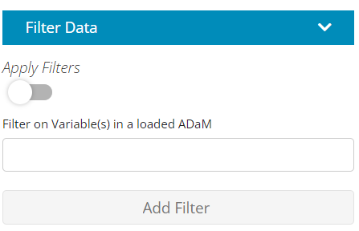
```

<br>


First, this is the only tab that has an "Apply Filters" toggle that precedes the usual ADaM data selector and "Add Filter" button. This toggle provides unique functionality when plotting, giving the user the following luxuries:

1. **Build filters all at once**. If the user has many filters to define on variables from multiple data sources, the chart will continually re-render after each filter is added. With large data sets, this can lead to a user experience that is somewhat slow and sluggish. As such, its advised to define your filters on the front end and then toggle "Apply Filters" to the "on" position to save time and compute power. Below is an example workflow displaying this practice.


1. **Switch back and forth** between filtered and un-filtered versions of the plot. This can be useful to verify expected changes in the plot before and after filtering.

<br> 

```{r, echo=FALSE, fig.align='center'}
knitr::include_graphics("figures/popExp/apply filters toggle.gif")
```

<br> 


Second, notice that the the text describing the filtering appears below the chart on the left-hand side.


## Need help?

Throughout all the tabs in the application, there are these little buttons (usually in the top right-hand corners) with question marks on them:

```{r, echo=FALSE, fig.align = 'center'}
knitr::include_graphics("figures/tableGen/TG need help.PNG")
```


When clicked, they launch a real-time guide that walks the user through the major components of the currently visible screen/ tab, providing context and suggested workflow. However, if the in-app guide doesn't address your needs, consult the online documentation (that you're reading now) for the most thorough user guide. If all else fails, send the [developers](mailto:adshelp@digicomm.jira.com?subject=IDEA App Question/ Request) an email with your question or request!

<br> 

```{r, echo=FALSE}
knitr::include_graphics("figures/popExp/need help.gif")
```


<br> 

<br> 

<br> 


