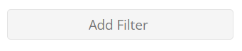
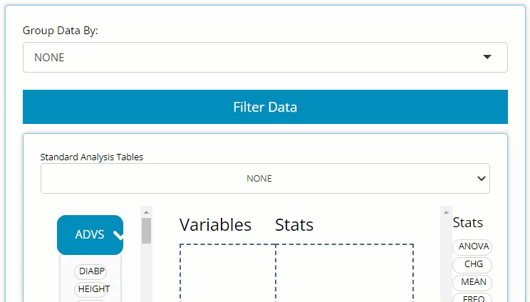
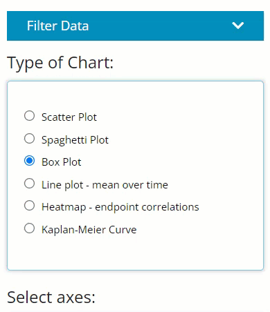
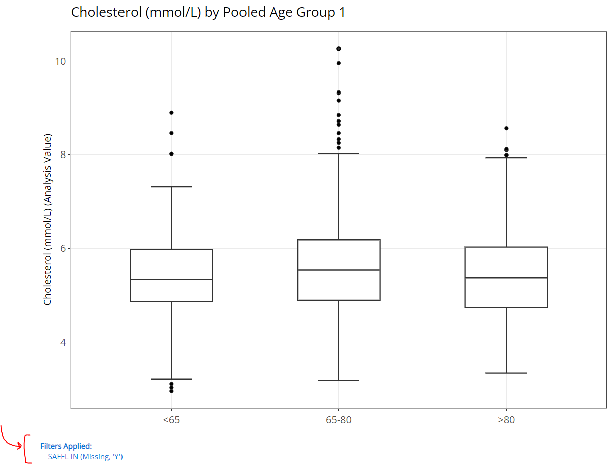
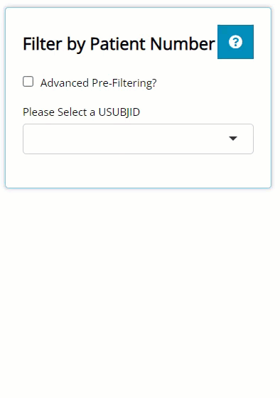
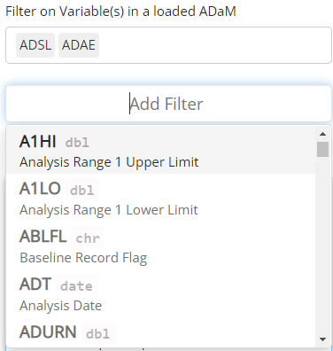
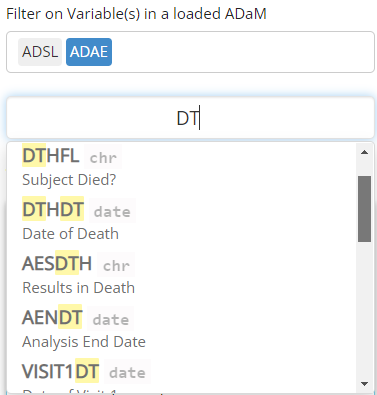
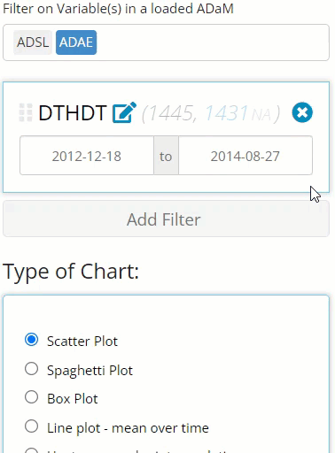
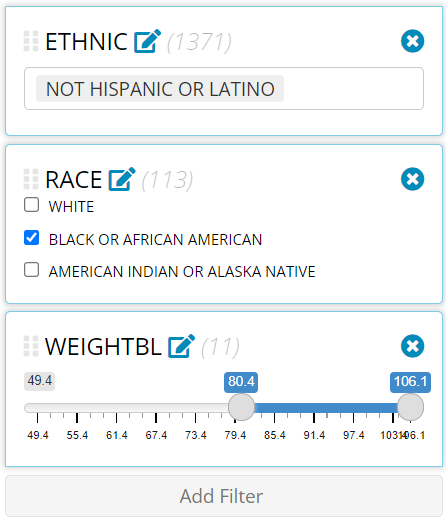
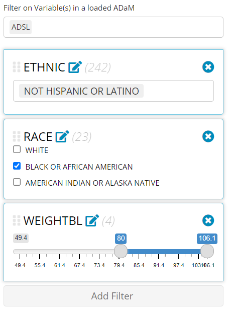

```{r, include = FALSE}
knitr::opts_chunk$set(
  collapse = TRUE,
  comment = "#>"
)
```

This tutorial will walk through how to leverage the `IDEA` app's filtering widget we've all come to love and enjoy. It exists to establish thorough and comprehensive data filtering capabilities for any tab, but not across all tabs. That is, filtering performed on the Table Generator tab doesn't not apply to the Population Explorer, or vice-versa. But the filtering widget functions in a very consistent way across all the tabs, with only subtle differences in how the filtering is applied.

## Subtle differences in each tab's filtering widget

The filtering widgets appearance is identical from tab-to-tab, but it's location and when the desired filtering is applied may vary. The filtering button always looks like this:

<br>

```{r, echo=FALSE, out.width="40%", fig.align='center'}

```

<br>

### Table Generator

Here, you only need to locate the large blue "Filter Data" button on the left-hand side above the drag & drop zone. Upon clicking, you'll see it reveals a data selector and the grey "Add Filter" button. More on the data selector later.


<br>

```{r, echo=FALSE, out.width="60%", fig.align='center'}

```

<br>

More on the data selector later, but it's important to note that as soon as a filter is defined for a certain variable, it effects the output immediately and displays a message that reflects the new data constraints below the table's title, as seen here (red brackets drawn for emphasis):

<br>

```{r, echo=FALSE, out.width="80%", fig.align = 'center'}
knitr::include_graphics("figures/tableGen/TG filtering.PNG")
```

<br>


### Population Explorer

Locate the smaller blue "Filter Data" button on the left-hand side above "Type of Chart" radio buttons. Upon clicking, you'll see it reveals the same data selector and the grey "Add Filter" button. However, notice how the user can turn the filters on and off usin the "Apply Filters" toggle. This can come in handy if you desire to flip back and forth between two populations.

<br>

```{r, echo=FALSE, out.width="50%", fig.align='center'}

```

<br>

Once the filters are applied, you'll see blue text appear below the plot's x-axis you've engineered. Red arrow and bracket drawn for emphasis below:

<br>


```{r, echo=FALSE, out.width="90%", fig.align='center'}

```

<br>

### Individual Explorer

On this tab, there is no blue "Filter Data" button. On this tab, the filtering widget only exists to pre-filter the list of patients available in the USUBJID dropdown list. So, on the left, there is a checkbox labeled "Advanced Pre-Filtering?". Upon selecting, you'll see it reveals the standard data selector and the grey "Add Filter" button where you can begin filtering. 


<br>

```{r, echo=FALSE, out.width="60%", fig.align='center'}

```

<br>

After you've defined your filters, you'll see the the list of patients will be shorter than when you started (depending on the filters applied).


## How does the filtering widget work, anyway?

In a nutshell, the filtering widget will look up and present all variables and variable values from the data sources specified, allowing the user to find and include/ exclude certain data points on that tab. 

### Selecting an ADaM & variable

Think about the variable by which you wish to filter the output, and recall which of the uploaded ADaMs it exists within. If you can't remember the data source, you can select more than one ADaM and then click "Add Filter". This will merge the data together and give you access to all the variables in both selected data set(s). Note, if you uploaded several large ADaMs on the data tab, it's best not to select them all when filtering, if possible, as the app will become sluggish.

<br>

```{r, echo=FALSE, out.width="50%", fig.align='center'}

```

<br>

Notice above that you can preview not only the variable names, but the variable labels and data types, which can be so very helpful. To make selecting your variables even more effortless, you can start typing the variable name to pull up variables that contain certain strings. In the example below, we search for all the date variables using the key letters "DT".

<br>


```{r, echo=FALSE, out.width="50%", fig.align='center'}

```

<br>


### Filtering variable values

The filtering widget is smart enough to identify the data that exists in each variable, and yields a user interface to compliment said data. For example, if you are filtering on a date field, a date range will appear that spans from the min to max date found in the data. Plus, you don't need to manually enter a date which could lead to errors if the "YYYY-MM-DD" format isn't followed. Instead, when you click on one of the date values, a handy calendar will pop up to help you select the date of interest, with invalid dates grayed out and non-selectable.

<br>


```{r, echo=FALSE, out.width="50%", fig.align='center'}
knitr::include_graphics("figures/filter/filtering date.PNG")
```

<br>

Notice in the above image, there is 1,445 rows of of merged data between the selected `ADSL` and `ADAE` that the widget is parsing through, and it found 1,431 `NA` values for this variable.  If you want to remove those `NA` values from this count, you need only click on the gray "NA", as seen below, revealing there are 14 non-`NA` rows. The recording below also shows how this number is reduced when we change our date range. It's important to note this is counting rows of data between the merged `ADSL` and `ADAE`, not unique subjects. If you want the row count to reflect unique subjects, you should only select the `ADSL` ADaM for filtering.

<br>

```{r, echo=FALSE, out.width="50%", fig.align='center'}

```

<br>

Furthermore, notice how we can continue to add additional filters using the "Add Filter" button. Doing so further reduces the number of rows in the merged data, as seen below. The beauty of this widget is you can filter as many variables as you want (well, as along as their are available rows remaining)!


Other data types and their unique interface are as follows: `chr`, `fctr`, `dbl`, and (not pictured) `dttm`. Character data allow you to select string values present in the data, while factor values are represented in check boxes. For either, more than one value can be selected at a time. Double data acts more like the date variables, by allowing you to select a range of desired values.


<br>

```{r, echo=FALSE, out.width="50%", fig.align='center'}

```

<br>


### Stack, re-order, and canceling filters

Notice in the image above that we were able to add an unlimited amount of filters to our data (as long as their are rows left to analyze) and that the order of the filters is important. First, `ETHNIC` = "NOT HISPANIC OR LATINO" retained 1,371 rows that were available for the next filter where we selected only "BLACK OR AFRICAN AMERICAN" patients, leaving us with only 113 rows. Finally, after we filtered patients by weight, we were only left with 11 rows.

If you wish to apply these filters in a different order, you can simply drag and drop them into the desired location and the data available & number of rows that exist after each filter will update. Why is order important? Well as you can see below, if we filter by weight first instead of last, we'll notice: 

1. one of our `RACE` categories will disappear because those patients do not exist for the given weight range and 

1. the allowed max weight to filter on increases as more data becomes available

If you want to cancel or remove any filter, simply select the "X" in the upper right-hand corner of the variable's filter panel. See recording below for guidance:


<br>

```{r, echo=FALSE, out.width="50%", fig.align='center'}
knitr::include_graphics("figures/filter/filter reorder and del.gif")
```

<br>

This was mentioned earlier, but for clarification, notice how the above recording has the loaded `ADSL` and `ADAE` selected, yet all the filtered variables were from the `ADSL` only. This is great example of when you may only want to include the data sets you absolutely need for filtering. If I would have selected only the `ADSL`, the row counts would be reflective of only unique patients counts (since `ADSL`s only have one row per patient) as seen below. However, since `ADAE` was also selected, it displayed the row count for the merged data, allowing us to view the count of adverse events as we filtered. Depending on your priorities, you may want to adjust the selected ADaMs accordingly!


<br>

```{r, echo=FALSE, out.width="50%", fig.align='center'}

```

<br>

### Filter impact

It's important to note, that after a filter is applied to a variable from a specific data set, all the subject level data is linked via `USUBJID`, and will apply those filters to **all data sources** on a given tab. For example, if you filter a variable from an `ADAE` like `AEACN` to the "DOSE REDUCED", not only will the `ADAE` be filtered, but all uploaded data that contains those "DOSE REDUCED" patients. Exciting, right? However, remember if you venture over to a different tab, those filters aren't carried with you!

Happy filtering!


